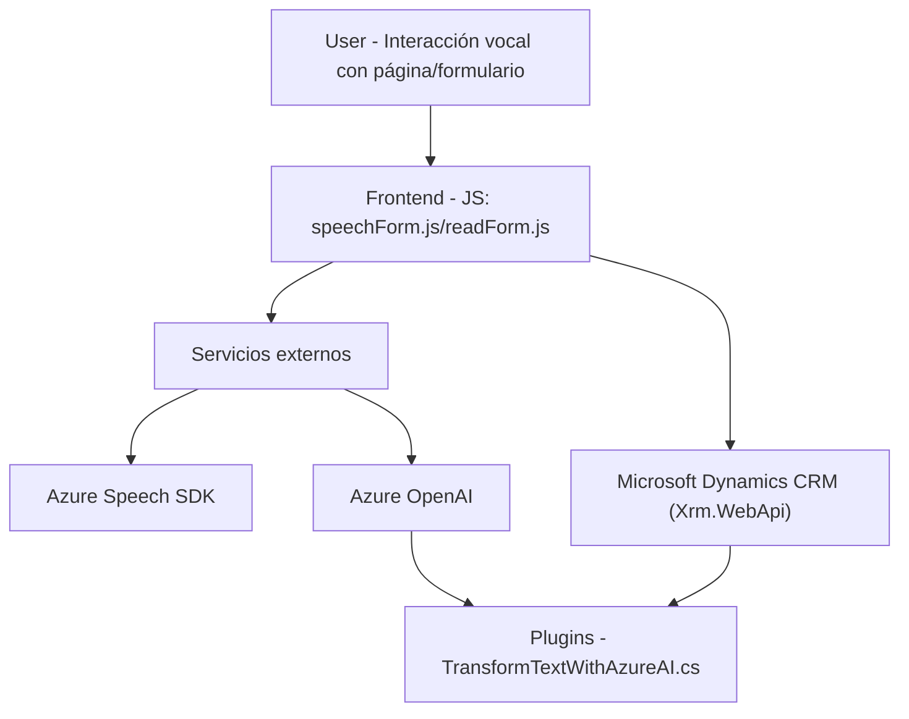

### Breve resumen técnico
El código y estructura del repositorio indica que estamos trabajando con una solución integrada que utiliza reconocimiento de voz, manipulación de formularios en Dynamics CRM, y transformación de texto con inteligencia artificial (Azure OpenAI). La solución es híbrida: contiene componentes **frontend** (en JavaScript/HTML), complementos o **plugins** en C#, y depende de tecnologías externas para sus funcionalidades avanzadas (Azure Speech SDK y Azure OpenAI).

### Descripción de arquitectura
La arquitectura sigue un enfoque de **n capas**:
1. **Frontend (Presentación)**: Archivos JS que interactúan con el formulario visible para recoger datos y generar voz (o procesar entrada de voz).
2. **Plugins (Lógica de negocio)**: Implementación de lógica avanzada en Dynamics CRM a través de plugins en C#, como la transformación del texto mediante inteligencia artificial.
3. **Servicios externos (Acceso a datos)**: Uso de servicios externos, como Azure Speech SDK para sintetizar/reconocer voces y Azure OpenAI para transformar texto.

La separación entre las capas es clara: la presentación se ocupa de la interacción con el usuario, mientras que los plugins extienden la lógica de negocio en el entorno de Dynamics CRM y forman intermediarios entre el sistema y los servicios externos.

### Tecnologías usadas
1. **Frontend**:
   - **JavaScript**: Manipulación del DOM y lógica de negocio en el lado del cliente.
   - **Azure Speech SDK**: Reconocimiento de voz y síntesis de texto a voz.
   - **Microsoft Dynamics SDK** (`Xrm.WebApi`): Manipulación de formularios y datos CRM.

2. **Backend**:
   - **C#**: Desarrollo de plugins para Dynamics CRM, utilizando la biblioteca `Microsoft.Xrm.Sdk`.
   - **Azure OpenAI**: Llama a un modelo GPT-4 para transformación de textos.
   - **ASP.NET Framework**: Presumiblemente utilizado como base para el plugin dado el uso del contexto entre CRM y servicios HTTP.

3. **Patrones y conceptos**:
   - **Modular Design**: Organización del código en funciones pequeñas con responsabilidades bien definidas.
   - **Service Integration (API Gateway)**: Para comunicarse con Azure Speech SDK y Azure OpenAI.
   - **Encapsulación**: Plugins en C# tienen su lógica especializada aislada.
   - **Abstracción**: Operaciones internas del SDK son ocultadas al desarrollador mediante métodos como `speakText`.
   - **Lazy Loading**: Carga condicional de dependencias externamente según necesidad (e.g., `ensureSpeechSDKLoaded`).

### Diagrama Mermaid

### Conclusión final
La solución es una implementación integrada en Dynamics CRM que amplía las capacidades estándar del sistema gestionando tanto voz como texto interactivamente. La entrada del usuario se procesa en el navegador utilizando métodos que dependen de la carga dinámica de Azure Speech SDK, y los datos pueden ser manipulados y gestionados por métodos implementados en plugins de CRM (como el procesamiento de texto con GPT-4 de Azure OpenAI). La arquitectura de n capas se adapta bien a la modularidad y al flujo de trabajo necesario, permitiendo independencia entre la presentación, la lógica de negocio y las integraciones con servicios externos.