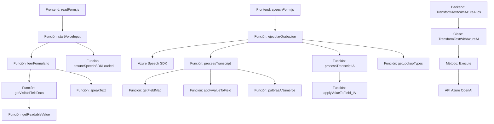

### Breve Resumen Técnico

El repositorio implementa una solución para la interacción por voz y procesamiento de datos en entornos CRM Dynamics, utilizando herramientas como **Azure Speech SDK** y **Azure OpenAI**. La estructura incluye un frontend con archivos específicos para el manejo de entrada/salida de voz y un plugin backend que ejecuta transformaciones avanzadas. El enfoque permite la captura dinámica de datos desde formularios y su análisis automatizado mediante IA.

---

### Descripción de Arquitectura

La solución posee una arquitectura híbrida basada en **n-capas** con elementos focalizados en **modularidad**. Consta de:
1. **Frontend:**
   - Manejo de entrada de voz mediante funciones JavaScript que procesan formularios y datos hablados.
   - Carga dinámica de dependencias externas como el **Azure Speech SDK**.
   - Estructura modular con funciones independientes para cada tarea (sintetizar texto, capturar datos de formularios).

2. **Backend:**
   - Implementación de plugins para CRM Dynamics mediante **Microsoft SDK**.
   - Uso de integración con servicios externos, como **Azure OpenAI API**.

El modelo combina el **Plugin Pattern** en el backend con una orquestación mediante llamadas a APIs externas desde el frontend.

---

### Tecnologías Usadas

1. **Lenguajes y Frameworks:**
   - **JavaScript:** Lógica para frontend, captura de eventos y procesamiento de formularios.
   - **C#:** Implementación del plugin para procesamiento extendido en CRM Dynamics.
   - **Newtonsoft.Json** y **System.Net.Http:** Para manejo de JSON y comunicación HTTP en C#.

2. **Servicios y SDKs:**
   - **Azure Speech SDK:** Para síntesis de voz y transcripción de audio.
   - **Azure OpenAI API:** Generación de respuestas estructuradas basadas en texto.

3. **Entornos:**
   - **Dynamics CRM SDK:** Para integración con formularios y datos dinámicos.

4. **Patrones:**
   - **Facade Pattern:** Organización modular en funciones de alto nivel (ej. `startVoiceInput` en JavaScript).
   - **SDK Wrapper:** Encapsulación del uso del Azure SDK en funciones concretas (`speakText`, `EnsureSpeechSDKLoaded`).
   - **Plugin Pattern:** Uso de la interfaz `IPlugin` en el backend CRM Dynamics.
   - **Service-oriented Architecture (SOA):** Interacción con servicios basados en APIs externas.

---

### Diagrama **Mermaid** Válido para GitHub

---

### Conclusión Final

La solución está diseñada para ser escalable y eficiente dentro de entornos **Dynamics CRM**. Combina una arquitectura estratificada con integración SaaS orientada a servicios, usando tecnologías de última generación como **Azure Speech SDK** y **Azure OpenAI**. Está estructurada modularmente en frontend y backend, facilitando la reutilización y ampliabilidad del código.

La dependencia directa de herramientas específicas (CRM Dynamics y Azure SDK) brinda una integración fuerte pero puede limitar la portabilidad de la solución a otras plataformas. Por último, incluir un sistema de pruebas automáticas y manejo de errores para servicios de API externos sería una mejora relevante para garantizar la resiliencia ante fallos en entornos productivos.