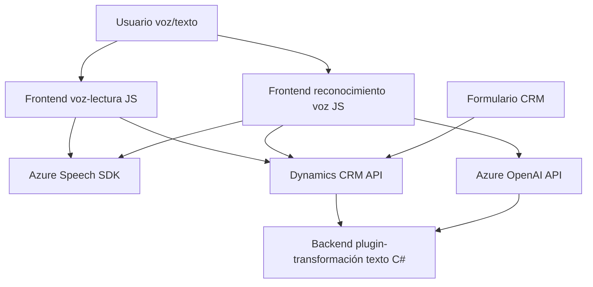

### Breve resumen técnico

El repositorio contiene tres archivos que implementan funcionalidades relacionadas con la interacción entre usuarios y formularios utilizando voz y texto, basadas en tecnologías de Azure. Los módulos se centran en la accesibilidad (lectura en voz alta de formularios), el reconocimiento de patrones textuales mediante Azure AI, y la integración de datos procesados con un sistema CRM (Dynamics 365).

---

### Descripción de arquitectura

1. **Tipo de solución**: La solución parece ser una combinación de componentes frontend (JavaScript para interfaces web) y backend (plugin .NET), diseñada para interactuar con servicios en la nube como **Azure Speech SDK** y **Azure OpenAI*. El propósito es mejorar la accesibilidad y funcionalidad en formularios, posiblemente en entornos CRM como Dynamics 365.

2. **Arquitectura general**:
   - La estructura de componentes y funcionalidades apunta hacia una arquitectura de **n capas**, que organiza la lógica en distintas responsabilidades clave:
     - **Capa de presentación (Frontend)**: Encargada de brindar las capacidades de voz y texto al usuario y enviar las solicitudes hacia el backend CRM.
     - **Capa lógica (Backend - Plugin .NET)**: Extiende funcionalidad CRM utilizando integraciones con APIs sobre arquitecturas de plugin de Dynamics CRM.
     - **Capa de integración**: Comunicación directa con servicios API externos como **Azure Speech SDK** (síntesis/reconocimiento de voz) y **Azure OpenAI** (GPT).

3. **Patrones de arquitectura**:
   - Modularidad: Funciones y clases organizadas con una única responsabilidad.
   - Event-driven programming: Activación de flujos de procesos basados en acciones del usuario en la interfaz o eventos del CRM.
   - Service integration: Dependencias directas con APIs y servicios de Azure.
   - Plugin architecture: Extensiones basadas en la arquitectura de eventos del CRM mediante clases que implementan `IPlugin`.

---

### Tecnologías usadas

- **Azure Speech SDK**: Para funcionalidades de reconocimiento y síntesis de voz desde el frontend.
- **Dynamics CRM y Plugins (.NET C#)**: Para extender funcionalidades del sistema CRM, como manipulación de formularios y datos.
- **Azure OpenAI**: Para transformar texto mediante modelos de lenguaje como GPT en procesos backend integrados con el CRM.
- **JavaScript modular**: Para manipulación del DOM, lectura de formularios y entrada de datos.
- **APIs nativas de Dynamics 365**: Para interacción directa con formularios y modelos de datos en el sistema CRM.
- **.NET Framework con C#**: En particular, para extensiones del CRM vía Dynamics SDK.
- **HTTP Requests y JSON**: Normalización de datos y consumo de servicios externos.
- Arquitectura basada en eventos u operaciones desencadenadas (`executionContext`).

---

### Diagrama Mermaid

---

### Conclusión final

El repositorio presenta una solución basada en accesibilidad e integración de tecnología de voz y texto en un entorno CRM (Dynamics 365). Utiliza frontend para interacción del usuario y backend mediante plugins .NET para extender capacidades del sistema CRM, apoyándose en componentes externos como **Azure Speech SDK** y **Azure OpenAI**. La arquitectura modular y orientada a eventos permite una separación clara de responsabilidades. Aunque está bien estructurada, sería recomendable proteger variables sensibles como la clave de API y emplear configuraciones dinámicas para entornos más seguros.