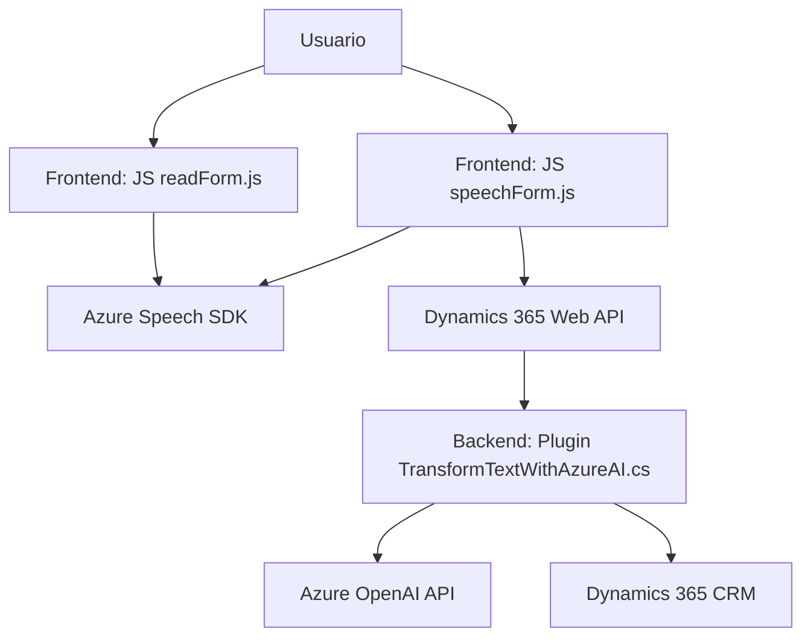

### Breve resumen técnico:
El repositorio analiza una solución que integra interacción por voz y generación de texto mediante el uso de tecnologías de Azure, Dynamics 365, y Azure OpenAI. Sus principales funciones están orientadas hacia el reconocimiento y síntesis de voz para ingresarla o leerla desde formularios en Dynamics CRM, además del procesamiento avanzado del texto a través de Azure GPT.  

---

### Descripción de arquitectura:
La arquitectura del repositorio presenta una combinación de patrones y estilos:  
1. **Multicapas**: Cada archivo evidencia una separación clara de responsabilidades:
   - Archivos frontend interactúan con Azure Speech SDK y Web APIs para dinámicas en la UI del formulario.
   - Plugins backend procesan reglas específicas de negocio y gestionan la comunicación con APIs externas, como Azure OpenAI.  
2. **Exposición de servicios externos**: Utiliza APIs como Azure Speech y Azure OpenAI como intermediarios para necesidades específicas.
3. **Modularidad**: Las funciones están desacopladas y organizadas de forma independiente para facilitar la reutilización y mantenimiento.  
4. **Cliente-Servidor con API Gateway**: Las solicitudes se distribuyen entre el frontend que maneja interacciones de usuario (voz y texto) y la capa backend que encamina peticiones a servicios externos.  

---

### Tecnologías, frameworks y patrones utilizados:
1. **Frontend**:
   - Lenguaje: JavaScript.
   - Framework: Dynamics 365 APIs en el browser (a través de `Xrm.WebApi`).
   - SDK: Carga dinámica de Azure Speech SDK desde el CDN (`https://aka.ms/csspeech/jsbrowserpackageraw`).

2. **Backend**:
   - Lenguaje: C# (.NET framework).
   - Integración: Dynamics CRM SDK (Microsoft.Xrm.Sdk).
   - API externa: Azure OpenAI (con GPT-4) para transformación de texto.

3. **Patrones de diseño**: 
   - Dependencia dinámica de SDK (Frontend).
   - Loosely coupled plugins para Dynamics CRM (Backend).
   - Delegación de tareas a servicios externos (Azure SDK).

---

### Diagrama Mermaid:
A continuación se muestra el diagrama basado en la estructura funcional y dependencias de los archivos analizados:

---

### Conclusión final:
El repositorio implementa una solución basada en **procesamiento de voz y transformación de texto** orientada alrededor de los **formularios Dynamics 365**. Utiliza tecnologías avanzadas como **Azure Speech SDK** para interactuar mediante voz y texto desde el frontend y **Azure OpenAI API**, que delega el procesamiento del texto en una arquitectura cliente-servidor.

La solución combina arquitectura multicapa y acoplamiento con servicios externos, lo que permite alta modularidad y escalabilidad. Sin embargo, se detecta un posible problema de seguridad relacionado con la exposición de una clave de API en el código del plugin. Se recomienda emplear **contenedores seguros** o almacenes de configuración para las credenciales críticas y asegurar un diseño que evite fugas de seguridad.

Esta solución demuestra un uso eficiente de Dynamics CRM combinado con tecnologías cloud y puede ser aplicada en entornos en los que el reconocimiento y síntesis de voz, funcionalidades AI y Dynamics CRM sean requeridos.