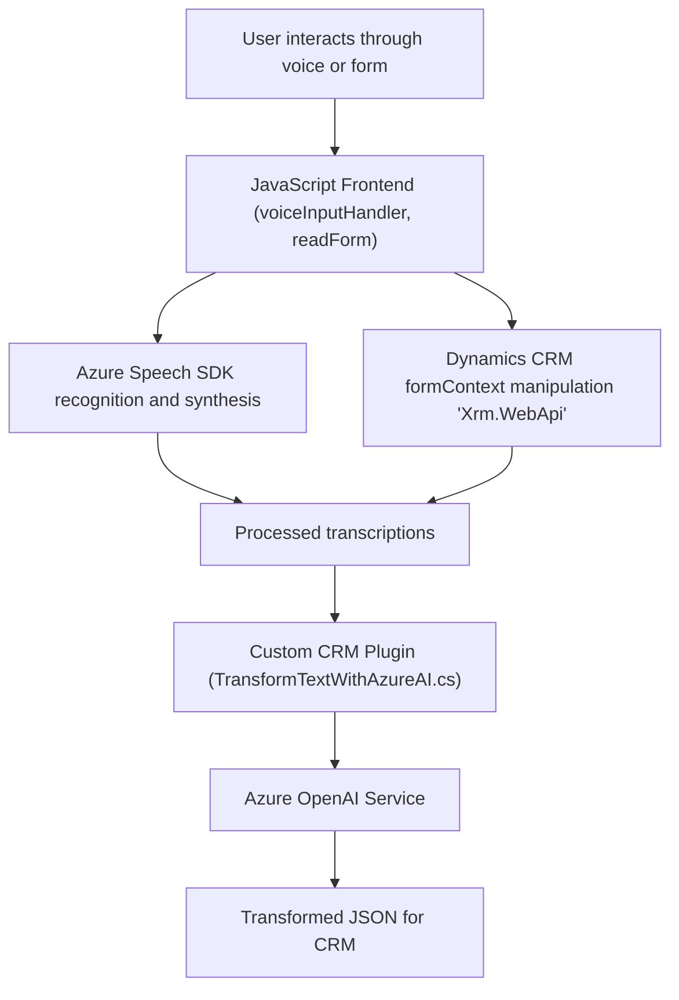

## Breve Resumen Técnico

El repositorio parece ser parte de un sistema más grande diseñado para integrar capacidades de reconocimiento de voz y síntesis de voz con un sistema de **Microsoft Dynamics CRM**, complementado con servicios de Azure Speech SDK y Azure OpenAI. Los archivos implementan la lógica necesaria para realizar transcripciones de voz, procesar datos de formularios en Dynamics CRM y transformar texto utilizando Azure OpenAI.

---

## Descripción de Arquitectura

La arquitectura parece ser una **híbrida basada en arquitectura n-capas** con integración de API externa, servicios de inteligencia artificial (IA) y componentes de Microsoft Dynamics CRM:

1. **Frontend (JavaScript):**
   - Los dos archivos `readForm.js` y `speechForm.js` contienen lógica que se ejecuta en el cliente (browser), utilizando Azure Speech SDK para voz y texto. Además, interactúan con el modelo del formulario de Dynamics CRM.
   - Las funciones están organizadas de manera modular y se enfocan en dos aspectos principales:
     - Lectura y síntesis de formularios (readForm.js).
     - Reconocimiento de voz, transcripción y asignación de datos (speechForm.js).

2. **Backend (C# Plugin):**
   - El archivo `TransformTextWithAzureAI.cs` implementa un **plugin** para Dynamics CRM que interactúa con Azure OpenAI para transformar texto utilizando una API externa.
   - Sigue una arquitectura de **microservicio**, delegando tareas específicas a Azure OpenAI.

3. **Dependencias:**
   - **Externa:** Azure Speech SDK para voz y Azure OpenAI para procesamiento de texto. Microsoft Dynamics CRM también está integrado.
   - **Interna:** Integración con Dynamics CRM (`formContext`, `Xrm.WebApi`) y APIs personalizadas de Dynamics CRM.

---

## Tecnologías Usadas

1. **Frontend:**
   - **JavaScript**: Principal lenguaje para el desarrollo de la capa frontend.
   - **Azure Speech SDK**: Utilizado para realizar síntesis de voz y reconocimiento de voz.
   - **Dynamics CRM SDK (Xrm.WebApi)**: Para interactuar y manipular datos de formularios en el sistema CRM.

2. **Backend:**
   - **C#:** Para el desarrollo del Plugin de Dynamics CRM.
   - **Azure OpenAI Service:** Usado para las transformaciones avanzadas de texto con modelos GPT.
   - **System.Net.Http:** Realiza peticiones API externas para comunicarse con Azure OpenAI.

3. **Patrones:**
   - **Modularidad Funcional**: Código bien segmentado de acuerdo con responsabilidades específicas.
   - **Cliente-Servidor:** Interacciones constantes entre la aplicación cliente (frontend) y backend/API.
   - **Plug-in Architecture (Dynamics CRM):** Para ejecutar reglas de datos y eventos específicos dentro de CRM.
   - **API Gateway Pattern:** Para comunicar las capas cliente y servidor con Azure OpenAI vía HTTP requests.

---

## Diagrama Mermaid válido para GitHub

---

## Conclusión Final

El repositorio muestra un sistema diseñado para extender las funcionalidades de **Microsoft Dynamics CRM**. Consta de dos componentes principales: frontend modular implementado en **JavaScript**, enfocado en formularios y reconocimiento/síntesis de voz, y un plugin de **C#** que utiliza una API externa de Azure OpenAI. La arquitectura es híbrida, dividida en frontend (cliente) y backend (plugin + externa). Las principales dependencias son **Azure Speech SDK** para la interactividad con voz y el servicio de **Azure OpenAI** para procesamiento avanzado de texto.

Implementa conceptos como modularidad funcional, separación de responsabilidades y patrones de arquitectura como **Cliente–Servidor** y **Plug-in Architecture**. Además, utiliza llamadas a APIs externas de manera eficiente, pero podría beneficiarse de mejoras en la gestión de configuración y seguridad (como el manejo de claves de las APIs).