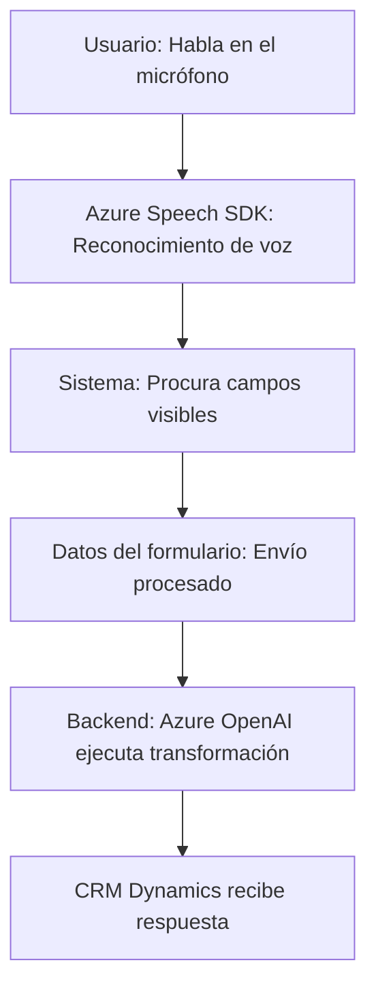
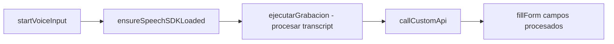
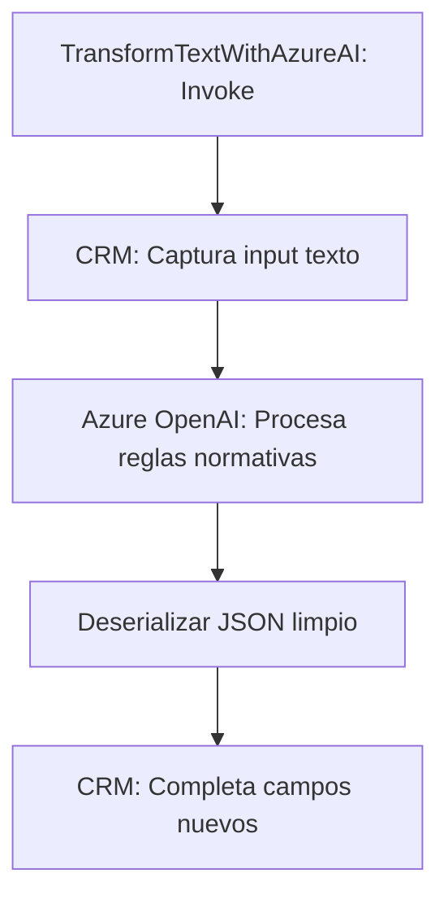

### Breve resumen técnico
El repositorio expuesto contiene los siguientes componentes:
- **Frontend:** Implementación en JavaScript que habilita entrada y salida de voz mediante integración con **Azure Speech SDK**. Procesa datos del formulario y maneja reconocimiento/síntesis de voz.
- **Backend Plugin:** Extensión del CRM Microsoft Dynamics que utiliza **Azure OpenAI** para transformar texto basado en ciertas reglas predefinidas.

---

### Descripción de arquitectura
El sistema presenta una arquitectura híbrida:
1. **Frontend**:
   - Combina un enfoque **evento-asíncrono basado en SDKs externos**. Cada módulo posee funciones autónomas que interactúan mediante **promesas/callbacks**. Permite la generación directa de datos desde voz y su transferencia a formularios en Dynamics 365.
   - Aprovecha la arquitectura **client-server**, donde el cliente es responsable del procesamiento inicial de voz y manipulación de formularios.
2. **Backend Plugin**:
   - Sigue un patrón **plugin-oriented**, es decir, extiende funcionalidad del CRM con un código específico invocado en contextos determinados (e.g., validación de datos).
   - Implementa una integración directa con servicios de IA externamente alojados (Azure OpenAI), manteniendo la lógica separada.

La conexión entre estos componentes es la comunicación basada en **API**: el `backend` consume resultados y transforma información para el CRM a partir de la IA.

---

### Tecnologías usadas
1. **Frontend**:
   - **JavaScript**:
     - Para lógica dinámica del cliente.
   - **Azure Speech SDK**:
     - Reconocimiento de voz.
   - **Dynamics 365 Web API**:
     - Interacción con formularios y datos del CRM.

2. **Backend Plugin**:
   - **C#**:
     - Implementación de plugins.
   - **Azure OpenAI API**:
     - Transformación de texto.
   - **Microsoft.Xrm.Sdk**:
     - Interfaces para integración con Dynamics CRM.

---

### Diagramas Mermaid

#### Diagrama general del flujo

#### Diagrama del módulo Frontend

#### Diagrama del plugin

---

### Conclusión
El repositorio contribuye a un ecosistema híbrido que conecta operaciones de frontend (procesamiento de voz y datos) con un backend que emplea inteligencia artificial para estructuración de información. La arquitectura refleja buena separación entre responsabilidades: los datos son recogidos por el cliente, refinados por APIs de speech y AI, y completados finalmente en un entorno CRM. Esto permite escalabilidad (mediante integración de servicios externos) y modularidad en sus distintos componentes.