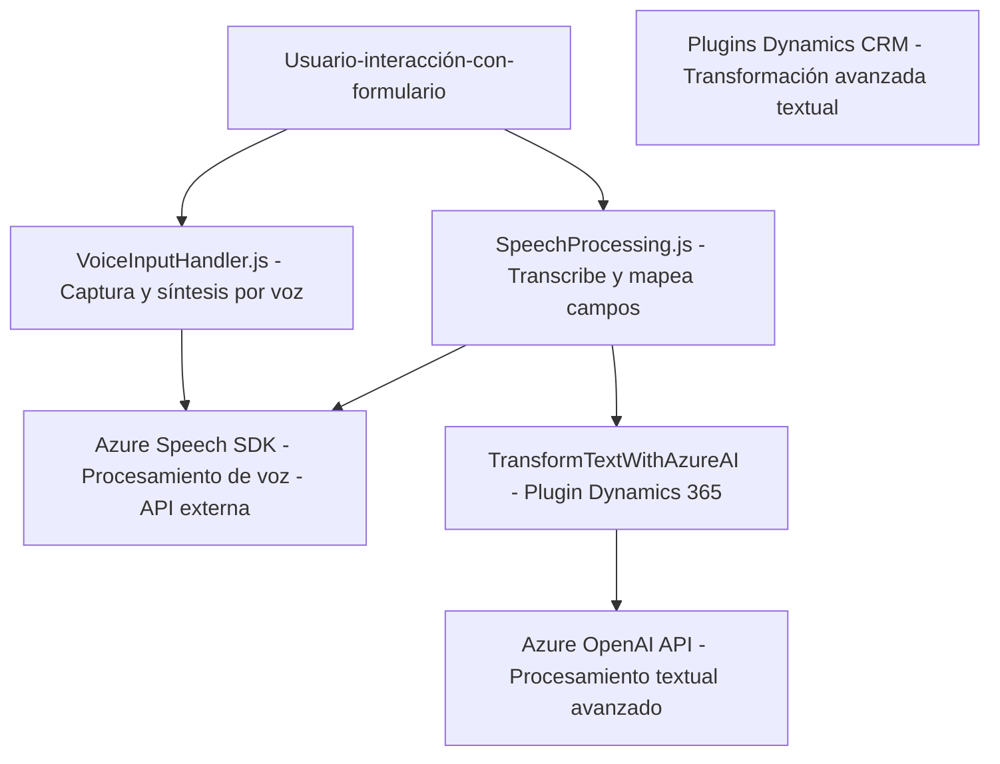

### Resumen Técnico

El repositorio presentado contiene tres archivos clave: dos principalmente para procesamiento de voz y uno para transformación textual mediante inteligencia artificial (AI). Su finalidad parece orientada hacia un sistema integrado con Dynamics 365, que permite captura de voz, síntesis y transformación textual utilizando servicios de Azure (Speech SDK y OpenAI). La solución tiene fuertes vínculos con la integración entre APIs externas (Azure) y el ecosistema de Dynamics 365.

---

### Descripción de Arquitectura

La arquitectura es **modular basada en capas** que combina:
1. **Frontend funcional:** Procesamiento en los archivos JavaScript (`voiceInputHandler.js` y `speechProcessing.js`) para interactuar con usuarios mediante voz.
2. **Backend / Plugin:** El archivo C# (`TransformTextWithAzureAI.cs`) es un plugin que realiza transformaciones textuales avanzadas en el servidor utilizando Azure OpenAI.

Se puede decir que sigue un **patrón n-capas** por su división entre frontend y backend. Adicionalmente, utiliza un **arquitectura orientada a servicios (SOA)** mediante la interacción con APIs de Azure Speech y Azure OpenAI.

---

### Tecnologías Usadas

1. **Microsoft Dynamics 365 CRM**
   - Contextos del formulario (`executionContext`).
   - Plugins server-side como módulo backend.

2. **Azure Speech SDK**
   - Scripting en JavaScript para síntesis y transcripción de voz.
   - Integración mediante APIs sobre HTTP.

3. **Azure OpenAI**
   - Procesamiento avanzado del lenguaje en plugins de Dynamics CRM.
   - Uso de la API `Chat Completions` del modelo GPT.

4. **Frameworks y Librerías**
   - Node.js para la capa front.
   - `.NET Framework` para Dynamics CRM Plugins.
   - `Newtonsoft.Json`, `System.Text.Json`, y `System.Net.Http` para comunicación HTTP y manejo de JSON.

---

### Diagrama **Mermaid** válido para GitHub Markdown

---

### Conclusión Final

El repositorio está diseñado para integrar voz, texto y AI mediante un ecosistema basado en **Azure y Dynamics 365**. Exhibe características como:
1. Entrada de voz y síntesis mediante **Azure Speech SDK** (Frontend).
2. Mapeo de datos y transcripción mediante funciones JavaScript dinámicas.
3. Transformación textual avanzada usando plugins de Dynamics CRM junto con **Azure OpenAI** (Backend).
4. Modularidad y división clara de responsabilidades con uso de APIs externas, lo que refleja una **arquitectura orientada a servicios (SOA)** y patrones como n-capas.

La solución es adecuada para aplicaciones empresariales que necesitan mejorar la interacción por voz y generar procesamiento inteligente mediante Azure.