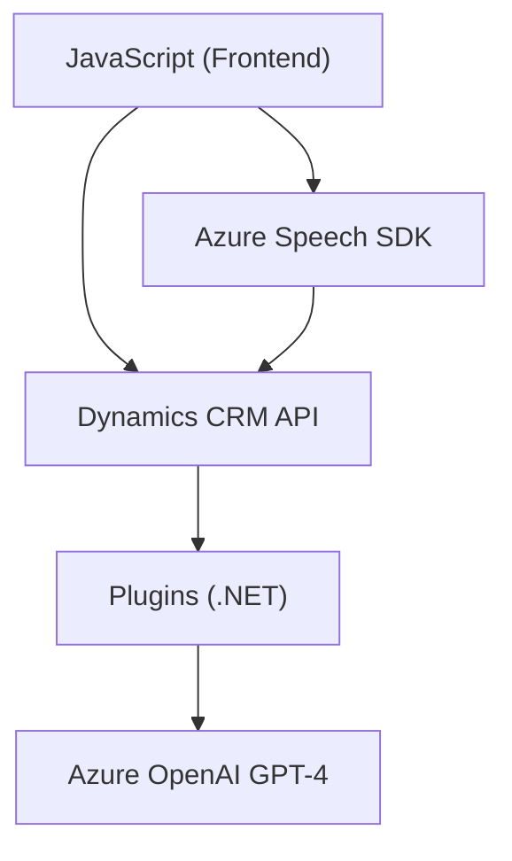

### Breve Resumen Técnico
El repositorio contiene archivos de código y recursos relacionados con un sistema híbrido que integra una interfaz de usuario frontend (JavaScript) con un backend basado en plugins de Dynamics CRM (.NET). Principalmente, ofrece capacidades para manejo de formularios con voz (utilizando Azure Speech SDK) y procesamiento avanzado de texto en lenguaje natural a través de Azure OpenAI.

---

### Descripción de Arquitectura
1. **Tipo de solución:** API basada en CRM, funcionalidad de voz y AI con integración frontend-backend. La solución ofrece:
    - Frontend basado en JavaScript para interacción y síntesis de voz con formularios.
    - Plugins backend (.NET) que extienden funcionalidades de Microsoft Dynamics CRM, integrando servicios externos como OpenAI.

2. **Arquitectura general:**  
    - **N capas** repartidas entre:
       - Presentación: JavaScript frontend relacionado con la experiencia de usuario.
       - Negocio/Dominio: Plugins en Dynamics CRM para manejar transformaciones de texto y lógica específica del negocio.
       - Servicios externos: Comunicación con Azure Speech SDK y OpenAI para funcionalidades avanzadas.
    - Además, se evidencia un inicio de **arquitectura hexagonal (puertos y adaptadores):** Los plugins actúan como puertos para integrar servicios externos, encapsulando la lógica de negocio y adaptándose a las APIs externas.

---

### Tecnologías Usadas
1. **Frontend:**
   - **Lenguaje:** JavaScript para la integración basada en eventos y en contexto de formularios.
   - **SDKs:** Azure Speech SDK para síntesis y reconocimiento de voz.
   - **API de CRM:** Microsoft Dynamics (ejemplo, `Xrm.WebApi.online`) para interacción directa con formularios y datos en la plataforma.

2. **Backend:**
   - **Lenguaje y Framework:** .NET (C#) para extensibilidad de CRM mediante plugins.
   - **Servicios externos:** Azure OpenAI (GPT-4) para transformación de texto.
   - **Librerías adicionales:** `System.Text.Json` (manejo de JSON), `System.Net.Http` (peticiones HTTP), `Microsoft.Xrm.Sdk` (interacción con servicios CRM).

3. **Patrones:**  
   - En el backend:
      - **Plugin architecture** en Dynamics CRM.
      - **Service integration** con Azure APIs (speech y OpenAI).
      - **Encapsulación modular:** Todas las funciones están diseñadas para reutilización mediante principios SOLID.  
   - En el frontend:
      - **Event-driven design:** Se inicia y controla el ciclo de reconocimiento de voz y síntesis según las interacciones del usuario.  
   - **Microfrontend-like** approach: Integración de características específicas con CRM.

---

### Dependencias Externas
1. **Azure Speech SDK:**  
   - Funcionalidad de voz: Reconocimiento y síntesis.
   - Región y clave deben configurarse dinámicamente desde variables de entorno para seguridad.

2. **Azure OpenAI GPT-4:**  
   - Transformación de texto en formato JSON estructurado.
   - Se requiere una configuración segura de la API Key.

3. **Microsoft Dynamics CRM:**  
   - APIs (`Xrm.WebApi.online`) y plugins manejan interacción directa con datos y esquemas de formularios del sistema CRM.

---

### Diagrama Mermaid

---

### Conclusión Final
El repositorio presenta una infraestructura bien diseñada para manejar formularios en un entorno CRM extendido con voz y procesamiento de lenguaje natural. Se utiliza una arquitectura de múltiples capas con integración de servicios externos y extensibilidad modular para Dynamics CRM.

Como recomendación, podría beneficiarse de:
1. **Gestión segura de claves de API:** Evitar exposición en código fuente.
2. **Optimización de dependencias:** Eliminar librerías importadas y no utilizadas.
3. **Mejoras de seguridad:** Validaciones adicionales en interacciones con APIs externas y CRM para prevenir problemas como inyecciones o errores inesperados con datos formateados inválidos.