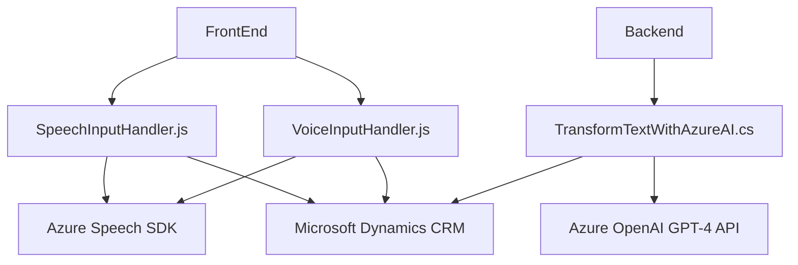

### Breve resumen técnico

La solución es una aplicación híbrida que integra funcionalidades de **entrada y salida de voz** mediante **Azure Speech SDK** y procesamiento de texto estructurado empleando **Azure OpenAI GPT-4 API**. Está orientada hacia un entorno de interacción con formularios dinámicos en **Microsoft Dynamics CRM**, mejorando la accesibilidad y eficiencia mediante reconocimiento de voz y transformación inteligente de texto.

---

### Descripción de arquitectura

1. **Tipo de solución**:  
   Se trata de una solución orientada al procesamiento de datos en formularios dinámicos. Combina un frontend en **JavaScript** para interacción de usuario, reconocimiento de voz y síntesis de voz, y un backend con **Microsoft Dynamics CRM Plugin** para procesamiento avanzado mediante **Azure OpenAI GPT-4**.

2. **Arquitectura**:  
   La arquitectura aplicada es una combinación de patrones como:
   - **API Gateway**: Módulos JavaScript interactúan con APIs de servicios externos como Azure Speech SDK y Microsoft Dynamics.  
   - **Event-Driven Architecture**: Tanto el SDK de reconocimiento de voz como los plugins de Dynamics CRM se activan mediante eventos.  
   - **N-Capas**: Dividido en interfaz de usuario (interacción con el formulario), procesamiento de datos por API y lógica de negocio en los plugins CRM.

3. **Módulos clave**:  
   - **Frontend/JS**: Ejecuta interacciones locales del usuario.
     - **readForm.js**: Extrae y convierte datos visibles del formulario en texto.
     - **speechForm.js**: Realiza reconocimiento de voz mediante Speech SDK y actualiza el formulario dinámico.
   - **Backend/Plugins**: Extiende la funcionalidad del CRM.
     - **TransformTextWithAzureAI.cs**: Define un plugin en .NET para integrar lógica avanzada usando **Azure OpenAI GPT-4 API** y convertir texto en JSON estructurado.

---

### Tecnologías usadas

1. **Frontend**:
   - Lenguaje: **JavaScript**.
   - Frameworks y SDKs:  
     - **Azure Speech SDK**: Síntesis de voz y reconocimiento.
     - **Microsoft Dynamics CRM formContext API**: Integración con formularios dinámicos.

2. **Backend**:
   - Lenguaje: **C# (ASP.NET)**.  
   - Frameworks:  
     - **Microsoft Dynamics CRM SDK**: Realiza interacciones con entidades CRM.
     - **Newtonsoft.Json**: Manejo flexible de JSON.
     - **System.Net.Http**: Para solicitudes HTTP asincrónicas.
   - External APIs:  
     - **Azure OpenAI GPT-4 API** (mediante comunicaciones HTTP con el endpoint OpenAI en Azure).

3. **Patrones usados**:
   - **Modularización**: División lógica de funciones en el frontend.
   - **Event-Driven Programming**: Procesos como reconocimiento de voz y la ejecución del plugin se activan mediante eventos específicos.
   - **Plug-in architecture**: Lógica de negocio personalizada para Dynamics CRM.
   - **Helper pattern**: Métodos como `getVisibleFieldData` y `callCustomApi` facilitan la reutilización y separación lógica.

---

### Diagrama Mermaid

---

### Conclusión Final

La solución combina tecnologías avanzadas (Azure Speech SDK y Azure OpenAI GPT-4) con los servicios de Microsoft Dynamics CRM para proporcionar una experiencia de usuario accesible e inteligente. Los patrones de diseño empleados, junto con la modularidad y separación de responsabilidades, hacen que la solución sea escalable y fácil de mantener. Además, el diseño híbrido permite adaptar funcionalidad tanto en el frontend como en el backend, mientras las dependencias externas aseguran integraciones con servicios innovadores y con alta fiabilidad.