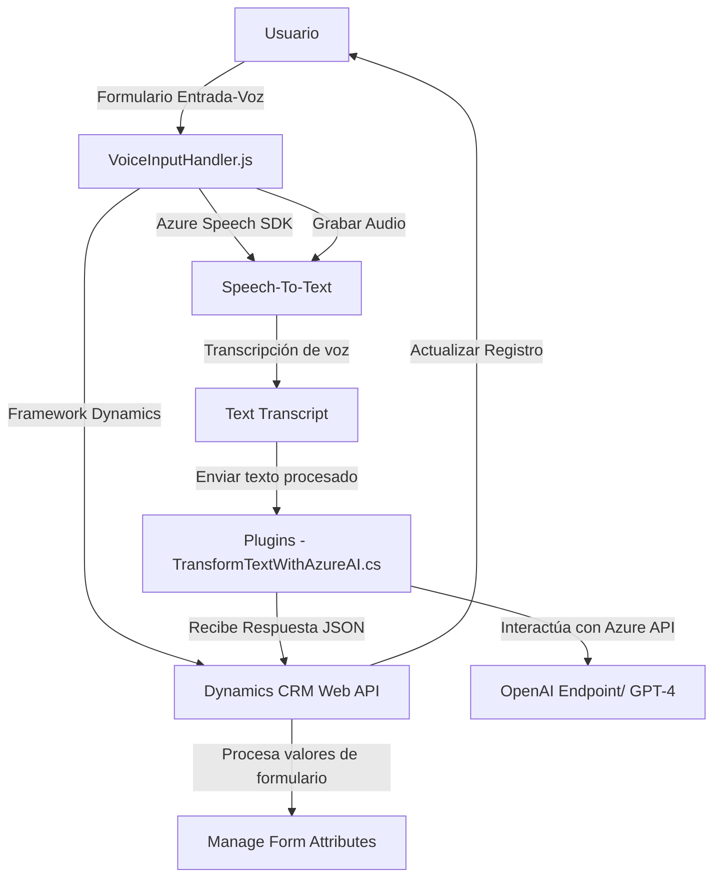

### Breve resumen técnico:
Este repositorio implementa un conjunto de soluciones y componentes destinados al desarrollo de una integración entre Microsoft Dynamics 365 y Azure (Speech SDK y OpenAI). Está diseñado para permitir interacciones como entrada y salida por voz, manipulación de datos en formularios dinámicos y transformación de texto mediante inteligencia artificial. Los archivos muestran una arquitectura orientada a servicios externos con integración modular y enfocada en la gestión API.

---

### Descripción de arquitectura:
1. **Tipo de solución**:  
   La solución representa una integración para Microsoft Dynamics 365. Combina funcionalidad de frontend (procesamiento de entrada de voz en formularios) y backend (plugins para Dynamics CRM que interactúan con Azure OpenAI). Es un **sistema híbrido cliente-servidor** que opera con dependencias externas para la síntesis de voz y la transformación de texto vía IA.

2. **Diseño arquitectónico**:  
   La arquitectura sigue un enfoque basado en **n capas**:
   - **Capa de presentación (Frontend/JS)**: Implementa funcionalidades para la interacción del usuario mediante formularios y entrada de voz, con procesamiento de texto visible a texto hablado o texto transcrito.
   - **Capa de lógica de negocio y servicios (Plugins)**: Aplica reglas de negocio y servicios avanzados de IA (Azure OpenAI).
   - **Capa de integración y API**: Maneja la comunicación entre el sistema y los servicios externos como Azure Speech SDK y Azure OpenAI.

3. **Patrones utilizados**:
   - Modularización: División del código en funciones y clases con responsabilidades claras.
   - API Integration: Comunicación con servicios externos a través de REST APIs (Azure Speech SDK y Azure OpenAI).
   - Plugin Architecture: Utilización del SDK de Dynamics CRM para extender funcionalidades a lo largo de procesos definidos.
   - Layered Architecture (n Capas): Separación clara entre presentación (frontend), lógica de negocio y servicios remotos.

4. **Dependencias o componentes externos**:  
   - **Azure Speech SDK**: Utilizado para procesar entrada y salida por voz en el frontend.  
   - **Azure OpenAI**: Asistencia de inteligencia artificial en la transformación de texto en los plugins.  
   - **Dynamics CRM Web API**: Permite la manipulación directa de formularios y registros en el sistema.  
   - **Librerías .NET**: `System.Net.Http`, `System.Text.Json` para manejar las solicitudes HTTP y procesamiento JSON.  

---

### Tecnologías usadas:
- **Frontend**:
  - Lenguaje: JavaScript.
  - Framework: No se especifica, pero el enfoque parece estructurado para integrarse directamente con la capa de presentación de Dynamics 365.
  - SDK externo: Azure Speech JavaScript SDK para la entrada y salida de voz.

- **Backend (Plugins)**:
  - Lenguaje: C#.
  - Framework: Microsoft Dynamics CRM SDK (.NET Framework).
  - Servicios externos: Azure OpenAI API.

- **Infraestructura**:
  - Microsoft Dynamics 365 (como base del sistema).  
  - Azure API endpoint para interacción con Speech SDK y OpenAI.  

---

### Diagrama Mermaid:
A continuación se presenta un diagrama de flujo que describe cómo interactúan los diferentes componentes del sistema:

---

### Conclusión final:
El repositorio describe una solución híbrida que conecta múltiples componentes tecnológicos para una experiencia enriquecida en Microsoft Dynamics 365. La solución combina habilidades de voz, manipulación de formularios dinámicos y transformación de texto mediante inteligencia artificial. La integración de los servicios se realiza mediante un diseño modular en una arquitectura de **n capas**, destacando los patrones de **Plugin Architecture** y **API Integration** para comunicaciones externas. Además, las dependencias externas clave, como Azure Speech y OpenAI, son gestionadas dinámicamente para optimizar la carga y los recursos en el frontend y el backend. La solución es escalable y permite fácilmente futuras extensiones.