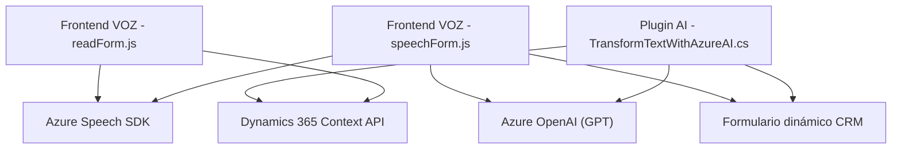

### Breve resumen técnico
El repositorio presentado está compuesto por un conjunto de archivos diseñados para integrar funcionalidades de voz y procesamiento de texto en formularios dinámicos de Dynamics 365. Esto incluye componentes frontend para interactuar con usuarios y sistemas de plugins que emplean inteligencia artificial y servicios en la nube (Azure) para realizar tareas específicas como el reconocimiento de voz y transformación de textos. 

### Descripción de arquitectura
La solución utiliza una arquitectura modular orientada a eventos y servicios integrados. Los archivos de frontend (`readForm.js` y `speechForm.js`) manejan la lógica de reconocimiento de voz y síntesis, mientras que el plugin `TransformTextWithAzureAI.cs` opera como un backend que procesa datos usando Azure OpenAI. La solución sigue el patrón **n-capas**, con separación entre presentación (frontend), lógica empresarial (procesamiento de voz y texto) y servicios externos.

### Tecnologías usadas
1. **Frontend (JavaScript)**
   - **Azure Speech SDK:** Para reconocimiento y síntesis de voz.
   - **ES6+ JavaScript:** Promesas, `async/await`, funciones de alto nivel.
   - **DOM Manipulation:** Uso básico para cargar scripts y procesar datos.

2. **Backend (C# Dynamics Plugin)**
   - **Microsoft Dynamics CRM SDK:** Para extender funcionalidades CRM.
   - **Azure OpenAI (GPT):** Procesamiento de texto mediante servicios en la nube.
   - **JSON Manipulation:** `System.Text.Json`, `Newtonsoft.Json`.

### Diagrama Mermaid válido para GitHub

### Conclusión final
La solución implementa una integración avanzada entre capacidades de voz y inteligencia artificial con los formularios de Microsoft Dynamics 365. Utiliza una arquitectura basada en capas que separa la presentación (frontend), integración lógica (voice SDK y OpenAI), y reglas empresariales (CRM). Sin embargo, es importante reforzar aspectos de seguridad como ocultar claves API y mejorar la gestión de errores para una mayor robustez.