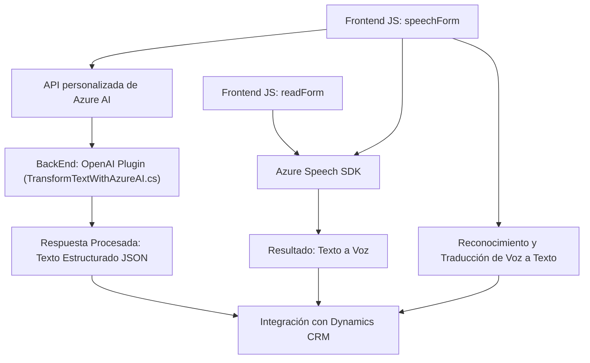

### Breve resumen técnico

El repositorio contiene archivos orientados a la integración de funcionalidades relacionadas con el manejo de formularios en Dynamics 365 mediante acciones avanzadas como entrada de voz, síntesis de texto a voz, y procesamiento de texto con Azure Speech SDK y OpenAI. La solución está diseñada para complementar un entorno CRM con capacidades de inteligencia artificial y entrada dinámica, lo que sugiere su uso como una extensión en un sistema empresarial.

---

### Descripción de la arquitectura

La solución está diseñada alrededor de una arquitectura **modular de tres capas**, con una separación entre:

1. **Frontend dinámico para formularios**: Proveen funcionalidad interactiva para la interfaz del usuario (como voz y síntesis) en el sistema de formularios de Dynamics 365.
2. **Servicios back-end integrados**: Utilizados para realizar el procesamiento de texto y lógica transformadora vía Azure OpenAI en un entorno CRM.
3. **Dependencias externas y APIs**: Integración con servicios externos como Azure Speech SDK y OpenAI para operaciones basadas en IA.

---

### Tecnologías observadas

1. **Frontend:**
   - **JavaScript**: Usado en archivos como `readForm.js` y `speechForm.js` para manipular datos de formularios y realizar las integraciones con el SDK de Azure.
   - **Azure Speech SDK**: Integrado en tiempo de ejecución para funcionalidades como síntesis de texto a voz y reconocimiento de comandos mediante voz.
   - **Dynamics 365 client scripting (contextos)**: Implementación del contexto de formulario dentro del entorno Dynamics CRM.

2. **Backend:**
   - **Plugins CRM en C#**: Extensión del Dynamics CRM mediante `TransformTextWithAzureAI.cs` configurado para aprovechar Azure OpenAI con reglas predefinidas.
   - **Azure OpenAI API**: Ejecuta transformaciones de texto dinámicas en el backend. 

3. **Dependencias:**
   - Librerías como `Newtonsoft.Json` y `System.Net.Http` para manipulación de JSON y comunicaciones REST.
   - Microsoft Dynamics SDK para interactuar con las APIs de CRM.

---

### Diagrama **Mermaid**

A continuación, un diagrama ilustrativo de la arquitectura y las interacciones entre los componentes. Este diagrama sigue el formato específico solicitado.

---

### Conclusión final

El repositorio es una **solución integrada** que extiende un sistema CRM como Dynamics 365, añadiendo capacidades avanzadas de reconocimiento de voz, síntesis de texto a voz y procesamiento de texto mediante integración directa con Azure Speech SDK y OpenAI. Su arquitectura modular de tres capas asegura claridad en responsabilidades y escalabilidad para futuros desarrollos. Sin embargo, sería ideal gestionar configuraciones y dependencias externas como claves de API de manera más segura, posiblemente mediante políticas de configuración en el entorno de ejecución seleccionado.