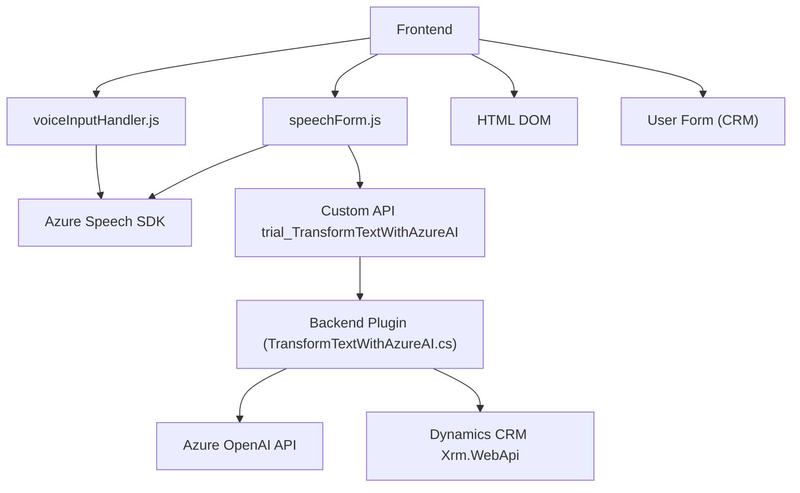

### Breve resumen técnico

La solución presentada se orienta hacia la integración de voz y texto mediante **Azure Speech SDK** y **Azure OpenAI**, además de interactuar con Microsoft Dynamics CRM. La arquitectura combina módulos JavaScript (que manejan acciones cliente en un frontend) y un plugin C# (que actúa como middleware para la transformación de texto en el CRM). Este sistema permite entradas por voz, síntesis textual y actualizaciones dinámicas en formularios CRM.

---

### Descripción de la arquitectura

La solución tiene características de una **arquitectura cliente-servidor distribuida orientada a servicios**, donde los componentes clave son:
1. **Frontend/JavaScript**: Implementa lógica de negocio en el navegador del cliente y las interacciones directas con el SDK de Azure Speech. Este módulo permite la captura, síntesis y procesamiento de datos desde formularios y voz.
2. **Backend/Plugin C#**: Extiende el CRM mediante integración con un servicio externo (Azure OpenAI) para enriquecer los datos. Este componente utiliza **Azure API** para generar estructuras JSON legibles desde texto libre.

Desde un diseño arquitectónico, el sistema no puede calificarse exclusivamente como "monolítico" o "de microservicios". Los elementos que interactúan están distribuidos, pero las dependencias con una plataforma centralizada (CRM) lo alejan de un diseño de microservicios puro. Es más conceptualizado como una solución basada en **capas distribuidas** o **arquitectura orientada a servicios (SOA)**.

---

### Tecnologías usadas

1. **Frontend**
   - **Azure Speech SDK**: Procesa voz (síntesis y reconocimiento).
   - **JavaScript**: Implementaciones modulares relacionadas con la manipulación de DOM y lógica cliente.
   - **HTML DOM Manipulation**: Carga dinámica de scripts y manejo de formularios.
   - **HTTP Requests** (probablemente `fetch` o similar): Para integrar APIs externas.

2. **Backend**
   - **C#**: Desarrollo del plugin principal en Dynamics CRM.
   - **Azure OpenAI (GPT-4)**: Utilizado para transformar texto en JSON.
   - **Microsoft Dynamics SDK**: Integración con el modelo de datos y ejecución del contexto CRM.
   - **System.Net.Http & Newtonsoft.Json**: Para realizar solicitudes API y manejar datos JSON.

3. **Generales**
   - **Promesas y asincronía en JS**: Para manejar flujos de SDK y APIs de reconocimiento de voz.
   - **Callback Pattern**: Uso de mecanismos para invocar funciones después de cargar recursos externos como el SDK de Azure Speech.

---

### Dependencias o componentes externos

1. **Azure Speech SDK**: Para síntesis y reconocimiento de voz.
2. **Azure OpenAI API**: Procesamiento de texto y generación de JSON.
3. **Xrm.WebApi (Dynamics CRM)**: Para integrar e interactuar con los objetos del CRM.
4. **HTTP Client Library en C#**: Llamadas al servicio de Azure.
5. **Custom API trial_TransformTextWithAzureAI**: Procesa texto con IA avanzada.

---

### Diagrama Mermaid válido para GitHub

---

### Conclusión final

La solución implementa una **arquitectura distribuida basada en servicios**, centrada principalmente en la integración de funcionalidad avanzada de voz y procesamiento de texto con **Azure Speech SDK** y **Azure OpenAI API**. El flujo entre frontend, backend y sistemas externos está diseñado para interactuar eficientemente con formularios en un contexto de Dynamics CRM. Aunque tiene una fuerte dependencia hacia servicios externos, su modularidad y encapsulación de responsabilidades permiten su adaptabilidad y escalabilidad.