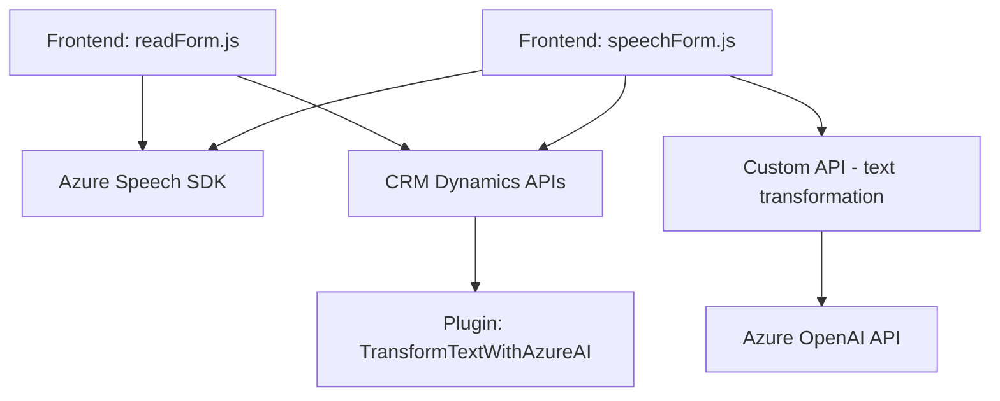

### **Resumen técnico**
Este repositorio contiene una solución orientada a la integración entre un frontend y plugins de Dynamics CRM que interactúan con servicios de Azure, específicamente Azure OpenAI y Azure Speech SDK. La funcionalidad principal gira en torno a la gestión de formularios en una interfaz CRM, habilitando el reconocimiento, síntesis de voz y transformación de texto mediante tecnologías basadas en inteligencia artificial.

---

### **Descripción de la arquitectura**
La solución está organizada como una **n-capas** o **arquitectura modular**. Tiene dos capas principales:
1. **Frontend**: Código JavaScript para manejar la interacción con el usuario, incluyendo la captura de audio/voz (speech-to-text), síntesis de texto (text-to-speech) y sincronización con el sistema CRM.
2. **Backend**: Implementación de un plugin para Dynamics CRM que encapsula lógica que transforma y procesa texto usando un servicio de inteligencia artificial en Azure OpenAI.

### **Tecnologías usadas**
1. **Frontend:**
   - JavaScript como lenguaje principal.
   - **Azure Speech SDK**: Para reconocimiento de audio (speech-to-text) y síntesis de voz (text-to-speech).
   - **Dynamics CRM Xrm API**: Integración en tiempo real con formularios CRM.
   - Modulos personalizados de JavaScript (modularización de funciones).
   - Promesas y funciones asíncronas para manejar APIs externas.

2. **Backend:**
   - **C#**: Lenguaje de programación para los plugins de Dynamics CRM.
   - **Azure OpenAI API**: Para el procesamiento de texto con mayor sofisticación.
   - Microsoft Dynamics SDK: Integración del plugin en eventos del CRM.
   - **Newtonsoft.Json** y `System.Text.Json`: Serialización/deserialización JSON.
   - HTTP client para comunicación con APIs externas.

### **Arquitectura**
- **n-capas**: Separación del frontend y el backend con una clara división de responsabilidades.
- **Event-driven**: Las funcionalidades de reconocimiento y síntesis de voz en el frontend están impulsadas por eventos iniciados por el usuario.
- **Modularización**: Todo el código está estructurado en funciones o clases separadas según su propósito específico.
- **Orientación a servicios (SOA)**: Dependencia directa de servicios de Microsoft Dynamics, Azure Speech SDK y Azure OpenAI.
- **Plugin-based architecture**: El plugin actúa como una extensión de Dynamics CRM.
- **Integración API**: Uso de APIs externas para funciones clave como reconocimiento de voz y transformación de texto.

---

### **Dependencias o componentes externos**
1. **Azure Speech SDK:** Para la síntesis y reconocimiento de voz.
2. **Azure OpenAI API:** Transformación de texto en el backend controlado por el plugin de Dynamics CRM.
3. **Dynamics CRM Xrm API:** Manipulación de formularios y campos en el frontend y backend.
4. **Newtonsoft.Json:** Manipulación del contenido JSON retornado por las APIs.
5. **HttpClient:** Comunicación con APIs externas.
6. **Custom API en Dynamics CRM**: Utilización de una API personalizada (`trial_TransformTextWithAzureAI`) que ejecuta transformaciones mediante el plugin.

---

### **Diagrama en Mermaid**
A continuación, se describe cómo interactúan los componentes del sistema mediante un diagrama Mermaid:

---

### **Conclusión Final**
La solución integra un frontend basado en JavaScript con un backend para Dynamics CRM desarrollado en C#. Su funcionalidad principal es automatizar tareas en un formulario CRM mediante el uso de tecnologías de voz y texto promovidas por Azure. Está estructurado como una arquitectura modular en capas, muy adecuada para un entorno empresarial que dependa de CRM como Dynamics.

La elección de tecnologías y patrones (n-capas, SOA, Event-driven y modularización) refleja buenas prácticas para la modularidad del sistema y escalabilidad. Sin embargo, sería recomendable mejorar el manejo de dependencias (por ejemplo, externalizar las configuraciones de servicios como las claves y endpoints de Azure) y robustecer el manejo de errores en los servicios externos.

Este sistema muestra una sólida implementación, adecuado para organizaciones que buscan optimizar procesos mediante IA y reconocimiento/síntesis de voz.