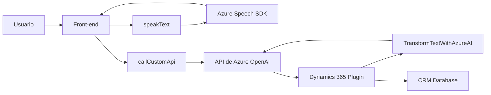

### Breve resumen técnico
El repositorio describe componentes clave para una solución que combina **entrada y salida por voz** con un sistema CRM, utilizando servicios como **Azure Speech SDK** y **Azure OpenAI**. Los módulos front-end manejan reconocimiento y síntesis de voz. Por otro lado, el archivo `.cs` define un **plugin para Dynamics 365** que procesa y transforma datos con IA.

---

### Descripción de arquitectura
- **Tipo de solución:**  
  La solución incluye una **integración de front-end** para entrada/salida por voz junto con un plugin basado en el **modelo extensible de Dynamics 365**. Este diseño utiliza una **arquitectura híbrida** que conecta una capa de presentación y lógica front-end con una capa de back-end en el CRM.
  
- **Arquitectura específica:**  
  - **Híbrida:** El front-end aplica un diseño modular/event-driven sobre JavaScript.  
  - **Plugin-based:** En el entorno del CRM (Dynamics 365), se usa programación basada en eventos para transformar datos mediante lógica personalizada.  
  - **Dependencias externas:** Servicios de Azure (Speech SDK y OpenAI) se integran mediante patrones de proxy y SDK.

---

### Tecnologías usadas
1. **Front-end:**
   - **JavaScript**: Lenguaje principal para manejar interacciones en tiempo real.
   - **SDK Externos:**  
     - **Azure Speech SDK:** Para síntesis y reconocimiento de voz.
     - **DOM Manipulation:** Gestión de elementos HTML y eventos asíncronos.
   - **Event-driven programming:** Lógica basada en eventos y callbacks.

2. **Back-end (Microsoft Dynamics 365 Plugin):**
   - **C#**: Desarrollo del plugin.
   - **Azure OpenAI API:** Modelos IA (GPT-4).  
   - **Microsoft.Xrm.Sdk**: Extensión para cuasi-eventos en CRM.
   - **Newtonsoft.Json**: Manejo avanzado de JSON.

3. **Patrones comunes:**
   - **Callback y Promesas:** Implementado en los scripts JS para manejar tareas asíncronas.
   - **Proxy para APIs:** Comunicación HTTP con Azure OpenAI en el plugin.
   - **Encapsulación Modular:** Código front-end altamente dividido por funcionalidad.

---

### Diagrama Mermaid

Entre ```mermaid y ```:



---

### Conclusión final
La solución es una aplicación que integra funcionalidades de voz e inteligencia artificial dentro de un ecosistema CRM robusto como Dynamics 365. Utiliza patrones diseñados para maximizar modularidad, interoperabilidad con SDK de terceros (Azure APIs), y extensibilidad basada en eventos. Esto la hace ideal para entornos donde la interacción natural por voz y la automatización avanzada sean indispensables.