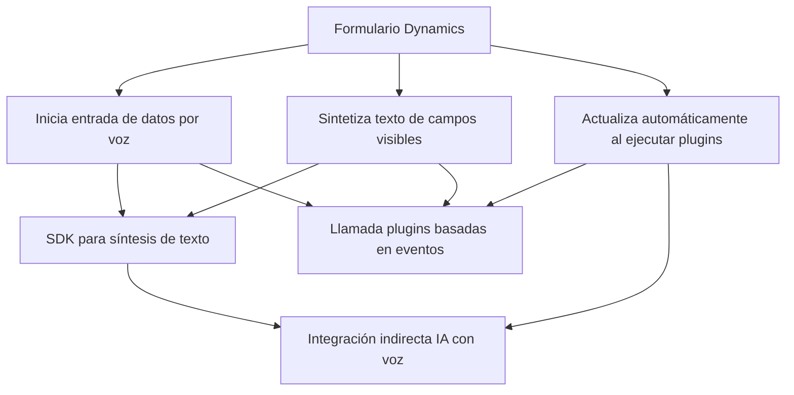

### Breve resumen técnico:
El repositorio contiene varios archivos orientados a la interacción con servicios de Azure y Microsoft Dynamics para crear funcionalidades como entrada y salida de voz mediante el SDK de Azure Speech, procesamiento de formularios, llamadas a APIs personalizadas, y plugins en Dynamics CRM que transforman texto con reglas de Azure OpenAI.

---

### Descripción de arquitectura:
#### 1. **Tipo de solución**:
- **Multicapa**: Diferentes capas que interactúan con servicios externos.
  - **Frontend**: Archivos JavaScript que gestionan vistas y entrada/salida de usuarios.
  - **Backend/Plugins**: Código (C#) que extiende funcionalidades de Dynamics CRM y llama a servicios de inteligencia artificial.

#### 2. **Arquitectura**:
- **Híbrida**:
  - **Monolítica en Dynamics CRM**: Plugins de C# se integran directamente dentro de Dynamics CRM, ejecutándose como parte de su evento de flujo.
  - **Con integración basada en servicios**: Utiliza APIs externas (p.ej., Azure Speech y Azure OpenAI), adoptando el patrón **cliente-servidor**.

#### 3. **Capas involucradas**:
- **Integración API externa**: JavaScript y Plugins en C# actúan como intermediarios para servicios de Azure Speech y Azure OpenAI.
- **Separación de funciones**:
  - Frontend encapsula lógica de UI y datos del usuario (eventos), interactuando con las APIs.
  - Backend (Plugins) transforma y procesa datos bajo reglas específicas antes de reponerlos al usuario o modificar estructuras en Dynamics CRM.

---

### Tecnologías y patrones utilizados:
1. **Frontend (JavaScript)**:
   - Manejo de eventos en formularios visuales de Dynamics.
   - SDK de Azure Speech para entrada y síntesis de voz.
   - Callback y Promesas para operaciones asíncronas.

2. **Backend (C#)**:
   - Plugins extendiendo la funcionalidad de Dynamics CRM (IPlugin Interface).
   - Peticiones HTTP a Azure OpenAI utilizando `System.Net.Http`.
   - Serialización JSON mediante **Newtonsoft.Json** o **System.Text.Json**.

3. **Servicios Externos**:
   - **Azure Speech SDK**:
     - Entrada de voz.
     - Síntesis de voz.
   - **Azure OpenAI**:
     - Transformación personalizada de texto basada en normas definidas (JSON).
   - **Dynamics Web API (`Xrm.WebApi`)**:
     - Operaciones CRUD en entidades del sistema.

4. **Patrones comunes**:
   - **Event-Driven Architecture (EDA)**: Respuesta basada en eventos disparados desde formularios o sistemas CRM.
   - **Cliente-Servidor**: Integración con servicios externos a través de APIs.
   - **Modularidad funcional** en el código JS y C#: Cada función o método encapsula su responsabilidad específica.

---

### Diagrama Mermaid válido para GitHub Markdown:
El siguiente diagrama muestra las principales relaciones entre componentes, tecnologías y servicios externos en la solución propuesta:

---

### Conclusión final:
La solución propuesta en el repositorio combina **frontend JavaScript** para manejar entrada/salida de voz y procesamiento de datos con estas interacciones, junto con un **plugin en C# para Dynamics CRM** que extiende la funcionalidad del sistema mediante el uso de servicios de inteligencia artificial de **Azure OpenAI**. La arquitectura es principalmente **multicapa** con componentes **monolíticos** dentro del sistema Dynamics CRM, pero adopta elementos de **arquitectura basada en servicios** para conectar modelos de IA y procesamiento avanzado. Esta solución demuestra modularidad, integración eficiente de APIs externas y un diseño adaptable al ecosistema empresarial de Microsoft.