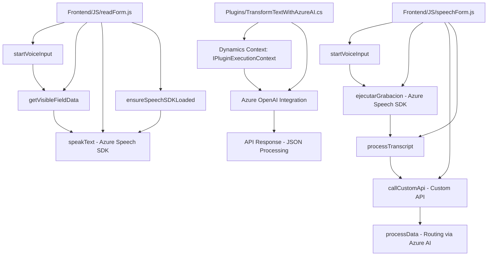

### Breve Resumen Técnico:

El repositorio describe una solución basada en la interacción con formularios en aplicaciones web, con capacidades de voz a texto y texto a voz, utilizando **Azure Speech SDK** y la integración con **Dynamics 365** y **Azure OpenAI API**. Está compuesto por componentes de frontend (en JavaScript) y un plugin backend (en C#) que extiende la funcionalidad de Dynamics 365.

---

### Descripción de Arquitectura:

1. **Tipo de solución**: 
   - API y frontend con procesamiento cliente-servidor. En conjunto, permiten la interacción con formularios mediante voz (frontend) y el procesamiento de texto basado en Azure OpenAI (backend).
   
2. **Arquitectura general**: 
   - La arquitectura sigue el modelo **n-capas**:
     - La capa de **presentación (frontend)** está implementada en JavaScript para la interacción directa con el usuario en el navegador, aprovechando Azure Speech SDK para síntesis y reconocimiento de voz.
     - La capa **de lógica de negocios (backend)** está estructurada como un plugin de Dynamics 365 y usa una lógica centrada en servicios para interactuar con Azure OpenAI y otras dependencias.
     - La capa **de integración** combina las dos anteriores mediante servicios de APIs.

---

### Tecnologías, Frameworks y Patrones Empleados:

1. **Frontend (JavaScript)**:
   - **Azure Speech SDK**:
     - Compra de servicios de voz y texto a voz.
     - Carga dinámica del SDK desde el entorno del navegador.
   - **Cargador dinámico de dependencias**: Usa la función `ensureSpeechSDKLoaded` para cargar el SDK solo cuando sea necesario.
   - **Modularidad del flujo**: Lógica dividida en funciones específicas: síntesis de voz, procesamiento de formularios y captura de datos visibles.

2. **Backend (C# Plugin)**:
   - **Microsoft Dynamics 365** (entorno de CRM).
   - **Azure OpenAI API**: Procesamiento avanzado de texto.
   - **NET Framework APIs**: Manejo de solicitudes HTTP y estructuras JSON dentro del desarrollo con .NET para consumir el servicio de OpenAI.
   - **Newtonsoft.Json** y **System.Text.Json**: Manipulación JSON en el backend.
   - **Patrones arquitectónicos**: Se identifica el uso de patrones como el *Facade* y el *Service Layer* para modularidad y simplificación de lógica.

3. **Integración**:
   - **Dynamics Web API**: Utilizado por el frontend para consultar o modificar registros en Dynamics.
   - **HTTP API Consumption**: Llamadas a servicios de terceros como OpenAI y Azure Speech SDK.

---

### Componentes externos y dependencias:

1. **Azure Speech SDK**:
   - Para interacción con servicios voz-a-texto y texto-a-voz.
   - Cargado dinámicamente en el frontend.

2. **Azure OpenAI API**:
   - Utilizada en el backend para el procesamiento avanzado de texto basado en IA.
   - Se requiere una clave y un endpoint de configuración.

3. **Microsoft Dynamics Web API**:
   - Exposición de APIs para la integración de dinámica de datos desde Dynamics 365.
   - Utilizado tanto en el plugin como en el frontend.

4. **Newtonsoft.Json & System.Text.Json**:
   - Frameworks de manipulación JSON en el plugin de backend.

5. **HttpClient** y servicios relacionados en C# .NET:
   - Para comunicación HTTP con Azure APIs.

---

### Diagrama Mermaid (GitHub Compatible):

---

### Conclusión Final:

El repositorio muestra una solución bien estructurada para integrar servicios de voz y procesamiento de texto en aplicaciones que usan **Dynamics 365** y **Azure Services**. La arquitectura del sistema está orientada a n-capas con una clara separación entre lógica de presentación (frontend) y lógica de negocios (backend). Esta separación hace que la solución sea escalable y facilite su mantenimiento.

Sin embargo, se podrían mejorar aspectos como:
- Incorporar un diseño más orientado a objetos en el frontend para gestionar la lógica de manera más organizada.
- Implementar patrones como *dependency injection* en el backend para una mayor flexibilidad en la gestión de dependencias.

En resumen, se trata de una solución robusta que aprovecha servicios externos como **Azure Speech SDK** y **Azure AI** para construir aplicaciones inteligentes con interacción por voz y procesamiento de texto.