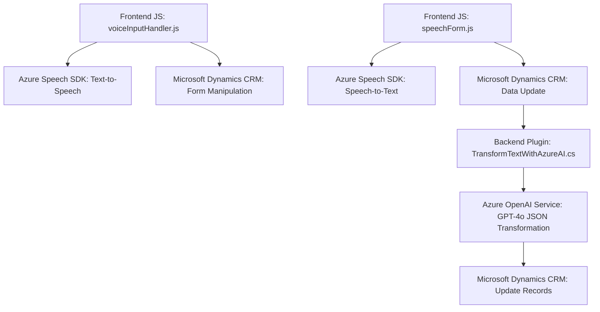

### **Breve Resumen Técnico**
El repositorio presenta una solución orientada a la interacción entre formularios en un sistema CRM basado en **Microsoft Dynamics 365** y diversos servicios en la nube proporcionados por **Azure**. La funcionalidad principal incluye:
- La lectura y asignación dinámica de datos de formularios usando reconocimiento de voz (Azure Speech SDK).
- La sintetización de voz basada en texto.
- Un plugin que conecta Microsoft Dynamics CRM con Azure OpenAI para realizar transformaciones avanzadas de texto a JSON usando inteligencia artificial.

---

### **Descripción de Arquitectura**
La arquitectura combina varios paradigmas:
- **FrontEnd basado en JavaScript:**
  - Se utiliza para la interacción en cliente con el sistema.
  - Incluye módulos que trabajan con formularios en Dynamics 365 y aprovechan las capacidades del navegador y del Azure Speech SDK.
- **Backend plugin en C#:**
  - Un plugin implementado bajo Dynamics CRM extiende la funcionalidad del servidor mediante integración con Azure OpenAI.
- **Service-Oriented Architecture (SOA):**
  - Usa múltiples servicios de Azure: Speech SDK para reconocimiento y síntesis de voz, y OpenAI para procesamiento de texto.

El diseño es modular, con componentes cohesionados, cada uno siguiendo una clara asignación de responsabilidades:
1. FrontEnd JavaScript para la capa de interfaz y reconocimiento/síntesis de voz.
2. Backend para procesamiento avanzado de datos con APIs externas.

Si bien hay separación entre las funcionalidades de cliente (JavaScript) y servidor (plugin C#), la arquitectura no cumple completamente con los principios de Arquitectura Hexagonal. Es más cercana a una **arquitectura de capas**.

---

### **Tecnologías Usadas**
1. **Cliente (Frontend):**
   - **Azure Speech SDK**: Integración para reconocimiento y síntesis de voz desde formularios.
   - **JavaScript/ES6+**: Para definir lógica de procesamiento en el navegador, manipulación del DOM y asincronía.
   - **Microsoft Dynamics 365 Web APIs**: Para interactuar con el backend del sistema CRM.

2. **Backend (Plugin en C#):**
   - **Microsoft Dynamics 365 SDK**: Framework para extensiones de funcionalidad en forma de plugins.
   - **Azure OpenAI**: Inteligencia Artificial con el modelo **GPT-4o** para transformar texto en formato estructurado.
   - **Newtonsoft.Json** y **System.Text.Json**: Para manejar datos JSON.

3. **Patrones Observados:**
   - **SOA (Service-Oriented Architecture):** Integración de APIs externas como servicios autónomos.
   - **Modularización:** Cada módulo o plugin tiene una función específica.
   - **Asincronía:** Uso de callbacks y promesas en el frontend para la gestión de SDK y opciones de voz.
   - **Factory Pattern:** Para la creación de servicios de Dynamics CRM (`IOrganizationServiceFactory`).

---

### **Diagrama Mermaid**

---

### **Conclusión Final**
La solución representa una arquitectura bien estructurada que aprovecha servicios en la nube (Azure Speech SDK y Azure OpenAI) y las capacidades de extensibilidad de Dynamics 365 CRM. Aunque funcional, la arquitectura se beneficia de una organización más clara siguiendo posibles principios como Arquitectura Hexagonal o uso de pipelines para desacoplar lógicas del negocio de SDKs externos.

- **Fortalezas:** 
  - Modularidad del código.
  - Integración con tecnologías líderes.
  - Uso de servicios asincrónicos.

- **Debilidades:** 
  - Fuerte vínculo directo con servicios externos que dificulta testeo unitario y la portabilidad.
