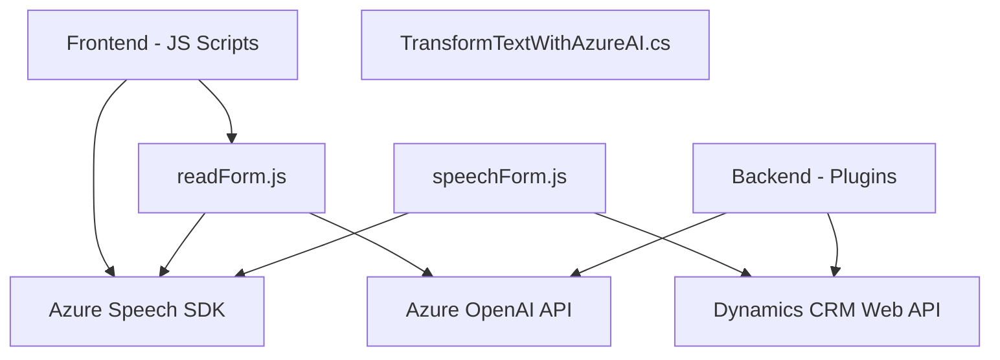

### Breve Resumen Técnico

El repositorio implementa funcionalidades relacionadas con el procesamiento de datos obtenidos desde formularios HTML y entrada de voz, que son convertidos a texto utilizando el **Azure Speech SDK**, así como mecanismos avanzados para transformar texto en JSON mediante la **Azure OpenAI API**. Estos datos se integran directamente con Microsoft Dynamics CRM para actualización de formularios y otros procesos relacionados.

---

### Descripción de Arquitectura

La estructura del proyecto muestra un sistema modular orientado al procesamiento de voz y datos dinámicos, con interacción directa con servicios externos como el **Azure Speech SDK**, la **Azure OpenAI API**, y la **Dynamics CRM Web API**. Basándonos en los elementos observados, el sistema sigue una arquitectura de **capas (n-tier)**; la solución incluye:
- **Frontend (Web Layer):** Scripts JavaScript procesan formularios y manejan datos del usuario (entrada de voz y texto).
- **API/Integración (Application Layer):** Se comunica con servicios en la nube (Azure SDK, Dynamics CRM API) para realizar tareas de síntesis de voz, transcripción y análisis de texto mediante IA.
- **Backend (Plugins Layer):** Implementado en C# y integrado directamente como plugin en Dynamics CRM; maneja transformación de datos con IA.

---

### Tecnologías Usadas

1. **Frontend**
   - Lenguaje: JavaScript.
   - Framework/Librerías: Azure Speech SDK (cargado externamente desde URL específica).
   - HTML para formularios dinámicos.

2. **Backend**
   - Lenguajes: C#.
   - Framework para Dynamics CRM Plugins.
   - Interacción con Microsoft/Xrm SDK.
   - Uso de `HttpClient` y librerías para manejo de JSON (`System.Text.Json`, `Newtonsoft.Json.Linq`) para integrarse con Azure OpenAI API.

3. **Servicios Externos**
   - **Azure Speech SDK:** Reconocimiento y síntesis de voz.
   - **Azure OpenAI:** Transformación de texto a JSON estructurado usando IA.
   - **Microsoft Dynamics CRM Web API:** Obtención y modificación de datos en un CRM mediante HTTP requests.

4. **Patrones**
   - Arquitectura de capas, encapsulando lógica de interacción en distintas partes del sistema.
   - Uso de patrones modernos de programación:
     - Callback-based async programming en frontend.
     - Modularización.
     - Connector Pattern (interfaz entre sistemas).
     - Plugin Pattern para Dynamics CRM.
   - Gestión de errores e integración con SDK externos.

---

### Diagrama Mermaid

---

### Conclusión Final

Este repositorio representa una solución de **n capas**, con componentes distribuidos entre frontend, aplicación y servicios externos. Su propósito principal es la interacción con Dynamic CRM, donde los datos del formulario o entrada de voz se procesan, estructuran y transforman mediante IA para ser aplicados en el sistema CRM. A nivel arquitectónico, cumple con patrones modernos de modularización y manejo de componentes externos. Sin embargo, hay oportunidades de optimización en la seguridad y mantenimiento, como eliminar configuraciones hardcoded y librerías innecesarias.