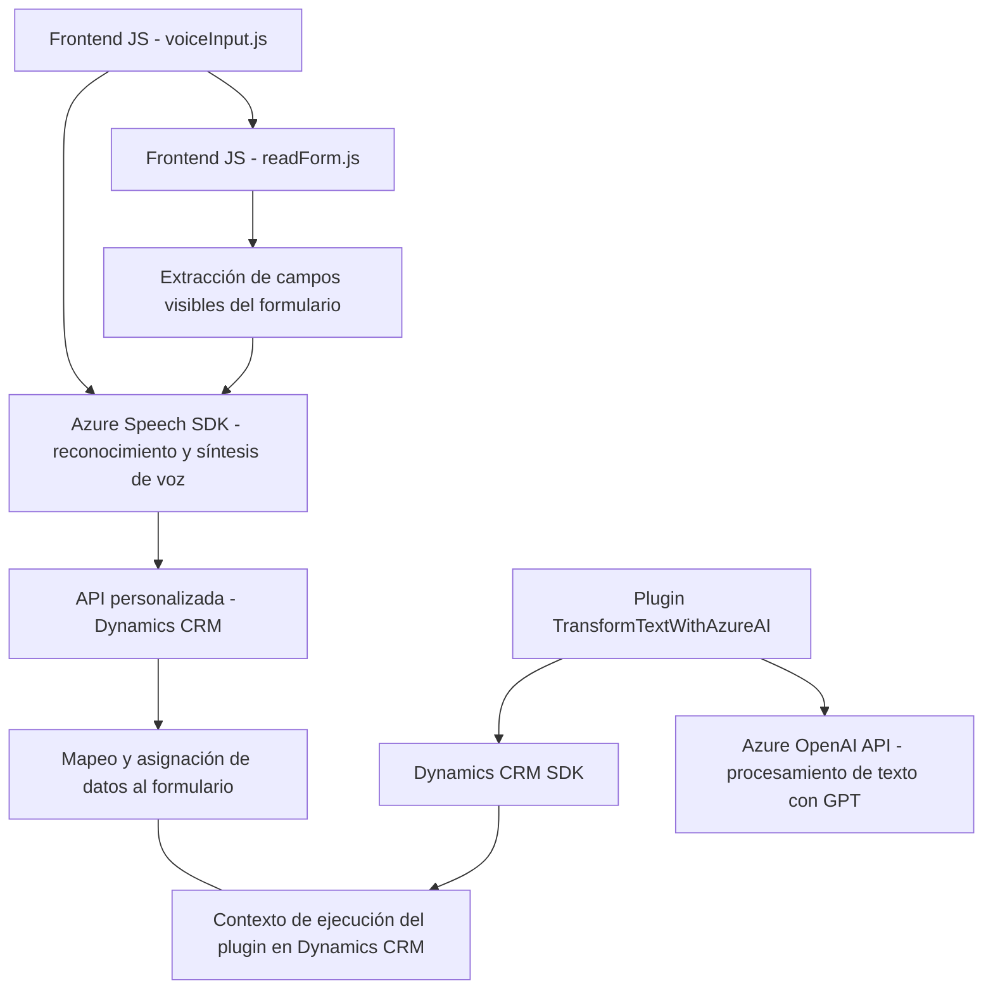

# Breve Resumen Técnico

El repositorio contiene archivos organizados en tres áreas funcionales que abordan la interacción entre un frontend de Dynamics CRM y servicios externos de Azure. La solución general incluye:
1. **Frontend/JS**: Scripts que habilitan reconocimiento y síntesis de voz utilizando Azure Speech SDK para interactuar con formularios y API de Dynamics CRM.
2. **Plugins**: Extensión personalizada de Dynamics CRM que utiliza Azure OpenAI para transformar entradas de texto en estructuras JSON basadas en reglas específicas.

La solución ofrece funcionalidad avanzada basada en:
- Reconocimiento y síntesis de voz.
- Procesamiento de transcripciones con inteligencia artificial.
- Transformación semántica de texto mediante un plugin en Dynamics CRM.

---

# Descripción de Arquitectura

La arquitectura sigue un enfoque de **n capas modificado**, combinando:
- **Presentación (Frontend)**: Scripts JavaScript para interfaz interactiva del usuario.
- **Capa lógica**: Utiliza funciones de Dynamics CRM y plugins para procesamiento backend.
- **Integración externa**: Comunicación con servicios específicos de Azure (Speech SDK para voz y OpenAI para procesamiento inteligente). 

Los componentes trabajan juntos de forma modular:
1. **Frontend Scripts (Handlers)**: Capturan y procesan datos o entrada de voz en el cliente.
2. **Plugins**: Extendibilidad para transformar texto mediante servicios de IA en capa de backend.
3. **Integración Asíncrona**: Llamadas API REST y tareas en segundo plano para manejar SDKs externos.

---

# Tecnologías Usadas

1. **Frontend**:
   - **JavaScript (ES6)**: Base del código.
   - **Azure Speech SDK**: Reconocimiento y síntesis de voz.
   - **Dynamics CRM Web API** (`Xrm.WebApi`).

2. **Backend (Plugins)**:
   - **C# (.NET Framework)**: Programación del plugin.
   - **Dynamics CRM SDK** (`Microsoft.Xrm.Sdk`).
   - **Azure OpenAI** para procesamiento basado en GPT.
   - **System.Net.Http**: Comunicación API REST.
   - **Newtonsoft.Json**: Manipulación avanzada de JSON.

---

# Diagrama Mermaid

---

# Conclusión Final

La solución presentada es una implementación de **n capas** altamente integrada que combina tecnologías frontend (JavaScript) y backend (Dynamics CRM SDK con .NET y plugins personalizados) para procesar voz, manejar formularios en Dynamics CRM, y aplicar inteligencia artificial avanzada basada en Azure. 

Este diseño modular facilita la extensibilidad y adaptabilidad en diferentes entornos a través de servicios externos como Azure Speech SDK y OpenAI, destacándose como una arquitectura orientada a servicios (SOA) centrada en su integración con servicios cloud.