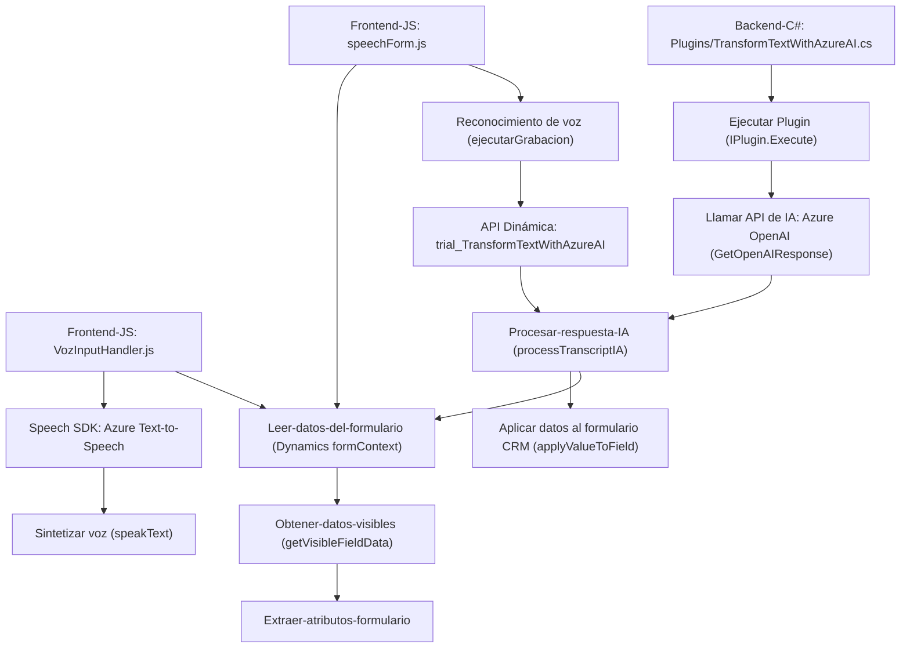

### Breve resumen técnico
El repositorio está enfocado en la integración de **Azure Speech SDK** y **Azure OpenAI** con **Microsoft Dynamics 365**. Los archivos proporcionados describen funcionalidades para extraer datos de formularios dinámicos en Dynamics, procesarlos y usar la entrada de voz o texto como interfase activa.

---

### Descripción de arquitectura
1. **Tipo de solución:** API y frontend para procesamiento de voz y texto (interfaz cliente) junto con un plugin en el servidor para la integración de IA mediante normas personalizadas.
   
2. **Arquitectura:**
   - El cliente (frontend) adopta un enfoque **n capas**, organizando las responsabilidades de entrada de datos (voz/formulario), procesamiento intermedio (SDK, lógica de negocio) y transmisión hacia servicios externos.
   - El plugin en Dynamics usa **arquitectura hexagonal**, combinando interacciones con servicios externos (Azure OpenAI) y el núcleo funcional del CRM Dynamics a través de eventos disparados por usuarios.

---

### Tecnologías usadas
1. **Frontend:**
   - **JavaScript:** Para lógica local y comunicación asincrónica con servicios externos.
   - **Azure Speech SDK:** Text-to-Speech (TTS) y Speech-to-Text (STT) para reconocimiento y síntesis de voz.
   - Funcionalidad dinámica relacionada con formularios de **Dynamics 365** y llamadas a su **Web API**.

2. **Backend (plugin):**
   - **C# y .NET:** Backend mediante el SDK de Dynamics CRM (`IPlugin`), con acceso a objetos de servicio y manejo de eventos.
   - **Azure OpenAI API:** Integración mediante el servicio de IA de Azure para transformar texto en JSON estructurado según normas específicas.
   - **HttpClient:** Para realizar solicitudes y procesamiento de respuestas desde APIs REST.
   - **Newtonsoft.Json:** Manipulación avanzada de datos JSON.

---

### Dependencias y componentes externos
#### Frontend:
- **Azure Speech SDK:** Para realizar reconocimiento y síntesis de voz desde el navegador.
- **Dynamics 365 Web API:** Para enviar datos desde el cliente al sistema CRM.
- **Custom API `trial_TransformTextWithAzureAI`:** API personalizada para ejecutar lógica externa basada en IA.

#### Backend (Plugin):
- **Azure OpenAI:** Servicio de inteligencia artificial para transformar texto según normas específicas.
- **Microsoft.xrm.sdk:** Para comunicarse con Dynamics 365 (con acceso a entidades y servicios).
- **JSON/HttpClient:** Dependencias estándar de C#.

---

### Diagrama Mermaid 100 % compatible con GitHub Markdown

---

### Conclusión final
El repositorio implementa una solución orientada a integrar funcionalidades avanzadas de voz, texto, y servicio de transformación de datos en sistemas **Microsoft Dynamics 365**. Utiliza una arquitectura **n capas** en la parte frontend (modularizada con funciones especializadas) y **hexagonal** en el backend (plugin), intercambiando información mediante servicios externos, lo que agrega capacidades como reconocimiento de voz, síntesis de texto, e integración con IA. Es evidente su enfoque en una arquitectura extensible y basada en servicios (SaaS) con dependencias bien organizadas.