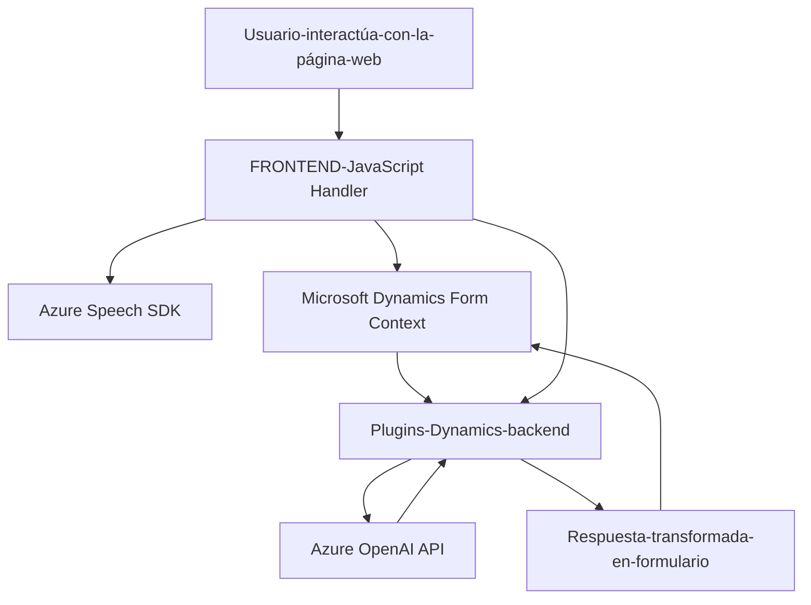

### **Breve resumen técnico**
El repositorio contiene una solución basada en módulos JavaScript (para interacción en frontend) y un plugin en C# diseñado para integrarse con Microsoft Dynamics CRM. Utiliza la biblioteca de Azure Speech SDK para proporcionar reconocimiento de voz y síntesis de texto a voz en el frontend, mientras que el plugin en C# emplea Azure OpenAI API para transformar texto según normas específicas.

---

### **Descripción de arquitectura**
La solución está diseñada con una arquitectura híbrida basada en **microservicios** acoplados al esquema CRM de Dynamics 365.
1. **Componentes Frontend**: 
   - Modular, enfocado en funcionalidades específicas como entrada de voz, procesamiento de textos y actualización dinámica de formularios.
   - Framework de soporte: JavaScript DOM manipulación y carga de dependencias dinámicas.
   - Integración con **Azure Speech SDK** y sus servicios a nivel de frontend.
2. **Backend**:
   - Un plugin en C# conectado a Microsoft Dynamics CRM, que se comunica con **Azure OpenAI API** para realizar operaciones de procesamiento.
   - Estilo de arquitectura basado en servicios externos (API REST).
   
---

### **Tecnologías y patrones utilizados**
1. **Frontend (JavaScript)**:
   - Lenguaje: JavaScript (ECMAScript).
   - Sdks: Azure Speech SDK (para reconocimiento de voz y síntesis de texto).
   - Dependencias dinámicas cargadas desde la web.
   - Patrones:
     - Modularidad funcional para aislar tareas específicas.
     - Event-Driven Architecture (procesos desencadenados por eventos como interacción de usuario).
     - Gestión dinámica de dependencias para cargar SDK en tiempo de ejecución.

2. **Backend (C# Plugin)**:
   - Lenguaje: C#.
   - Framework: Microsoft Dynamics SDK.
   - Sdks/Librerías:
     - Microsoft.Xrm.Sdk (integración con Dynamics CRM).
     - Azure OpenAI API (procesamiento de texto e integración con transformación IA).
     - System.Text.Json y Newtonsoft.Json.Linq para manipulación de JSON.
     - Regex para transformación y validación de entrada.
   - Patrones: 
     - Plugin Design Pattern.
     - Service Provider Pattern.
     - Integración de Microservicio a través de API externa.

---

### **Dependencias o componentes externos**
1. **Frontend**:
   - Azure Speech SDK: Proporciona reconocimiento de voz y síntesis de texto en el explorador.
   - JavaScript DOM API: Manipulación de elementos HTML y gestión de scripts.
   - Configuración dinámica de API (e.g., claves de Azure).
2. **Backend**:
   - Microsoft Dynamics CRM para obtener el texto de entrada y escribir los valores transformados.
   - Azure OpenAI API para transformar el texto según normas específicas.
   - Hosting: El plugin es cargado como un componente en el ecosistema Dynamics.
3. **General**:
   - Requiere configuraciones seguras para claves de API y conexión a los servicios de Azure a través de variables de entorno o soluciones como **Azure Key Vault**.

---

### **Diagrama Mermaid** 

---

### **Conclusión Final**
La solución representa una arquitectura basada en **microservicios** centrada en la experiencia del usuario a nivel de frontend y el poder de IA en backend. Con una integración robusta entre Azure Speech SDK en frontend y Azure OpenAI en el backend, se puede implementar un sistema flexible para formularios dinámicos con interacción por voz y procesamiento de texto avanzado.

Sin embargo, la gestión de claves de Azure necesita ser mejorada por razones de seguridad (por ejemplo, mover las claves a solución de vault). Además, la funcionalidad de cada elemento está bien organizada, lo que permite una extensión modular tanto en frontend como en plugins backend.