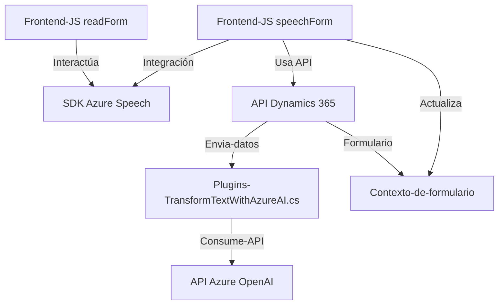

# Análisis Técnico del Repositorio de GitHub

## Breve resumen técnico:
El repositorio incluye tres componentes principales:
1. **Frontend/JS/readForm.js**: Implementa funciones para síntesis de voz utilizando el Azure Speech SDK y datos de formularios.
2. **Frontend/JS/speechForm.js**: Proporciona reconocimiento de voz y actualización del formulario en Dynamics 365 mediante el SDK y APIs personalizadas.
3. **Plugins/TransformTextWithAzureAI.cs**: Es un plugin que integra con Microsoft Dynamics CRM para transformar texto en JSON con la API de Azure OpenAI.

## Descripción de la Arquitectura:
La solución combina diversos servicios y componentes:
- **Arquitectura basada en eventos y microservicios**: La solución exhibe una arquitectura en la que se conecta el frontend con servicios externos (Azure Speech SDK y Dynamics 365 API). Además, utiliza un backend que se integra directamente con Dynamics CRM y Azure OpenAI, abordando tareas específicas mediante plugins.
- **Capas del sistema**:
  - **Frontend**: Contiene los módulos JavaScript que interactúan con el SDK de Azure Speech y Dynamics 365.
  - **Backend Plugin**: El código C# configura un microservicio mediante plugins para extender la funcionalidad dinámica de Dynamics CRM usando OpenAI.

## Tecnologías Usadas:
1. **Del lado frontend**:
   - **Azure Speech SDK**: Usado para síntesis de voz y reconocimiento de voz desde formularios HTML dinámicos en Dynamics CRM.
   - **Dynamics 365 Web API**: Se utiliza `executionContext` para leer y actualizar formularios.
   - **JavaScript**: Adopta un enfoque modular y asincrónico.
   - Patrones:
     - Modularización del código en funciones con propósitos específicos.
     - Programación basada en eventos.
   
2. **Del lado backend**:
   - **Microsoft Dynamics CRM Plugin Architecture**: Su implementación sigue el modelo de desarrollo de plugins.
   - **Azure OpenAI API (GPT)**: Para transformar texto en JSON estructurado.
   - **C# con .NET SDK**: Redacción de plugins y consumo de APIs.
   - Patrones:
     - Plugin architecture: Para integrar con eventos de Dynamics CRM.
     - Consumo de Remote APIs: Para interacción con Azure OpenAI.
   
3. **Dependencias**:
   - **Externas**:
     - Azure Speech SDK (Frontend, síntesis/reconocimiento).
     - Azure OpenAI (Backend, transformación de datos).
     - Dynamics 365 API (actualización y consumo dinámico de formularios).
   - **Internas**:
     - Métodos auxiliares en JS para mapeo y procesamiento de datos.
   
## Diagrama **Mermaid** para GitHub Markdown:
A continuación, se presenta un diagrama de los componentes, su interacción y los servicios externos utilizados.

## Conclusión Final:
La solución de este repositorio es una implementación híbrida que combina un frontend, APIs de servicios externos (Azure Speech, Dynamics 365, Azure OpenAI), y un backend con plugins en C#. Esta arquitectura parece estar diseñada para mejorar la interacción en sistemas como Dynamics 365 utilizando reconocimiento de voz, conversión de texto y automatización con IA. La estructura del código evidencia modularidad, separación de responsabilidades y uso extensivo de servicios. Es una arquitectura flexible que aprovecha tanto las capacidades de integración API como la extensión funcional de Dynamics CRM mediante plugins.