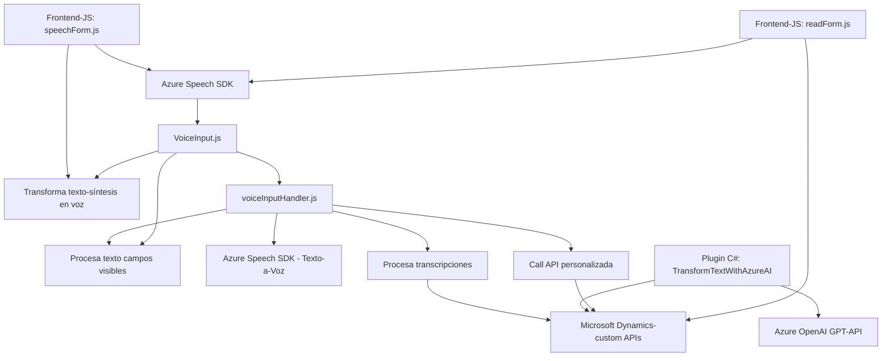

### Breve resumen técnico
El repositorio presentado implementa funcionalidades relacionadas con el manejo de **entrada/salida de voz**, inteligencia artificial aplicada al procesamiento de texto, y extensiones para sistemas CRM (Dynamics 365) usando servicios en la nube. Estas capacidades aprovechan tecnologías de Microsoft Azure como Speech SDK y OpenAI API. La solución puede clasificarse como una integración a nivel **front-end** y **back-end** dentro de aplicaciones empresariales basadas en formularios dinámicos.

---

### Descripción de arquitectura
La arquitectura parece estar basada en una combinación de **arquitectura en capas** y **microlibrerías integradas**, donde se observa claramente:
1. Un módulo **frontend JS** que interactúa con formularios dinámicos, utilizando Azure Speech SDK para lectura y síntesis de voz.
2. Un módulo **plugin de backend** diseñado para agregar capacidades de procesamiento avanzado de texto (Azure OpenAI) en un entorno Dynamics 365.
3. Mecanismos de integración y extensión basados en patrones como **Facade**, **Event-driven architecture**, **Command pattern** y **Plugin architecture**.

En conjunto, es una solución híbrida que cubre **accesibilidad**, **reconocimiento de voz**, y **procesamiento AI en formularios empresariales**.

---

### Tecnologías usadas
1. **Frontend:** 
   - **Azure Speech SDK**: Utilizado para reconocimiento de voz y síntesis de audio.
   - JavaScript con integración directa a Dynamics 365's API (`formContext`, `Xrm.WebApi`).

2. **Backend/Plugins:**
   - **C# .NET Framework**: Utilizado para crear un plugin que interactúa con Dynamics 365 y Microsoft.Xrm.Sdk.
   - **Azure OpenAI API**: Para procesamiento y generación avanzada de texto (GPT-based models).
   - **NewtonSoft JSON**: Para manejo y parsing de estructuras JSON.

3. **Integration Services:**
   - Microsoft Dynamics 365 API.
   - APIs REST de Azure Speech y Azure OpenAI.

---

### Diagrama **Mermaid** válido para GitHub

---

### Conclusión final
La solución propuesta parece enfocada en mejorar la **interacción a través de voz** en **formularios empresariales dinámicos**, proporcionando accesibilidad, automatización y capacidades avanzadas de inteligencia artificial. La arquitectura es híbrida, con capas más evidentes en el backend y modularidad en el frontend basada en funciones. La integración de servicios externos como Azure Speech SDK, OpenAI API y Dynamics 365 es un punto clave que demuestra la versatilidad del sistema. Sin embargo, garantizar la seguridad en el manejo de claves de Azure y datos sensibles del CRM será esencial para mantener la confiabilidad de la solución.