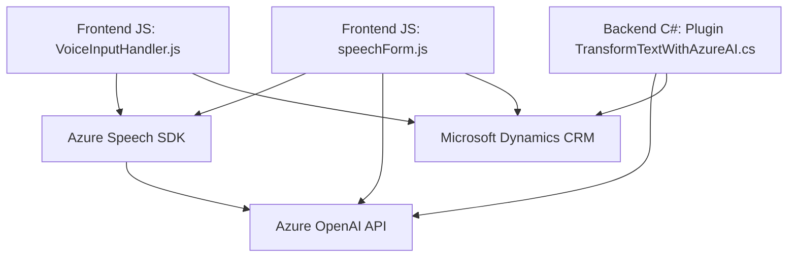

### Breve resumen técnico

La solución en el repositorio es una **aplicación híbrida** que integra lógica para el manejo de fórmulas con entrada/salida de voz, utiliza el **Azure Speech SDK** y un **plugin de Dynamics CRM** para realizar procesamiento avanzado de texto con **Azure OpenAI API**. Los archivos de JavaScript implementan funcionalidad para conectarse y manejar datos de formularios, mientras que el plugin en `C#` extiende la lógica del CRM para un procesamiento más elaborado por medio de reglas definidas.

### Descripción de arquitectura

1. **Tipo de solución**: La arquitectura combina un frontend basado en JavaScript (para formularios manejados por voz) con un backend extensible de Microsoft Dynamics 365, en forma de plugins. La solución tiene un enfoque **cliente-servidor** para la integración con APIs externas como Azure Speech y Azure OpenAI.
2. **Tipo de arquitectura**: 
   - **N capas (3):** 
     - **Presentación:** Interacción con formularios manejados por voz.
     - **Lógica de negocio:** Tanto el frontend como el plugin procesan datos y aplican las reglas correspondientes.
     - **Persistencia/API:** Uso de Dynamics CRM para interactuar con la base de datos y Azure APIs para procesamientos avanzados.
   - El diseño también tiende hacia un modelo **plug-in architecture** en el backend de Dynamics CRM, acoplándose a su ecosistema.
3. Modularización: Los archivos de frontend separan lógicas específicas en funciones para manejo del SDK, entrada/salida de voz, y mapeo entre atributos o campos del formulario.
4. **Patrones destacados**: Modularización, integración de servicios, procesamiento condicional, gateway pattern.

### Tecnologías usadas

- **Frontend**:
  - Lenguaje: JavaScript.
  - Frameworks: Utilización directa del contexto DOM y APIs dinámicas de Dynamics 365.
  - SDK: **Azure Speech SDK para síntesis y reconocimiento de voz**.
  
- **Backend**:
  - Lenguajes: C#.
  - Frameworks:
    - **Microsoft Dynamics SDK** (`IPlugin`, `IServiceProvider`) para extender la lógica del CRM.
    - **Newtonsoft.Json** y **System.Text.Json** para manipulación de JSON.
  - APIs externas: **Azure OpenAI API** para transformación avanzada de texto.

- Dependencias comunes:
  - Sistema de integración asincrónica de APIs como el uso de peticiones HTTP para comunicar con Azure.

### Diagrama Mermaid válido para GitHub

### Conclusión final

La solución utiliza un enfoque moderno con integración de servicios basados en IA, aprovechando directamente herramientas de Microsoft como Azure Speech SDK y OpenAI, además de Dynamics CRM. Su arquitectura es **modular** y **expandible** mediante patrones comúnmente asociados a arquitecturas de **plug-ins** y 3 capas. Los archivos están bien estructurados y organizados por responsabilidades, lo que facilita su mantenimiento y extensibilidad. Sin embargo, el diseño podría beneficiarse de una mayor independencia entre módulos (por ejemplo, desacoplar aún más la conexión directa con Dynamics y Azure).