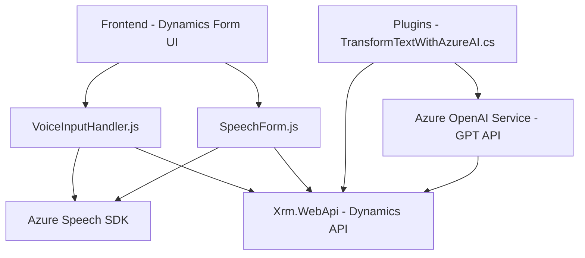

### Breve resumen técnico:

El repositorio implementa diversos componentes centrados en la interacción entre usuarios y formularios dinámicos de Dynamics 365 CRM utilizando reconocimiento de voz basado en el SDK de Azure Speech y procesamiento de texto con Azure OpenAI. Esto incluye elementos de frontend, integración con un sistema CRM, y un plugin para procesamiento avanzado de datos mediante inteligencia artificial.

---

### Descripción de la arquitectura:

La solución sigue una arquitectura híbrida, donde se integran múltiples capas y una aproximación a la **arquitectura n-capas**. Cada capa tiene una responsabilidad específica:
1. **Frontend:** Archivos JavaScript para la gestión del reconocimiento de voz, adaptación de formularios dinámicos y consumo de APIs externas (Azure Speech SDK y OpenAI GPT API).
2. **Backend:** Plugins desarrollados en .NET para integrar lógica avanzada en Dynamics CRM utilizando patrones estándar de plugin (via `IPlugin`).
3. **Servicios Externos:** Interacción basada en APIs REST como el SDK de Azure Speech y Azure OpenAI para tareas especializadas, como reconocimiento de voz o procesamiento de texto.

---

### Tecnologías usadas:

1. **Frontend:**
   - **Azure Speech SDK:** Para el reconocimiento y síntesis de voz.
   - **Dynamics CRM Xrm.WebApi:** Para la gestión y modificación dinámica de formularios.
   - **HTML DOM APIs:** Gestión de elementos del DOM y carga dinámica de recursos (como el SDK).

2. **Backend:**
   - **Microsoft Dynamics SDK:** Para implementar plugins sobre la plataforma Dynamics.
   - **Azure OpenAI Service:** Transformación de texto a través de modelos GPT.
   - **C#/.NET Framework:** Desarrollo de plugins para el entorno CRM.

3. **Patrones utilizados:**
   - **Event-driven Architecture:** Uso de eventos y callbacks para orquestar la funcionalidad dependiente de recursos externos.
   - **Modular Design:** Cada archivo contiene funciones claramente segmentadas por responsabilidad.
   - **Integration Pattern:** Integración de servicios externos mediante sus APIs.
   - **n-Capas con interacción directa:** Provisión de interfaz entre usuarios, CRM y servicios externos (Azure).

---

### Dependencias o componentes externos:

1. **Azure Speech SDK**
   - Reconocimiento y síntesis de voz.
   - Internamente, utiliza servicios de Azure AI, incluyendo modelos específicos para voz a texto.

2. **Microsoft Dynamics CRM SDK (Xrm.WebApi)**
   - Para manipular formularios en Dynamics 365.
   - Procesamiento de atributos y objetos directamente sobre la interfaz de usuario.

3. **Azure OpenAI Service**
   - Integración con modelos GPT mediante solicitudes HTTP.
   - Analiza texto y devuelve estructuras en JSON. 

4. **System Libraries (for Plugins):**
   - `System.Net.Http`: HTTP communication with external services.
   - `Newtonsoft.Json.Linq` and `System.Text.Json`: Parsing and handling of JSON responses from APIs.

---

### Diagrama Mermaid válido para GitHub:

---

### Conclusión final:

La solución representa una robusta integración de servicios externos, inteligencia artificial y gestión de formularios dinámicos dentro de la plataforma Dynamics 365 CRM. El diseño modular y los patrones arquitectónicos usados (event-driven, integración de servicios, n-capas) hacen que el sistema sea extensible, mantenible y preparado para futuras expansiones. La combinación de Azure Speech SDK y Azure OpenAI proporciona funcionalidades avanzadas como interacción por voz y procesamiento de lenguaje natural, lo que mejora la interacción del usuario y optimiza tareas manuales en el sistema CRM.