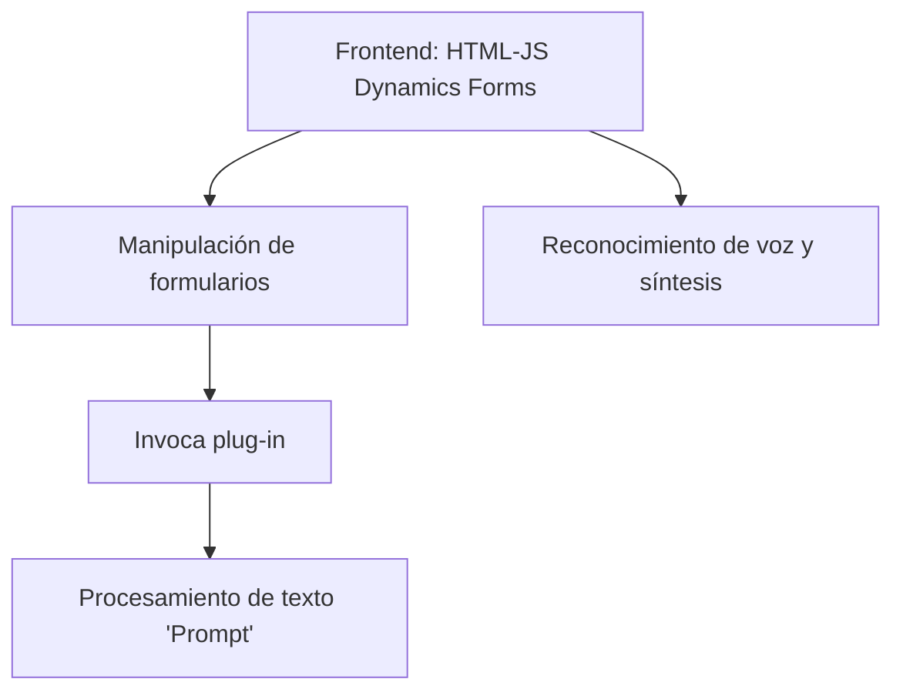

### Resumen técnico
El repositorio contiene código orientado a la interacción entre frontend y servicios de Microsoft Dynamics CRM, mediante integración con servicios de Azure Speech SDK y Azure OpenAI Service. El objetivo principal es implementar funcionalidades relacionadas con el reconocimiento de voz, síntesis de texto a voz y transformación de texto en estructuras JSON.

---

### Descripción de arquitectura
La solución tiene un enfoque **n-capas funcional**, donde el frontend (JavaScript) interactúa directamente con servicios de Azure Speech y APIs de Dynamics CRM para procesar voz y texto. 

Por otro lado, se incluye un plug-in desarrollado en C# para extender las funcionalidades de Dynamics CRM, delegando la tarea de transformar texto con servicios REST hacia Azure OpenAI. La arquitectura puede clasificarse como **Service-Oriented Architecture (SOA)** debido al aprovechamiento de servicios externos y APIs especializadas.

---

### Tecnologías usadas
1. **Frontend (JavaScript)**:
   - Framework: Sin evidencia de frameworks frontend específicos (como React o Angular), el código parece operar en un entorno estándar de Dynamics CRM.
   - SDK: Azure Speech SDK para reconocimiento y síntesis de voz.
   - API: Dynamics CRM Web API para manipulación de formularios y datos.

2. **Backend (C#)**:
   - Framework: .NET para desarrollo del plug-in.
   - Microsoft.Xrm.Sdk para integración con Dynamics CRM.
   - Azure OpenAI Service con HTTP para procesamiento de texto.

3. **Otras herramientas**:
   - `Newtonsoft.Json.Linq` y `System.Text.Json` para manipulación de datos JSON.

4. **Patrones adoptados**:
   - Modularización: Separación de funciones para operaciones específicas.
   - Adapter Pattern: En el plug-in para conectar Dynamics CRM con Azure OpenAI.
   - Service-Oriented: Delegación de tareas como reconocimiento de voz y transformación de texto en servicios externos.

---

### Diagrama Mermaid

---

### Conclusión final
La solución integra Microsoft Dynamics CRM con servicios de Azure para habilitar funcionalidades avanzadas de voz y texto. Su diseño modular y orientado a servicios mejora la escalabilidad y el aprovechamiento de APIs especializadas.

Recomendaciones:
1. **Seguridad**: Implementar configuración mediante archivos seguros para evitar exposición de claves API en el código.
2. **Validaciones más robustas**: Ampliar la gestión de errores en las solicitudes a servicios externos (Azure).
3. **Escalabilidad adicional**: Considerar el uso de configuraciones basadas en contenedores (Docker) o microservicios para aislar componentes críticos como el plug-in o el reconocimiento de voz.