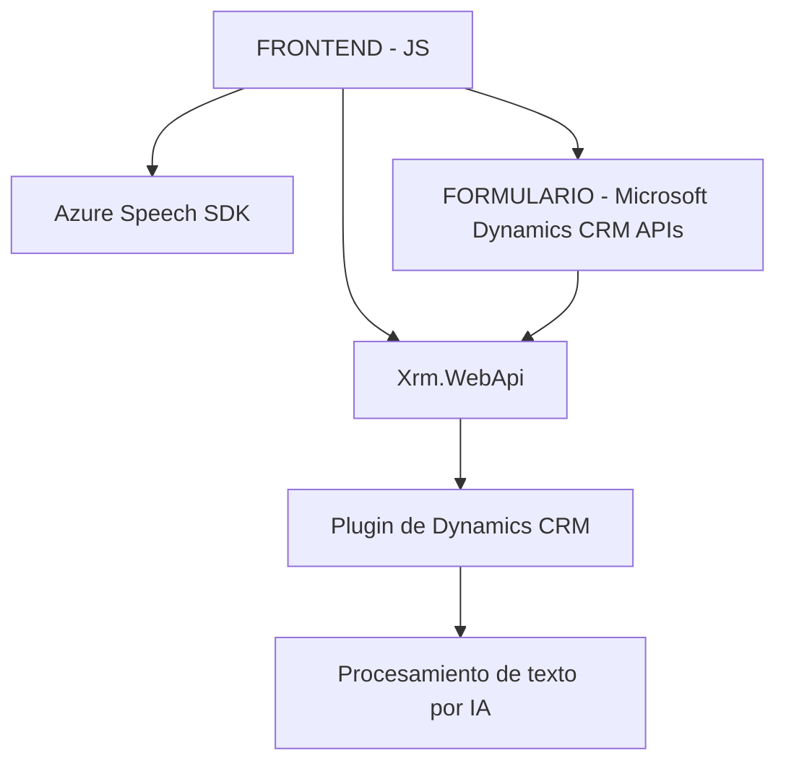

### Breve resumen técnico

El repositorio parece implementar una solución destinada a la interacción dinámica con formularios en Microsoft Dynamics CRM mediante entrada y síntesis de voz usando Azure Speech SDK, junto con la integración de Azure OpenAI para procesamiento y transformación de texto hablado.

---

### Descripción de arquitectura

#### Tipo de solución
Es una solución híbrida compuesta por un *frontend JavaScript* que interactúa directamente con formularios de Dynamics CRM y utiliza servicios de Azure (Speech SDK y OpenAI), además de plugins en el backend que amplían la funcionalidad del CRM.

#### Arquitectura general
La solución incluye elementos propios de una arquitectura **cliente-servidor** y **microservicios**:
1. **Frontend**: Modular con patrones basados en eventos y arquitectura de tipo de "n capas" (separación entre controladores y servicios de datos).
2. **Middleware/Backend**: Desarrollado como un plugin de Dynamics CRM que actúa como componente desacoplado para realizar transformaciones usando Azure OpenAI. Este plugin se puede considerar como un microservicio de procesamiento puntual.

El sistema usa:
- **Event-driven programming**: Principalmente en el lado del cliente, mediante el uso de callbacks.
- **Facade pattern**: Las funciones principales (`startVoiceInput`, etc.) actúan como interfaces unificadas para los bloques funcionales.
- **Data Mapping**: Traducción de datos transcritos a estructuras clave-valor para la actualización de formularios.
- **Delegación de tareas y Single Responsibility Principle**: Cada función se encarga de una tarea específica (por ejemplo, `speakText` para la síntesis).

---

### Tecnologías, frameworks y patrones utilizados

#### Tecnologías y frameworks
1. **Frontend JavaScript**
   - **Azure Speech SDK**: Utilizado para síntesis y transcripción de voz. Se gestiona mediante carga dinámica y callbacks.
   - **HTML DOM APIs y Microsoft Dynamics CRM APIs**: Para interactuar con formularios y campos visibles.
   - **JSON Handling**: Utilizado para la transmisión de datos entre el frontend y servicios externos como Azure OpenAI y CRM.

2. **Backend (.NET/C#)**
   - **Microsoft Dynamics CRM SDK**: Para la interacción directa con entidades y eventos de negocio dentro del CRM.
   - **System.Net.Http**: Para realizar solicitudes web a la API externa de Azure OpenAI.
   - **Azure OpenAI API**: Procesa mensajes y devuelve respuestas transformadas con inteligencia artificial.
   - **Newtonsoft.Json**: Manejo de estructuras JSON transformadas provenientes de Azure OpenAI.

---

### Componentes externos que podrían estar presentes

1. **Azure Speech SDK**: Para la síntesis y análisis de voz en el cliente, importado desde la URL: `https://aka.ms/csspeech/jsbrowserpackageraw`.
2. **Azure OpenAI API**: Usada en el backend (plugin de Dynamics CRM) para transformar texto transcrito en un JSON estructurado.
3. **Dynamics CRM APIs**:
   - `formContext.data.entity.attributes.get()`
   - `Xrm.WebApi`
4. **HTTP library**: Comunicación con servicios externos a través de solicitudes HTTP en el backend.
5. **Newtonsoft.Json/JToken API**: Para parseo y manipulación de objetos JSON en el plugin.

---

### **Diagrama Mermaid**

---

### Conclusión final

**Tipo de solución:** La estructura del repositorio sugiere una solución para interacción entre voz y formularios dinámicos en Microsoft Dynamics CRM. Incluye tanto un frontend (gestionado mediante JavaScript y SDK de Azure Speech) como un backend basado en C# y Dynamics CRM Plugin SDK.

**Arquitectura:** Cliente/servidor integrada con servicios externos, con delegación de funcionalidades específicas a distintos componentes. Aunque el frontend tiene características de separación en n capas y modularidad, el backend tiene un diseño basado en microservicios, donde el procesamiento de texto delegado al Azure OpenAI constituye un servicio independiente.

**Solidez tecnológica:** Se apoya firmemente en tecnologías modernas y robustas como Azure Speech, OpenAI, y Dynamics CRM SDK, garantizando capacidad de integración con aplicaciones empresariales. Esto lo hace práctico y flexible para sistemas de alta interacción entre usuarios y software CRM corporativo.