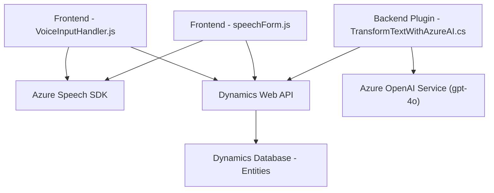

### Breve resumen técnico
El repositorio parece ser una solución estructurada para integrar capacidades de voz y procesamiento de lenguaje natural con Dynamics CRM, utilizando Azure Speech SDK y Azure OpenAI. Se incluye interacción basada en voz para formularios CRM mediante un frontend, y procesamiento avanzado de texto mediante plugins y servicios externos.

---

### Descripción de arquitectura
El repositorio tiene una arquitectura híbrida compuesto por los siguientes componentes:
1. **Frontend (JavaScript):**  
   - Implementa la interacción y síntesis de texto desde un formulario CRM utilizando Azure Speech SDK.  
   - Usa programación modular basada en funciones para tareas bien definidas.  

2. **Backend (Plugins en C#):**  
   - Utiliza el estándar de diseño de plugins de Dynamics CRM (`IPlugin`) para transformar texto mediante Azure OpenAI y actualizar entidades en Dynamics mediante su API Web (`Xrm.WebApi`).  

**Tipo de arquitectura:**  
- El sistema emplea una arquitectura **n-capas** en dos niveles:
  1. **Capa frontend:** Generación de entradas, síntesis y transcripciones de voz.  
  2. **Capa backend:** Ejecución de lógica empresarial mediante plugins y transformación avanzada con servicios externos (Azure OpenAI y Speech SDK).  

---

### Tecnologías usadas
1. **Frontend:**  
   - **Frameworks/Librerías:** JavaScript raw.  
   - **Azure Speech SDK**  
     - Para síntesis de voz en tiempo real y reconocimiento automático del habla (ASR).  
   - **Dynamics Custom API**  
     - Para conectar y actualizar datos.

2. **Backend:**  
   - **Framework:** .NET Framework.  
   - **Azure OpenAI (gpt-4o):**  
     - Procesamiento avanzado de lenguaje natural.  
   - **Dynamics CRM SDK:**  
     - Control de entidades y funcionamiento con `IOrganizationService`.

3. **Otros:**  
   - Programación orientada a objetos en C#.  
   - Promesas/`async-await` en JavaScript.  
   - Importaciones dinámicas para SDK externos.

---

### Dependencias o componentes externos
1. **Azure Speech SDK:**  
   - Sintetizador de voz y reconocimiento de voz desde texto (ASR).  
   - URL: `https://aka.ms/csspeech/jsbrowserpackageraw`.
2. **Azure OpenAI Service:**  
   - Endpoint: Procesamiento avanzado de lenguaje natural con GPT-models.  
   - Tipo: GPT-4 personalizado.  
3. **Microsoft Dynamics CRM Web API:**  
   - Tipo: Custom APIs para llamadas a entidades y operaciones de base de datos (`Xrm.Service.WebApi`).  
4. **Newtonsoft.Json:**  
   - Manejo avanzado de JSON en .NET para procesar respuestas JSON de OpenAI.  

---

### Diagrama Mermaid

---

### Conclusión final
El repositorio presenta una solución bien estructurada para implementar interacción avanzada entre humanos y sistemas mediante voz y procesamiento de texto, integrando múltiples servicios SaaS como Azure Speech (TTS y ASR) y Azure OpenAI. La arquitectura de n-capas facilita la separación de responsabilidades entre frontend para input/output de voz y backend para lógica empresarial y procesamiento de lenguaje natural. Además, el uso de SDKs y APIs de nube muestra una fuerte inclinación por la arquitectura basada en servicios.