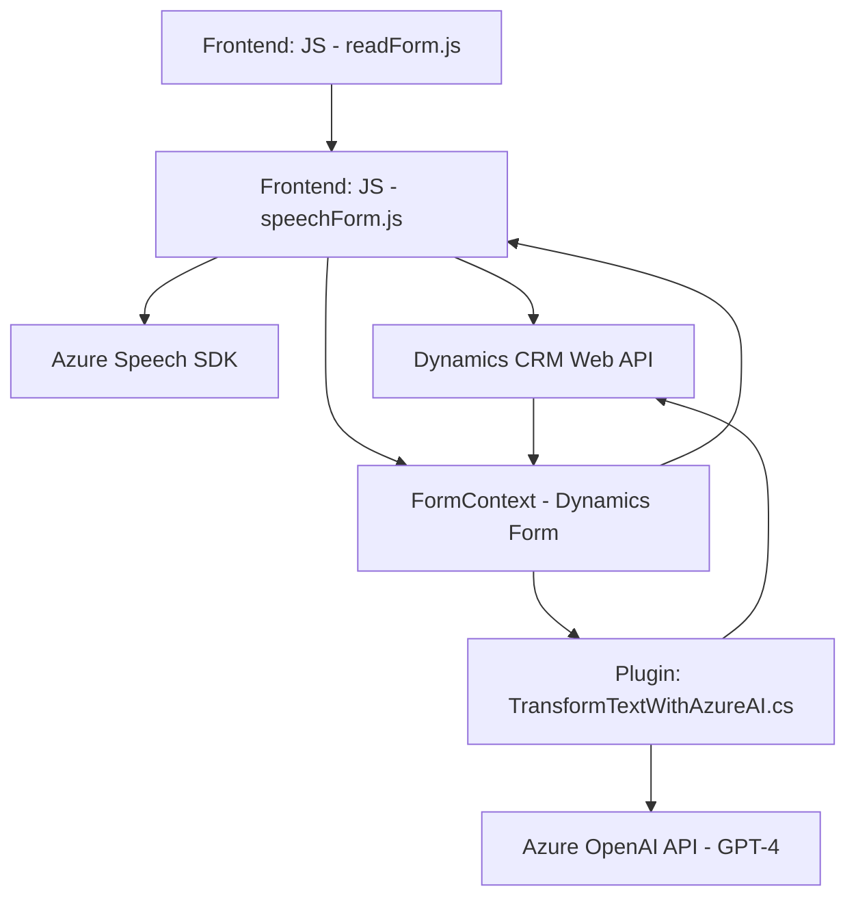

### Breve Resumen Técnico
El repositorio contiene una implementación destinada a leer, preprocesar y convertir datos en voz o manejar transcripción de voz en un entorno Microsoft Dynamics 365, utilizando Azure Speech SDK y Azure OpenAI API. Combina frontend en JavaScript para formularios interactivos, APIs personalizadas integradas como plugins y servicios externos para procesamiento de voz y texto con IA.

---

### Descripción de Arquitectura
1. **Tipo de solución:**  
   - Principalmente un sistema basado en **API (integración)** complementada con un **frontend** dinámico que interactúa con formularios en Dynamics 365. Incluye plugins para procesamiento de reglas en un backend.
  
2. **Arquitectura:**  
   - Arquitectura **n-capas** híbrida con integración de servicios externos (SDK, APIs).  
   - Frontend (JS) actúa como **controlador cliente**, comunicándose con Dynamics 365 y los plugins (backend). Este backend utiliza Azure OpenAI (llamada directa al servicio API) como apoyo para inteligencia artificial.  
   - Uso extensivo de SaaS (Azure Speech SDK y Azure OpenAI) para extender capacidades de procesamiento.

---

### Tecnologías y Frameworks Usados
1. **Frontend:**  
   - **JavaScript**: Domina el procesamiento de datos del formulario.  
   - **Azure Speech SDK**: Librería gestionada para síntesis y reconocimiento de voz.  

2. **Backend (Microsoft Dynamics Plugins):**
   - **C#**: Utilizado para la lógica de plugins en Dynamics CRM.  
   - **Newtonsoft.Json** y **System.Text.Json** para manejo de JSON.  
   - APIs como **Azure OpenAI** consumidas con `HttpClient`.  

3. **Patrones y Principios:**
   - **Modularidad:** Código dividido en funciones pequeñas y reusables.  
   - **Eventos y callbacks:** Para procesar dinámicamente SDK en tiempo de ejecución.  
   - **SaaS Integration:** Llama servicios externos directamente desde el frontend y backend.  
   - **Plugin architecture** en Dynamics CRM.

---

### Dependencias o Componentes Externos
1. **Azure Speech SDK:** Para síntesis y reconocimiento de voz.  
2. **Azure OpenAI API:** Para procesamiento avanzado de texto y generación de JSON estructurado.  
3. **Dynamics 365 Web API:** Utilizado en casi todas las etapas para manipulación de datos en formularios y reglas internas.  
4. **Servicios HTTP y JSON:** En backend para integrar plugins con APIs externas.  

---

### Diagrama **Mermaid** (100 % compatible con GitHub Markdown)

---

### Conclusión Final
El repositorio evidencia una solución híbrida de n-capas altamente modular y extensible, ideal para entornos empresariales como Dynamics CRM. Se destaca por la integración de SaaS (Azure Speech y OpenAI) para enriquecer funcionalidades del sistema, como síntesis de voz y procesado inteligente de texto. La arquitectura combina frontend dinámico, integraciones SDK y plugins personalizados, cumpliendo con estándares modernos y patrones centrados en eventos y modularidad funcional. La calidad del diseño permite escalabilidad y adaptaciones según nuevas necesidades de negocio.