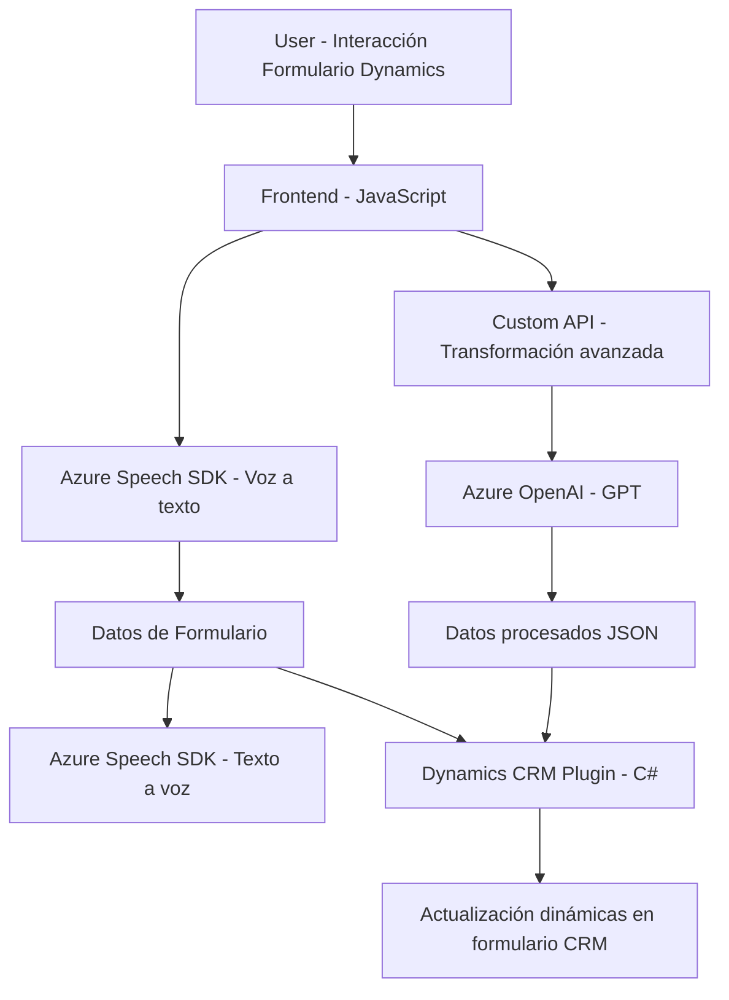

### Resumen técnico
El repositorio parece estar enfocado en la integración de procesamiento avanzado de texto y voz con Microsoft Dynamics 365. Incluye módulos para sintetizar y reconocer voz mediante **Azure Speech SDK**, y plugins para integración con **Azure OpenAI** para transformar texto en entornos CRM. Las capas de código abarcan frontend, servicios REST y plugins en Dynamics 365.

---

### Descripción de la arquitectura
La solución se basa en una **arquitectura híbrida n-capas**, donde:
1. **Frontend (JavaScript)** interactúa directamente con Dynamics 365 formularios, integrando servicios de reconocimiento y síntesis de voz.
2. **Plugins (C#)** actúan como lógica de negocio en el backend dinámico de Dynamics CRM, conectándose con APIs externas como Azure OpenAI.
3. **Servicios externos:** Comunicación basada en APIs de Azure Speech SDK y Azure OpenAI.

El enfoque modular y la división por contexto funcional refuerzan una estructura extensible, aunque el sistema no presenta microservicios ni patrones hexagonales en general.

---

### Tecnologías, frameworks y patrones usados
1. **Frontend:**
   - **JavaScript** para lógica de interacción con formularios Dynamics 365.
   - **Azure Speech SDK (JavaScript)** para manejo de voz.
   - **Asynchronous Programming (Promises y Callbacks).**
   - Patrones:
     - Modularización funcional.
     - Error handling básico en el flujo de ejecución.

2. **Backend:**
   - **C# y Dynamics 365 SDK**:
     - Plugins que implementan `IPlugin`.
     - Uso de entidades, atributos, y mapeo de valores en formularios.
   - **Azure OpenAI SDK**:
     - Peticiones REST para llamar al endpoint de OpenAI GPT-4.

3. **Integración con servicios:**
   - Azure Speech SDK y Azure OpenAI (API REST).

**Patrones dominantes**:
- Modularización funcional en frontend.
- CRUD dinámico basado en la lógica de plugins Dynamics CRM.
- Delegación de servicios externos para capacidades avanzadas (voz e IA).

---

### Dependencias o componentes externos presentes
1. **Azure Speech SDK**: Manejo de voz (reconocimiento y síntesis).
2. **Azure OpenAI**: Procesamiento de texto con inteligencia artificial (GPT).
3. **Dynamics 365 SDK**: Lógica CRM de modo extensible.
4. **Custom API**: Interacción personalizada para transformar texto avanzado.
5. **Frameworks externos (e.g., Newtonsoft.Json)**: Manejo de objetos JSON en C#.

---

### Diagrama Mermaid válido para GitHub Markdown

---

### Conclusión final
La arquitectura y el código analizado corresponden a una solución **híbrida de múltiples capas** basada en la interacción directa con formularios de Dynamics CRM. Se integra con servicios avanzados de Azure para ofrecer capacidades de procesamiento de voz y texto utilizando inteligencia artificial. Los patrones de diseño modulares, el uso de SDK externos y servicios basados en APIs refuerzan su extensibilidad, aunque la solución no incorpora paradigmas modernos, como microservicios o hexagonal.