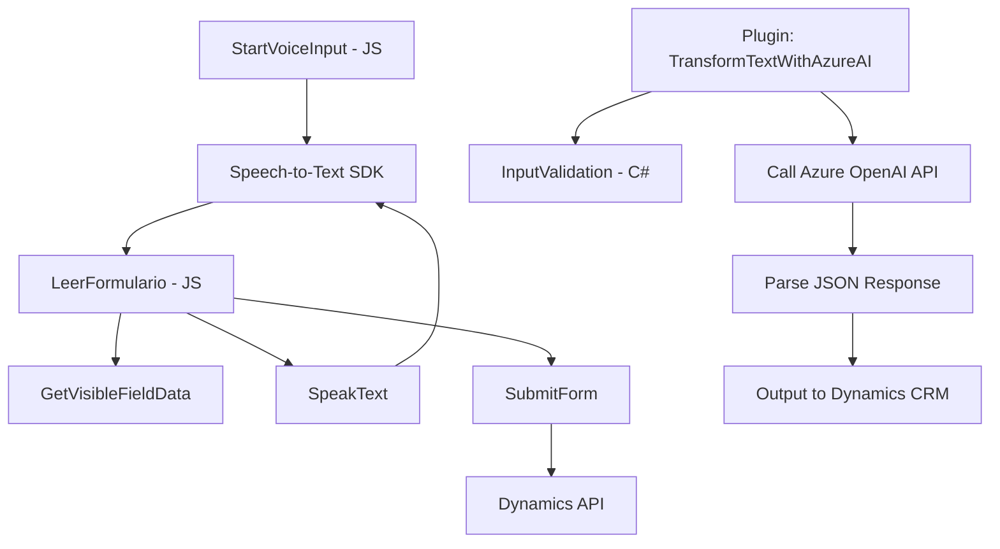

### Breve resumen técnico:
El repositorio presenta una solución que integra procesamiento de voz, manipulación de formularios de Dynamics CRM y transformación de texto con IA. Utiliza módulos especializados para síntesis y reconocimiento de voz, conectándose al Azure Speech SDK y Dynamics APIs, además de un plugin en C# para transformar texto mediante Azure OpenAI.

---

### Descripción de arquitectura:
La arquitectura empleada en este sistema combina módulos independientes con una orientación **n-capas**. Cada capa tiene roles específicos:
1. **Frontend (JavaScript)**: Encargado del manejo de lógica de voz y conectividad. Integración con Azure Speech SDK y procesamiento dinámico de formularios.
2. **Backend Plugin (.NET/C#)**: Extiende las funcionalidades de Dynamics CRM mediante un robusto plugin que conecta con Azure OpenAI para transformación de texto.
3. **Dependencias externas**: Servicios en la nube (Azure) y APIs para reconocimiento, síntesis y transformación de datos. El diseño es modular y utiliza patrones de integración controlada, como la verificación dinámica del SDK.

---

### Tecnologías usadas:
1. **Frontend:**
   - **JavaScript** (ECMAScript 6+): Para extraer datos de formularios y procesar voz.
   - **Azure Speech SDK**: Para conversión texto-voz y voz-texto.
   - APIs de Dynamics 365 (`Xrm.WebApi`): Para comunicación con formularios empresariales.

2. **Backend:**
   - **C# (.NET Framework):** Para desarrollo del plugin.
   - **Azure OpenAI API**: Para interacción de IA y transformación del contenido.
   - **JSON Libraries:** Manejo de estructuras JSON a través de `System.Text.Json` y `Newtonsoft.Json.Linq`.

3. **Patrones de diseño:**
   - **Facade Pattern:** Simplificación de interacción con Azure Speech SDK y OpenAI API.
   - **Plugin-based Architecture:** Extendiendo capacidades de Dynamics CRM.
   - **Modular Design:** División de funcionalidades en métodos autónomos especializados.

---

### Diagrama Mermaid:

---

### Conclusión final:
La solución muestra una interacción avanzada entre frontend, servicios en la nube y backend empresarial. La arquitectura **n-capas** garantiza separación lógica, mientras que patrones como **Facade** y **Modular Design** optimizan el manejo de dependencias externas. La implementación de servicios en Azure asegura alta disponibilidad y escalabilidad del sistema. Dada su orientación modular con interacción externa, esta solución tiene flexibilidad para integrar más componentes de IA y extender capacidades.