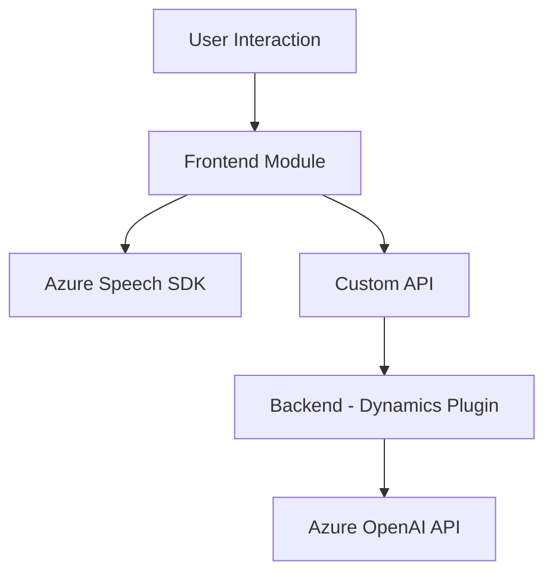

### Breve resumen técnico
El repositorio contiene una solución tecnológica que integra funcionalidades relacionadas con la interacción entre formularios web y servicios en la nube, usando reconocimiento de voz, síntesis de texto a voz, procesamiento asistido por inteligencia artificial (Azure OpenAI), y funcionalidad de plugin personalizado en Dynamics CRM. Esto apunta a una solución híbrida con una combinación de frontend para la interfaz de usuario, backend dinámico y servicios en la nube.

---

### Descripción de arquitectura
La arquitectura del sistema parece estar dividida en capas funcionales que facilitan extensibilidad, mantenimiento y comunicación entre componentes:
1. **Frontend Layer:** Los archivos bajo el directorio `FRONTEND/JS` son JavaScript con funciones para manipular formularios, manejar entrada por voz, transformar datos extraídos de formularios y sintetizar texto a voz. El frontend actúa como la capa de interacción con el usuario y depende del SDK de Azure Speech para lograr la funcionalidad principal.
2. **Backend Layer:** 
   - El archivo C# `Plugins/TransformTextWithAzureAI.cs` representa un plugin personalizado de Dynamics CRM orientado a transformar texto utilizando la API de Azure OpenAI. Este plugin actúa como un componente externo para recibir y procesar solicitudes desde Dynamics.
   - La solución implementa integración directa con el convenio de microservicios mediante el uso de la API personalizada para expandir la funcionalidad de procesamiento de formularios.
3. **Microservicios:** La lógica personalizada es delegada a APIs específicas en Azure OpenAI y otros servicios de Microsoft Dynamics 365, lo que indica una arquitectura orientada a **microservicios**.

La arquitectura combina principios de **n capas** en la parte del frontend y una integración de componentes externos en la capa backend con diseño modular y responsabilidad única.

---

### Tecnologías usadas
1. **Frontend:**
   - **Tecnologías:** JavaScript (vanilla JS), Azure Speech SDK.
   - **Frameworks:** Ningún framework específico (ambiente dependiente de Dynamics CRM y SDK).
   
2. **Backend:**
   - **Tecnologías:** .NET Framework/C#. Usa Dynamics CRM SDK integrado con una API externa basada en un modelo de inteligencia artificial (Azure OpenAI GPT-4).
   - **Frameworks:** SDK de Microsoft Dynamics CRM para extensibilidad con `IPlugin`.

3. **Patrones identificados:**
   - Modularidad.
   - Delegación y división de responsabilidades.
   - Integración con SDKs.
   - Arquitectura de plugins (Dynamics CRM).
   - Diseño basado en microservicios: interacción con API REST de terceros.
   - Mapeo dinámico de datos.

---

### Diagrama Mermaid válido para GitHub

---

### Conclusión final
Esta solución consiste en una arquitectura híbrida basada en:
- **N capas en el frontend:** Contiene funcionalidades de entrada por voz, síntesis de texto a voz y manipulación de formularios, integradas a través del **Azure Speech SDK**.
- **Custom plugins en el backend:** Facilita la interacción con Dynamics CRM utilizando la API de **Azure OpenAI** para transformar datos introducidos en el formulario y aplicar reglas específicas.
- **Microservicios:** Usa un enfoque de desacoplamiento funcional mediante el uso de servicios externos (Azure APIs), lo que permite máxima flexibilidad para ciertos procesos críticos como la integración de inteligencia artificial.

Aspectos técnicos relevantes incluyen el uso de un SDK para sintetizar voz y reconocer audio, junto con el manejo eficiente de datos en formularios dinámicos. Sin embargo, algunas áreas pueden optimizarse, como la gestión de configuraciones y manejo de errores en los plugins del backend.