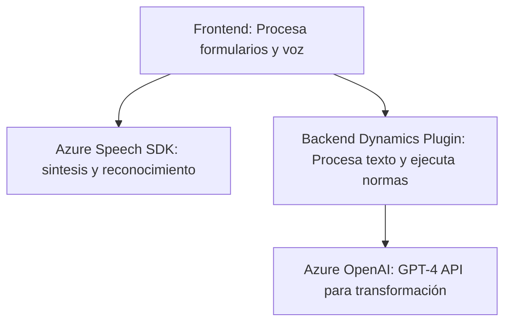

### Breve resumen técnico:

El repositorio parece ser una solución híbrida que integra estrictamente funcionalidades entre un frontend (JavaScript) y un backend/plugin (.NET) con interacción directa hacia servicios externos como el Azure Speech SDK y Azure OpenAI Service. Principalmente, el sistema está diseñado para gestionar formularios dinámicos en entornos CRM ayudando a capturar, transformar y sintetizar datos desde/para usuarios.

---

### Descripción de arquitectura:

1. **Tipo de solución**:
   - **Frontend JS**: Construido para sistemas CRM con funcionalidades orientadas a capturar y procesar datos de entrada mediante voz (Speech-to-text y Text-to-Speech).
   - **Backend Plugin (C#)**: Extiende el comportamiento del Dynamics CRM para transformar datos según normas predefinidas utilizando Azure OpenAI.
   - Utiliza servicios Cloud como SDK e IA.

2. **Tipo de arquitectura**: 
   - **Multicapa**:
     - Frontend modularizado (capa UI).
     - Backend como lógica en Microsoft Dynamics CRM.
     - Dependencias externas para servicios de IA (Azure Speech y OpenAI).
   - Los plugins y procesamiento muestran elementos de **modularidad** vertical.

---

### Tecnologías usadas:

1. **Frontend (JS)**:
   - **Azure Speech SDK**: Para reconocimiento y síntesis de voz.
   - Promesas y asincronía en el manejo de APIs externas.
2. **Backend (C# Plugin)**:
   - **Microsoft Dynamics CRM SDK** (`IPlugin`, Web API).
   - **Azure OpenAI**: Transformación de texto usando GPT-4 para generar salidas estructuradas.
   - **HTTP Client**: Para consumir servicios REST del Azure OpenAI.
   - **JSON Libraries**: Transformación y manejo eficiente de datos JSON.

3. **Patrones arquitectónicos**:
   - **Callback y Promesas**: Usado extensivamente en async JS para interacción con APIs.
   - **Separación de responsabilidades**: Frontend para interacción con usuario, backend para procesamiento extendido (ejecución de eventos).
   - **Modularización**: Componentes JavaScript y plugins son separados por función específica.
   - **API Gateway**: Facilitado por Dynamics CRM para integraciones con APIs externas como Azure OpenAI.

---

### Diagrama Mermaid:

---

### Conclusión final:

Este repositorio configura una solución CRM extendida orientada a servicios, diseñada para maximizar la experiencia del usuario en la captura y procesamiento de datos mediante voz y herramientas de IA. La arquitectura multicapa asegura modularidad, escalabilidad y una integración robusta con servicios externos, lo que es ideal para entornos empresariales.