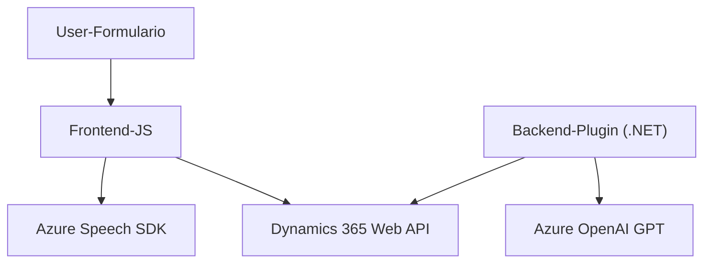

### Breve resumen técnico

El repositorio incluye archivos para frontend (JavaScript) y backend (código .NET) que trabajan con tecnologías de voz y procesamiento de lenguaje natural, basados en Azure. Los principales objetivos son interactuar con formularios en Dynamics CRM mediante voz (con Azure Speech SDK y OpenAI GPT) y transformar texto utilizando un plugin en Dynamics CRM.

---

### Descripción de arquitectura

La arquitectura general tiene los siguientes componentes:
1. **Frontend**: Un sistema basado en módulos JavaScript para interactuar con Dynamics CRM utilizando formulación visual y entrada/salida de voz vía **Azure Speech SDK**. Estas funciones reflejan una arquitectura orientada a la interacción entre cliente y servicios externos.
2. **Backend**: Utiliza una arquitectura plugin-based personalizada en Dynamics 365, principalmente para procesamiento de texto con **Azure OpenAI GPT** mediante solicitudes HTTP. El diseño encapsula la lógica de transformación del texto en el plugin.

La arquitectura global puede clasificarse como **n capas**, considerando la separación evidente entre el cliente (frontend) y el servidor (backend), además del uso de APIs externas.

---

### Tecnologías usadas
1. **Frontend**:
   - **JavaScript (ES6)**: Para las funcionalidades de voz y la gestión de formularios.
   - **Azure Speech SDK**: Uso de servicios de reconocimiento y síntesis de voz por parte de Azure.
   - **Dynamics 365 Web API**: Para la gestión de datos del dominio (formularios).

2. **Backend**:
   - **.NET Framework/C#**: Plugin diseñado en Dynamics CRM.
   - **Azure OpenAI GPT**: Procesamiento avanzado de texto basado en IA.
   - **Newtonsoft.Json** y **System.Text.Json**: Manejo de datos JSON.
   - **System.Net.Http**: Comunicación HTTP con APIs externas.

3. **Patrones:**
   - **Modularización por funciones**: Funciones claras en el frontend para separar lógica de captura y voz.
   - **Cliente-Servidor**: Comunicación API desde plugin y frontend con servicios externos.
   - **Encapsulamiento y segregación de responsabilidades**: Implementación en métodos independientes tanto en el frontend como en el plugin.

---

### Diagrama Mermaid válido para GitHub

---

### Conclusión final

El repositorio implementa una solución con una arquitectura **n capas**, que combina un frontend basado en JavaScript para interacción por voz con formularios y un backend plugin en Dynamics CRM para procesamiento avanzado de texto usando Azure OpenAI GPT. Está diseñado para maximizar la modularidad, la interacción con APIs externas, y las capacidades de IA, lo que resulta en un sistema robusto y eficiente. El diseño sigue buenas prácticas, como separación de responsabilidades y encapsulación lógica.