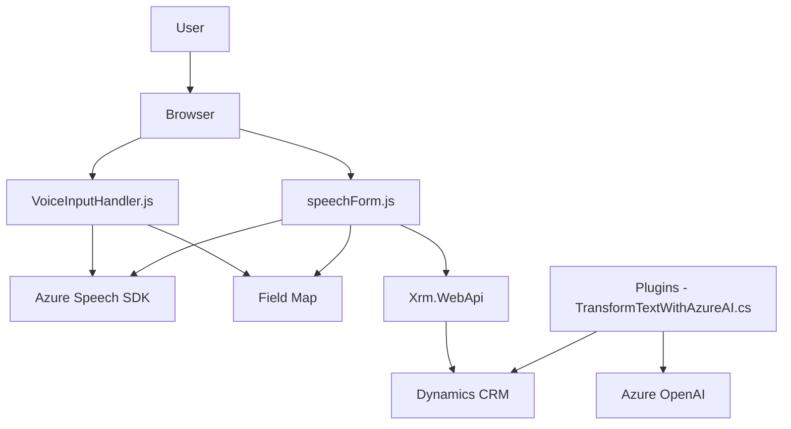

### Breve resumen técnico:

La solución presentada en los archivos **readForm.js**, **speechForm.js**, y **TransformTextWithAzureAI.cs** apunta a un entorno que probablemente integra formularios dinámicos interactivos dentro de un sistema CRM como **Microsoft Dynamics**, añadiendo las capacidades de reconocimiento y conversión de voz en texto mediante **Azure Speech SDK**, y la transformación avanzada de texto a través del servicio **Azure OpenAI (GPT-3/4)**.

---

### Descripción de arquitectura:

La arquitectura de esta solución es **modular híbrida**. Está diseñada para trabajar principalmente con estructuras basadas en **capas** y patrones de integración externa. La aplicación tiene las siguientes características en conjunto:

1. **Presentación:**
   - La capa de presentación interactúa directamente con el usuario mediante un sistema de formularios, apoyándose en scripts orientados al cliente (JavaScript).
   - Funcionalidades clave incluyen capturar datos visibles del formulario, sintetizar voz en texto, y asignar valores a los campos del formulario.

2. **Aplicación/Negocio:**
   - La lógica de negocio está parcialmente implementada en el cliente y extendida en el servidor, en el cual un plugin de CRM escrito en **C#** se encarga de aplicar reglas específicas.
   - Uso de patrones como **Adapter** y **Proxy** para asignar valores de campos y servicios de API externos.

3. **Integración de Servicios Externos:**
   - El SDK de Azure Speech habilita reconocimiento de voz y síntesis de voz.
   - El servicio **Azure OpenAI** procesa texto en la capa de aplicación mediante un **plugin CRM** desarrollado en **.NET**.

4. **Persistencia y Datos:**
   - La lógica de datos interactúa con los servicios nativos de Dynamics CRM para almacenar información.
   - Uso del **Xrm.WebApi** (JavaScript) y el **IOrganizationService** (.NET) para la manipulación de datos en CRM.

---

### Tecnologías usadas:

1. **Frontend**:
   - **JavaScript** para crear funcionalidades de interacción con el usuario y la lógica de procesamiento de formularios.
   - **Azure Speech SDK**: utilizado para la síntesis de voz y el procesamiento de entrada por voz.

2. **Backend**:
   - **C#** y **.NET Framework** con **Microsoft.Xrm.Sdk** para desarrollo de plugins de Dynamics CRM.
   - **Azure OpenAI Service**: utilizado para transformación avanzada de texto.
   - **System.Net.Http**: para llamadas HTTP RESTful.
   - **Json Handling (Newtonsoft.Json y System.Text.Json)**: procesamiento de datos en JSON para las interacciones con API de OpenAI.

3. **Integración y Persistencia**:
   - **Microsoft Dynamics CRM APIs** como **Form Context API** y **Xrm.WebApi**.
   - CRM como sistema de almacenamiento predeterminado para los datos de formularios procesados y transformados.

---

### Diagrama Mermaid:

---

### Conclusión final:

La solución descrita integra capacidades de voz y procesamiento textual mediante servicios de Azure en un entorno **Microsoft Dynamics CRM**. A nivel de arquitectura, sigue una **estructuración de n capas**, con elementos del diseño híbrido que aprovechan tanto la funcionalidad del cliente (JavaScript y SDK de Azure Speech) como servicios de procesamiento API en el servidor (Azure OpenAI). Además, utiliza patrones como **Facade**, **Adapter** y **Proxy**. Esto permite una integración eficiente y modular con servicios externos para la automatización de entrada y procesamiento de datos, haciendo posible la mejora en interacción y productividad de usuarios en plataformas empresariales. 