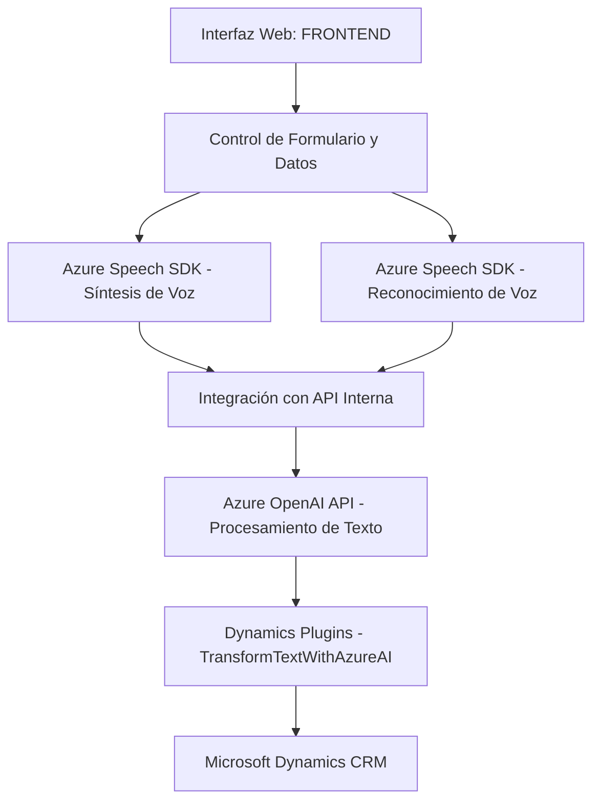

# Breve Resumen Técnico

Este repositorio implementa un sistema que integra formularios web con capacidades avanzadas de síntesis y reconocimiento de voz mediante Azure Speech SDK y procesamiento de datos con Azure OpenAI API. Abarca principalmente dos contextos: el **frontend** (interfaz y comportamiento del usuario) y la **integración de CRM** mediante plugins en Microsoft Dynamics.

---

# Descripción de Arquitectura

La solución utiliza una arquitectura **híbrida**, combinando:
- **Separación por capas** (frontend y backend claramente diferenciados).
- **Modularidad** en el frontend.
- **Plugin-Based Architecture** en el backend, con componentes integrados a Dynamics CRM.
- **Integración con servicios externos** (Azure Speech SDK y Azure OpenAI API) para tareas de síntesis de voz y procesamiento avanzado de texto.

Patrones aplicados:
1. **Modularización**: Cada archivo se organiza por responsabilidades específicas, tanto en el frontend como en backend.
2. **Carga dinámica de dependencias**: Azure Speech SDK se carga bajo demanda.
3. **Repository Pattern**: Uso de mapas dinámicos en formularios para mapeo de valores y transformar datos.
4. **Integración de APIs externas**: Servicios de voz (Azure Speech SDK) y procesamiento con IA (Azure OpenAI API).

---

# Tecnologías Usadas

1. **Frontend**:
   - **JavaScript**: Implementa lógica de interacción del usuario y manipulación del DOM.
   - **Azure Speech SDK**: Procesamiento de voz (síntesis y reconocimiento).
   - **Dynamics Web API (`Xrm.WebApi.online`)**: Conexión a CRM para formularios y entidades.

2. **Backend**:
   - **Microsoft Dynamics CRM SDK**: Extensiones de plugins.
   - **Azure OpenAI API**: Procesamiento de texto con inteligencia artificial.
   - **Newtonsoft.Json**: Manejo de datos JSON.

3. **Otros**:
   - Integración con Azure Services mediante REST API.
   - **DOM API** para manipulación de formularios en el navegador.

---

# Diagrama Mermaid

---

# Conclusión Final

La solución destaca por su capacidad de integrar tecnologías avanzadas como Azure Speech SDK y Azure OpenAI API en dos niveles: frontend para interacción con el usuario y backend para procesamiento y transformación de datos en un entorno CRM. Su arquitectura modular y basada en plugins permite escalabilidad y mantenimiento, mientras que el uso de servicios externos como IA y síntesis de voz refuerza la experiencia de usuario con funcionalidades avanzadas.

La presentación en el diagrama Mermaid sintetiza la interacción y flujo lógico entre los componentes principales, cumpliendo con los lineamientos de GitHub Markdown.