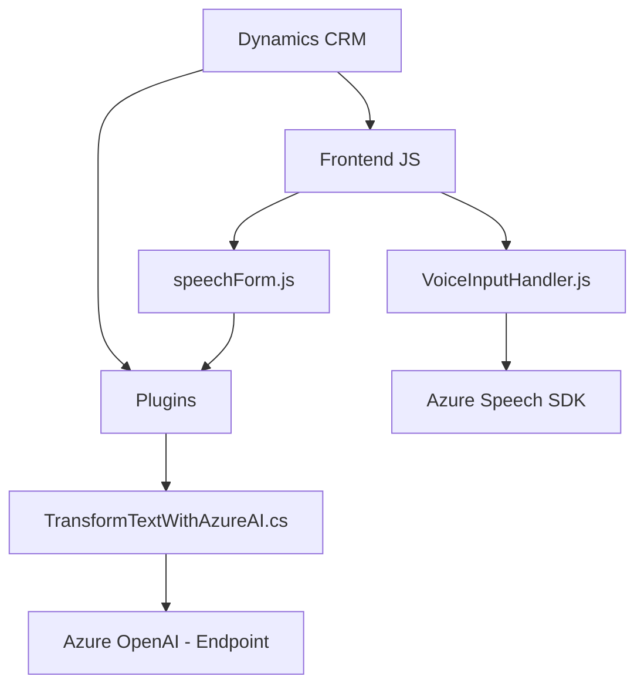

### Breve resumen técnico

El repositorio contiene una solución que parece estar enfocada en integrar inteligencia artificial para el reconocimiento y procesamiento de voz, junto con plugin y lógica personalizada para formularios en Microsoft Dynamics CRM, y servicios externos como Azure Speech SDK y Azure OpenAI API.

### Descripción de arquitectura

La arquitectura general de esta solución es **modular** y **event-driven**, distribuida en una integración híbrida que utiliza componentes de un frontend JavaScript, lógica de interacción con formularios en Dynamics CRM, y plugins en C#. No se puede clasificar como un monolito, ya que tiene puntos de entrada distintos y específicos. Sin embargo, tampoco es una arquitectura de microservicios por falta de autosuficiencia entre las partes. Podría considerarse un modelo **n-capas** con integración de servicios externos (Speech SDK y OpenAI API).

### Tecnologías usadas

#### Lenguajes y frameworks:
- **Frontend (JavaScript):**  
    - Integrado con Dynamics CRM `executionContext` para el procesamiento de voz y manipulación de formularios.
    - Carga dinámica y uso del SDK de **Azure Speech** para reconocimiento y síntesis de voz.
    - Modularización básica con manejo de promesas y separación de funciones para diferentes tareas.
- **Backend (C#):**  
    - **Microsoft Dynamics CRM Plugin Framework:** Uso del entorno de Microsoft Dynamics para ejecución basada en eventos.  
    - Azure OpenAI para la transformación de texto mediante la API REST de OpenAI.  
    - Manejador de datos y mapeo entre Dynamics CRM y el servicio IA.

#### Patrones utilizados:
- **Event-driven architecture:** En el plugin y reconocimiento de voz (flujo asincrónico).
- **Factory pattern:** Creación dinámica de servicios en C#.
- **Verificación y carga dinámica:** Uso del patrón para SDK externo en JavaScript.
- **Utility functions:** Modularización en funciones pequeñas con SRP (Single Responsibility Principle) en ambos lados.

### Dependencias o componentes externos

1. **Azure Speech SDK:**  
   Para reconocer y sintetizar voz en el lado del cliente.
2. **Azure OpenAI API:**  
   Para transformar texto con IA en el lado del plugin.
3. **Dynamics CRM**:  
   La solución está muy acoplada al contexto de esta plataforma.
4. **JSON procesamiento:**  
   Usa `System.Text.Json` y `Newtonsoft.Json` en backend para manipular estructuras JSON.
5. **Exposición de claves de API:** Como se indicó en el plugin, la API key de Azure OpenAI está configurada manualmente en el código.

---

### Diagrama Mermaid

---

### Conclusión final

La solución presenta una arquitectura **modular** con separación de responsabilidades, pero depende ampliamente de componentes externos (Azure Speech y OpenAI). Aunque bien diseñada para cumplir con los objetivos de integración con Dynamics CRM, tiene algunas áreas de mejora en términos de seguridad (como la gestión de claves API) y mayor separación o desacoplamiento, especialmente en el lado del plugin.

Se podría evolucionar la arquitectura hacia un enfoque de microservicios en el backend (por ejemplo, haciendo que las transformaciones IA estén más desacopladas del contexto de CRM) o utilizar una **arquitectura hexagonal** para lograr más flexibilidad frente a las dependencias del sistema. También sería recomendable seguir principios de seguridad como la externalización de claves y certificados.