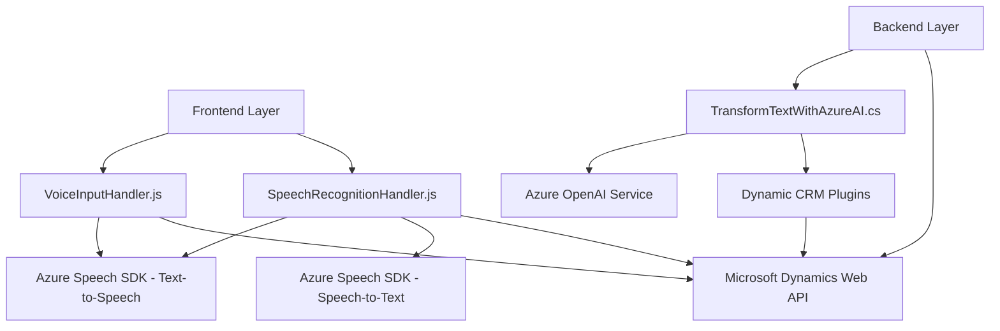

### Breve resumen técnico
El repositorio presenta implementaciones para síntesis de voz, reconocimiento de palabras habladas, manipulación de datos en formularios de Dynamics CRM y extensión mediante plugins que se conectan a Azure OpenAI Service. Estos componentes interactúan con servicios externos y el contexto de CRM, buscando agregar funcionalidades cognitiva y dinámica a un sistema preexistente.

### Descripción de arquitectura
La solución tiene una estructura híbrida basada en eventos y capas. En el frontend:
1. Interacción directa con servicios de Azure Speech SDK para síntesis y reconocimiento de voz.
2. Procesamiento de datos en formularios, de manera modular.
En el backend:
1. Plugins que actúan bajo un patrón de arquitectura "Plugin Pattern" típico de Dynamics CRM.
2. Integración con servicios externos (Azure OpenAI) para manejo avanzado de la inteligencia artificial.

Es una arquitectura **n-capas orientada a servicios**, donde cada capa y componente tiene una clara separación de responsabilidades: 
- **Frontend**: Entrada interactiva controlada por eventos para la capa de presentación.
- **Backend**: Extensiones en el core del sistema CRM, que delegan tareas específicas como transformación de texto a un proveedor IA externo.

### Tecnologías usadas
1. **Frontend**:
   - **JavaScript**: Manipulación de datos en formularios.
   - **Azure Speech SDK**: Reconocimiento de voz y síntesis de texto a voz.
   - **Microsoft Dynamics Web API**: Interacción con formularios y estructuras de CRM.

2. **Backend**:
   - **Dynamics CRM SDK (`IPlugin`)**: Creación de plugins funcionales.
   - **Azure OpenAI Service**: Conexión con modelos GPT para transformación avanzada de texto.
   - **.NET Framework**: Desarrollo de plugins que interactúan en el entorno CRM.

### Dependencias o componentes externos
1. **Azure Speech SDK**: Para manejo de voz y texto en el frontend.
2. **Microsoft Dynamics Web API**: Para interacción de datos en formularios.
3. **Azure OpenAI Service**: Uso de modelos GPT para transformación de texto a JSON.
4. **Newtonsoft.Json** / **System.Text.Json**: Procesamiento de estructuras JSON en el backend.

---

### Diagrama Mermaid

---

### Conclusión final
La solución combina capacidades cognitivas (via Azure Speech y OpenAI) con una arquitectura n-capas orientada a servicios. Esencialmente, se trata de una implementación modular e integrada en Microsoft Dynamics CRM destinada a enriquecer la dinámica del sistema mediante entrada de voz, síntesis de texto y manejo avanzado de formularios. Su diseño hace uso extensivo de servicios externos para lograr procesos automatizados y cognitivos.