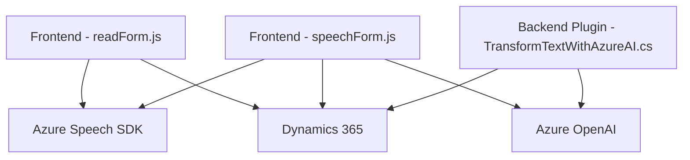

### Breve resumen técnico
El repositorio contiene tres archivos clave que integran capacidades de voz y procesamiento de datos con el servicio Azure Speech SDK, complementados por Dynamics 365 y Azure OpenAI. Los archivos están orientados a automatizar procesos basados en formularios y datos estructurados o no estructurados, mientras interactúan con APIs externas.

---

### Descripción de arquitectura
La solución está diseñada como una capa de interacción que se conecta con dos componentes principales:
- **Frontend:** Archivos `readForm.js` y `speechForm.js` manejan la entrada y salida de voz, procesamiento de datos y vinculación con formularios dinámicos en Dynamics 365.
- **Backend Plugin:** Archivo `TransformTextWithAzureAI.cs`, que actúa como un microservicio auxiliar en Dynamics para transformar texto con reglas específicas, a través de Azure OpenAI.

La arquitectura global es una combinación de **n capas** y **microservicios**:
1. **Frontend dinámico:** Procesa voz y datos en formularios en el cliente (browser).
2. **Backend en Dynamics CRM:** Utiliza plugins para extender funcionalidades específicas con integración de APIs.
3. **Integración externa:** Conexión con servicios SaaS como Azure Speech SDK (reconocimiento y síntesis de voz) y OpenAI.

---

### Tecnologías usadas
1. **JavaScript (Frontend):**
    - Azure Speech SDK: Para síntesis y reconocimiento de voz.
    - Dynamics 365: Manipulación de formularios y datos.
    - Event-driven architecture: Acciones disparadas por eventos de voz y transcripción.
    - Modular Design: Funciones con responsabilidades individuales.

2. **C# (Backend Plugin):**
    - Azure OpenAI: Transformación inteligente de texto en objetos JSON.
    - Microsoft.Xrm.Sdk: Conexión y extensión de Dynamics CRM.
    - REST API: Integración con el endpoint de Azure.
    - Newtonsoft.Json: Manejo avanzado de JSON.
    - Dynamic plugins: Personalización flexible para CRM.

3. **Servicios externos:**
    - Azure Speech SDK.
    - Azure OpenAI.
    - Dynamics 365 SDK.

---

### Diagrama Mermaid válido para GitHub

**Diagram breakdown:**
- **A (readForm.js):** Lee formularios visibles, recoge datos y utiliza Azure Speech SDK.
- **B (speechForm.js):** Procesa voz, llama APIs personalizadas y mapea transcripciones a formularios.
- **C (TransformTextWithAzureAI.cs):** Plugin en Dynamics que transforma texto mediante Azure OpenAI.
- **D (Azure Speech SDK):** Reconocimiento y sintetización de voz.
- **E (Azure OpenAI):** Procesamiento de texto y generación de JSON estructurado.
- **F (Dynamics 365):** Punto central de manipulación de plugins y formularios.

---

### Conclusión final
El repositorio combina un **arquitectura n capas** para frontend y backend en Dynamics 365 con **microservicios externos** (Azure Speech SDK y Azure OpenAI) en una solución altamente modular y extensible. Es ideal para aplicaciones empresariales que incorporen reconocimiento de voz, procesamiento de datos estructurados y automatización basada en formularios dinámicos.

La integración del reconocimiento de voz y generación de datos por IA proporciona una solución robusta y escalable en entornos corporativos.