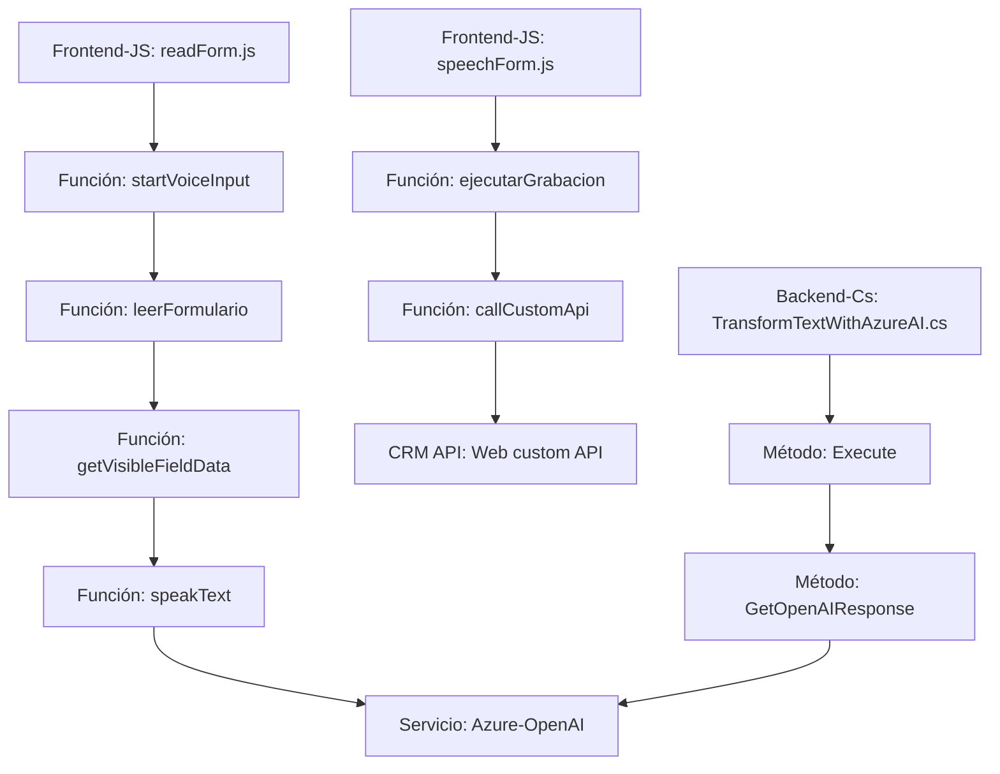

**Análisis técnico del código y repositorio**

---

### **Breve resumen técnico**
El repositorio incluye componentes que integran la funcionalidad de reconocimiento de voz, síntesis de texto a voz y transformación de texto con inteligencia artificial. Los archivos están diseñados para un entorno híbrido que conecta el frontend (JavaScript) con las funcionalidades backend de Microsoft Dynamics CRM, además de interactuar con servicios externos como Azure Speech SDK y Azure OpenAI.

---

### **Descripción de arquitectura**
Este sistema utiliza una **arquitectura híbrida** basada en patrones de desarrollo como la arquitectura en capas y principios de diseño modular:
1. **Frontend (JavaScript)**: Implementa funcionalidades para interactuar con el usuario mediante captura y síntesis de voz.
2. **Backend (C#)**: Contiene un plugin diseñado para integrarse con el contexto y las entidades de Microsoft Dynamics CRM.
3. **Externo**: Servicios de Azure (Speech SDK para síntesis y transcripción, y OpenAI para transformar texto).

Aunque algunas características pueden ajustarse en un contexto distribuido, el sistema actual se encuentra más cercano a una arquitectura **de n capas**: donde el frontend echa mano del SDK para procesamiento local, mientras que el plugin actúa como la capa lógica que organiza las operaciones hacia servicios externos.

---

### **Tecnologías usadas**
1. **Frontend**
   - **Lenguaje**: JavaScript.
   - **Azure Speech SDK**: Para transcripción y conversión texto a voz.
   - **Microsoft Dynamics CRM Web API**: Interacción con los formularios de Dynamics CRM.

2. **Backend**
   - **Lenguajes**: C# (.NET Framework / .NET Core).
   - **Servicio Azure OpenAI**: Procesamiento avanzado del lenguaje (GPT-4o confirmado).
   - **Microsoft Dynamics CRM SDK**: Implementación del plugin como una pieza modular para el sistema CRM.
    
3. **Patrones**
   - **Módulos**: Separación lógica entre extracción de datos, procesamiento y síntesis/transcripción.
   - **Adapter Pattern**: Interface entre el plugin de Dynamics y servicios externos como Azure OpenAI.
   - **Lazy Loading**: Carga dinámica del SDK de Azure Speech en el frontend.

---

### **Dependencias o componentes externos**
1. **Microsoft Dynamics CRM SDK:** Para la implementación del plugin y acceso al modelo del sistema CRM en el entorno backend.
2. **Azure Speech SDK:** Para integración con transcripción y síntesis de texto a voz (en el frontend).
3. **Azure OpenAI API:** Utiliza modelos GPT avanzados para procesamiento de texto mediante solicitudes HTTP.
4. **Microsoft Dynamics CRM Web API:** Permite que el frontend lea, escriba y manipule formularios en CRM.
5. **Librerías de .NET y JSON para manejo del plugin:**
   - Newtonsoft.Json.Linq (para JSON).
   - System.Text.Json y System.Net.Http (para comunicación HTTP).
   - System.Text para manipulación textual avanzada.

---

### **Diagrama Mermaid**

---

### **Conclusión final**
El repositorio muestra una integración avanzada que combina interacción con el usuario (captura y síntesis de voz) y procesamiento de inteligencia artificial. El diseño está orientado a un sistema modular multi-capa, donde los componentes frontend y plugin funcionan en ambientes diferentes pero se conectan mediante APIs externas como Azure Speech y Dynamics CRM.

Aunque actualmente no es un microservicio distribuido, puede adaptarse fácilmente a este enfoque reorganizando las interacciones en contenedores o servicios independientes.

El nivel de abstracción y separación lógica hacen que este diseño sea escalable, seguro y altamente funcional para entornos empresariales.