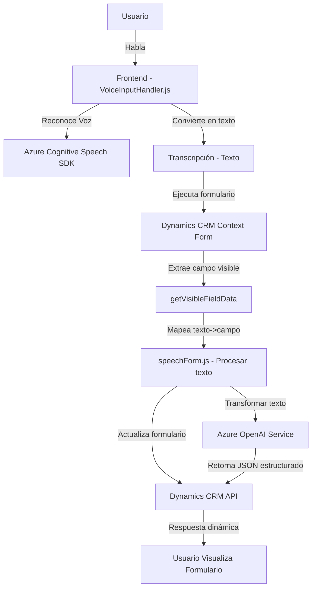

### Breve resumen técnico:
El repositorio incluye componentes diseñados para interactuar con formularios de **Microsoft Dynamics 365** utilizando reconocimiento de voz y servicios de transformación de texto basados en **Azure Cognitive Services**. Los principales objetivos son la captura de voz, procesamiento de datos hablados, síntesis de voz, integración con formularios dinámicos y transformación de texto con IA.

### Descripción de arquitectura:
La solución combina múltiples capas: 
- **Frontend dinámico** para interacción basada en reconocimiento de voz y síntesis.
- **Plugin backend** en **Dynamics CRM** para llamar a servicios externos (Azure OpenAI) y organizar transformaciones de datos.
- **Servicios externos** desacoplados (Azure Cognitive Speech y OpenAI).

La solución refleja una **arquitectura híbrida**:
1. **N-capas:** Interacción entre frontend (Dynamics Forms UI), backend (Plugins de Dynamics API) y servicios externos (Azure API).
2. **Integración de microservicios:** Uso de servicios externos para funciones específicas (speech-to-text, text transformation via OpenAI).
3. **Event-driven**: Procesos asíncronos basados en eventos como carga de SDK y respuestas de APIs externas.

### Tecnologías usadas:
1. **Frontend:** JavaScript.
   - Azure Cognitive Services SDK.
   - Microsoft Dynamics SDK.
   - Estrategias de modularidad y eventos basados en callbacks y promesas.
2. **Backend:** C#.
   - Microsoft Dynamics SDK: `IPlugin`.
   - Newtonsoft.Json para JSON manipulación.
   - Azure OpenAI para procesamiento de texto inteligente.
3. **Servicios externos:**
   - **Azure Cognitive Speech SDK**: Reconocimiento y síntesis de voz.
   - **Azure OpenAI GPT**: Procesamiento de texto con IA.

### Dependencias y componentes externos:
1. **Azure Cognitive SDK**: Sintetización y reconocimiento de voz.
2. **Azure OpenAI GPT**: Transformaciones basadas en reglas definidas.
3. **Dynamics CRM API**: Integración directa con formularios y datos.
4. **Newtonsoft.Json**: Deserialización de objetos JSON.
5. **System.Net.Http**: Peticiones REST a servicios externos (OpenAI y Azure).

### Diagrama Mermaid válido para GitHub:

### Conclusión final:
La solución es un sistema de **reconocimiento de voz** y **transformación de texto** integrado en Dynamics CRM, utilizando **Azure Cognitive Services** y **OpenAI GPT**. Aprovecha una arquitectura **modular en n-capas** con servicios desacoplados, enfatizando **reusabilidad** y **escalabilidad**.

Las buenas prácticas son notablemente aplicadas en la estructura del código (modularización, event-driven architecture). Sin embargo, existe margen de mejora en la gestión de configuraciones sensibles (e.g., claves de Azure) y en la posible incorporación de un sistema más robusto de autenticación y seguridad para las interacciones con APIs externas.