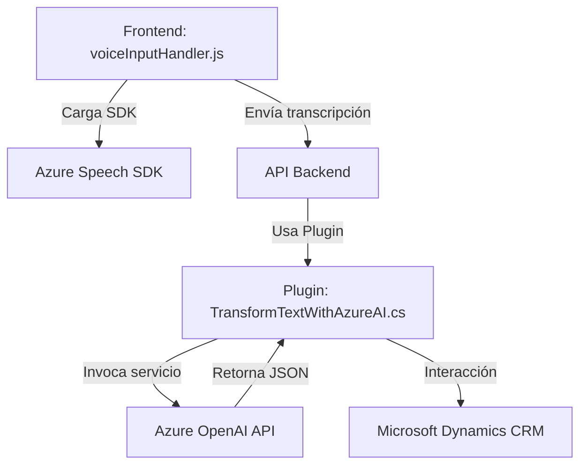

### Breve resumen técnico

El repositorio contiene una solución que integra un frontend para interacción mediante voz, un backend basado en plugins para Microsoft Dynamics CRM y servicios externos como Azure OpenAI y Azure Speech SDK. El objetivo principal es procesar formularios y datos mediante reconocimiento de voz y conversión de texto en interfaces de usuario contextuales, y transformar texto bajo reglas específicas usando servicios de inteligencia artificial.

---

### Descripción de arquitectura

1. **Frontend**:
   - Basado en módulos JavaScript para interacción con formularios contextuales (Dynamics CRM).
   - Utiliza el Azure Speech SDK para reconocimiento y síntesis de voz.
   - Modulariza procesos como carga dinámica del SDK, procesamiento de campos visibles en formularios, y asignación de valores transcritos a atributos dinámicos.

2. **Backend**:
   - Implementa un plugin en C# para Microsoft Dynamics CRM.
   - Extiende la funcionalidad del sistema mediante un evento que procesa texto con reglas definidas, utilizando una API de Azure OpenAI.

3. **Arquitectura general**:
   - **Capas**:
     - **Presentación**: Componentes de frontend (ej. `voiceInputHandler.js`) interactúan con el usuario.
     - **Servicio**: Se invocan APIs externas (Azure OpenAI y Azure Speech SDK) para procesamiento avanzado.
     - **Backend CRM**: El plugin en C# actúa como una extensión del sistema CRM, procesando eventos con lógica específica.
   - Segregación funcional: Cada componente tiene una responsabilidad concreta relacionada con su capa; frontend procesa datos de usuario, backend maneja transformación de texto.

   Esta solución tiene características de **arquitectura en capas** con integración de **microservicios externos** (APIs de Azure) y un módulo de extensión (plugin CRM).

---

### Tecnologías usadas

1. **Frontend (voiceInputHandler.js y speechForm.js)**:
   - **Lenguaje**: JavaScript/HTML.
   - **Frameworks**: Dynamics CRM para formularios contextuales.
   - **SDK**: Azure Speech SDK.
   - **Paradigma**: Modularidad y uso de Promesas/Callbacks para asíncronos.

2. **Backend (TransformTextWithAzureAI.cs)**:
   - **Lenguaje**: C#.
   - **Frameworks**:
     - Dynamics CRM SDK.
     - .NET Framework.
   - **APIs externas**:
     - Azure OpenAI.
   - **Patrones**:
     - Inyección de dependencias (`IServiceProvider`).
     - Plugin CRM como extensión del sistema.

3. **Servicios externos**:
   - **Azure Speech SDK**: Procesamiento de voz en frontend.
   - **Azure OpenAI**: Conversión de texto con reglas específicas en backend.

---

### Diagrama Mermaid válido para GitHub

---

### Conclusión final

La solución está diseñada alrededor de una arquitectura en capas que utiliza un frontend modular para interacción por voz, plugins prediseñados en Microsoft Dynamics CRM para procesar formularios y transformaciones de texto asistidos por inteligencia artificial mediante Azure OpenAI. Es un sistema híbrido que combina una extensión local del CRM con microservicios externos, optimizando reconocimiento de voz y transformación semántica en una única propuesta funcional. La integración es robusta, pero podría beneficiarse de una estrategia sólida de pruebas sobre la comunicación asíncrona entre los módulos.