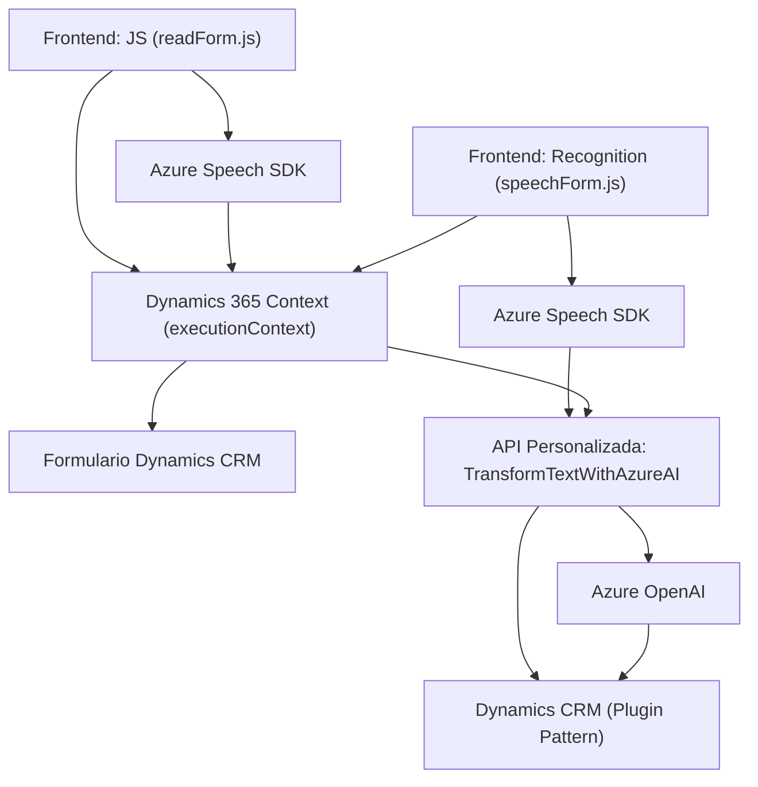

**Breve resumen técnico:**
Este repositorio contiene tres archivos principales relacionados con la integración de voz y servicios AI en una plataforma Dynamics 365. Se implementan funcionalidades frontend para manejo de eventos y APIs externas (Azure Speech SDK), integradas con una capa de backend mediante plugins en .NET. El propósito del proyecto es facilitar la interacción con formularios mediante reconocimiento de voz, síntesis de voz, generación dinámica de valores, y transformación de texto usando servicios Azure OpenAI.

---

**Descripción de arquitectura:**
El diseño general sigue una **arquitectura de n-capas**, caracterizada por las siguientes capas principales:
1. **Frontend (JavaScript):** Proporciona funcionalidades para el reconocimiento de voz y síntesis, interactuando directamente con el usuario mediante formularios en Dynamics 365.
2. **Servicios Intermedios (API y Azure Speech SDK):** Capas de integración con servicios de reconocimiento y síntesis de voz.
3. **Backend (Plugin de Dynamics 365 en C#):** Procesa datos y proporciona interacción con un servicio externo (Azure OpenAI) para transformaciones mediante reglas específicas.

La gestión asincrónica y modularidad en el código refleja el uso de **patrones event-driven** en el frontend, mientras que el plugin utiliza el **Plugin Pattern** para integrarse como capa extensible en Dynamics CRM.

---

**Tecnologías usadas:**
1. **Frontend:**
   - **JavaScript:** Para el manejo de interacción del usuario, carga de SDK, y lógica del formulario.
   - **Azure Speech SDK:** Reconocimiento y síntesis de voz, integración dinámica desde el navegador.
   - **Dynamics 365 Context Objects:** Métodos como `executionContext`, `formContext`.

2. **Backend:**
   - **C#:** Implementación del plugin en Dynamics CRM.
   - **Microsoft.Xrm.Sdk:** Para interactuar con el contexto de Dynamics CRM.
   - **Azure OpenAI Service:** Realiza transformaciones de texto vía integración HTTP REST.

3. **Dependencias adicionales:**
   - **Newtonsoft.Json y System.Text.Json:** Procesamiento de respuestas JSON desde OpenAI.
   - **Azure Services:** Azure Speech y OpenAI.

---

**Diagrama Mermaid válido para GitHub:**

---

**Conclusión final:**
El repositorio está diseñado para extender las capacidades de Dynamics 365 mediante el uso de reconocimiento y síntesis de voz y la integración con servicios de AI. La arquitectura está basada en n-capas con una clara separación entre frontend (interacción del usuario y lógica de voz), servicios intermedios (Azure Speech SDK), y backend (plugins y servicios externos). El diseño modular facilita la modificación y escalabilidad, aunque aspectos como la configuración de claves de API deberían considerarse desde la perspectiva de seguridad. Ideal para soluciones empresariales centradas en experiencia de usuario y automatización por voz.