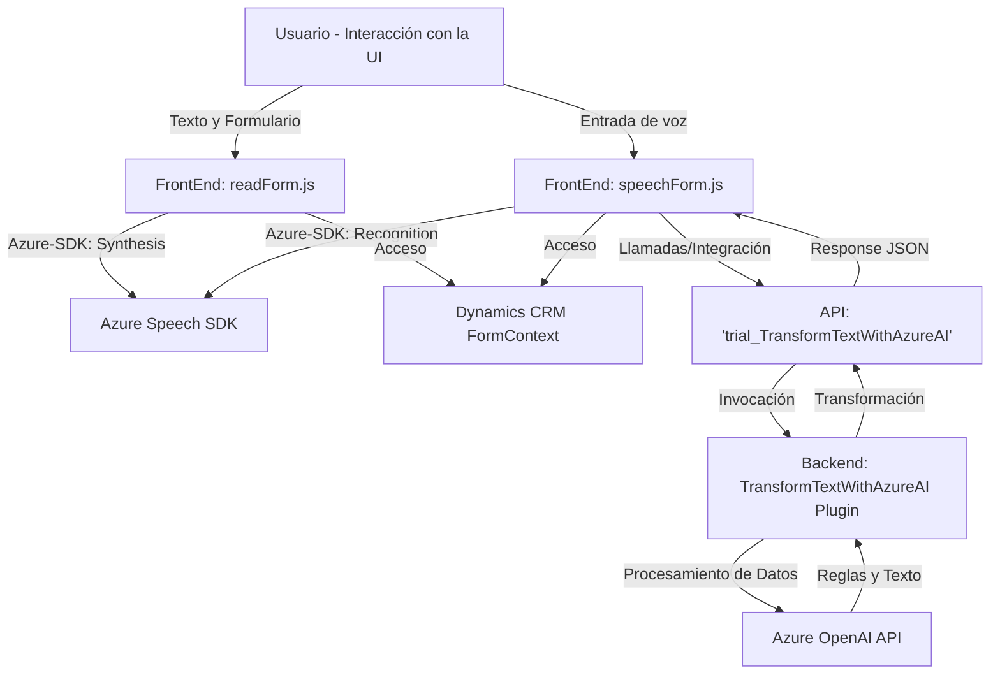

## Breve resumen técnico

El repositorio contiene tanto fragmentos de código para **frontend** en JavaScript como un **plugin backend** desarrollado en C#. Parece orientado a desarrollar funcionalidades relacionadas con la integración de voz y procesamiento de texto inteligente en una plataforma como Microsoft Dynamics 365. Se utiliza Microsoft Azure Speech SDK para sintetizar texto y reconocer la voz, y una API personalizada basada en Azure OpenAI para transformar el texto hablado en un formato estructurado aplicable al contexto del formulario.

---

## Descripción de arquitectura

La solución parece estar diseñada con un enfoque de **arquitectura de N capas** con una separación entre el frontend y el backend, además de emplear servicios externos (como APIs) para realizar tareas específicas de síntesis de voz y procesamiento de texto. Esta arquitectura permite garantizar una independencia entre las funcionalidades del frontend, el backend y los servicios externos, favoreciendo el desacoplamiento y escalabilidad.

En el frontend, se procesan las entradas de voz de los usuarios y se realizan integraciones con servicios externos para recibir datos enriquecidos. En el backend, un plugin trabaja en conjunto con Dynamics CRM y Azure OpenAI para procesar los datos. Esta arquitectura facilita la interacción entre componentes y servicios mientras centraliza la lógica empresarial y el manejo de datos en el CRM.

---

## Tecnologías usadas

### Lenguajes:
- **JavaScript:** Utilizado para implementar la lógica de la interfaz y las interacciones con los servicios de Azure.
- **C#:** Utilizado en el plugin de Dynamics CRM.

### Servicios y componentes externos:
- **Microsoft Azure Speech SDK:**
  - Reconocimiento de voz para transformar input en texto o lectura de texto en voz.
- **Dynamics CRM Web API:**
  - Utilizado para interactuar con datos en formularios de CRM.
- **Azure OpenAI API:**
  - Procesa texto utilizando modelos avanzados de lenguaje (GPT-4).

### Frameworks y librerías externas:
- **Newtonsoft.Json y System.Text.Json:** Para el manejo y procesamiento de JSON en el plugin.
- **Microsoft.Xrm.Sdk:** Para interactuar con el contexto y servicios de Dynamics CRM.
- **RESTful API integration:** Disparo de peticiones HTTP para servicios externos.

### Patrones:
- **Event-Driven Architecture:** Operaciones del frontend y backend se disparan según eventos específicos (e.g., interacción del usuario o cambio en un campo del formulario).
- **Dependency Injection:** Utilizado para pasar objetos de contexto (como el API de Azure o el contexto de CRM) a las funciones y métodos del código.
- **Encapsulation and Modularity:** Cada función y método en los archivos realiza tareas específicas (adherencia al principio de responsabilidad única).
- **Layered Architecture:** Separación clara entre las tareas del frontend (captura y procesamiento de voz) y las del backend (transformación de texto, lógica empresarial).

---

## Diagrama Mermaid

---

## Conclusión Final

La solución presentada es un ejemplo claro de integración avanzada de capacidades de síntesis y reconocimiento de voz con Microsoft Azure Speech SDK, apuntando a mejorar los procesos de interacción con datos en formularios de Dynamics 365. Gracias al uso de una API personalizada que conecta la aplicación con Azure OpenAI, se logra transformar texto hablado en objetos estructurados aplicables a las necesidades del sistema CRM.

La arquitectura empleada en este proyecto combina un **frontend interactivo impulsado por funciones específicas** con un **backend plugin modular** que entrega procesamiento avanzado de datos. El enfoque es adecuado para escenarios empresariales donde la integración de servicios en la nube puede mejorar la productividad y precisión de tareas relacionadas con el procesamiento de voz y texto.