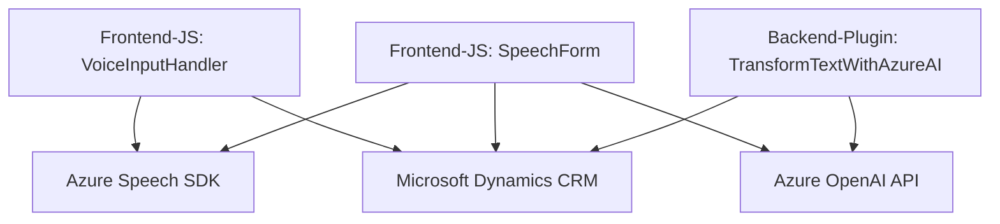

### Breve Resumen Técnico
El repositorio analiza extensivamente una solución relacionada con el procesamiento de datos en formularios de Microsoft Dynamics CRM mediante Azure Speech SDK, Azure OpenAI API y otras tecnologías asociadas. Integra funcionalidad de acceso y captación de voz, transcripción a texto, conversión de texto a JSON estructurado y actualización dinámica de los atributos de un formulario CRM.

---
### Descripción de Arquitectura
La solución combina varias capas de integración:
1. **Frontend (JavaScript):** Scripts que sirven como puente entre el formulario en el sistema CRM y la interacción con Azure Speech SDK para obtener datos mediante voz o sintetizar texto.
2. **Backend (Plugin C#):** Plugins que funcionan como microservicios conectados a Dynamics CRM y Azure OpenAI API, procesando datos complejos en segundo plano.
3. **API personalizada:** Un nivel de procesamiento externo basado en Azure OpenAI API, que convierte texto en JSON estructurado para una manipulación automatizada.

El diseño general podría clasificarse como una arquitectura **n-capas**. Los componentes frontales interactúan con middleware (SDK/Plugins) y servicios externos (Azure Speech, OpenAI API). También muestra compatibilidad con patrones de microservicio orientados a la interacción modular con APIs.

---
### Tecnologías Usadas
1. **Frontend:**
   - **JavaScript**: Lenguaje principal para manejar lógica en el cliente.
   - **Azure Speech SDK**: Para tareas como síntesis de voz, transcripción y conversión de datos.
   - **Framework Dynamics CRM (JavaScript)**: APIs internas para manipulación de datos del formulario.

2. **Backend/API:**
   - **C# (.NET)**: Desarrollo de plugins mediante Microsoft Dynamics SDK.
   - **Azure OpenAI API**: Procesamiento avanzado de texto utilizando capacidades de Inteligencia Artificial.
   - **Newtonsoft.Json** y **System.Text.Json**: Librerías para serialización/deserialización JSON en el backend.

3. **Patrones:**
   - Modularización: Funciones individuales para tareas específicas en frontend y backend.
   - Asincronía: Uso de callbacks y promesas para manejar dependencias dinámicas.
   - Microservicio: Plugins y APIs externas como sistemas independientes, con interacciones bien definidas.
   - Encapsulación: Separación de lógica interna y la interacción externa (Azure Speech y OpenAI).

---
### Diagrama Mermaid (Estructura Representativa)

---
### Conclusión Final
La solución combina tecnologías modernas para implementar accesibilidad y automatización en formularios CRM. La arquitectura se basa en componentes modulares y altamente integrados, organizados en patrones de diseño n-capas y microservicios. El uso de Azure Speech SDK y Azure OpenAI API posiciona el sistema como una solución avanzada para interacción natural con usuarios y procesamiento inteligente de datos. Es un ejemplo práctico de cómo integrar servicios de inteligencia artificial a una plataforma de gestión empresarial existente.