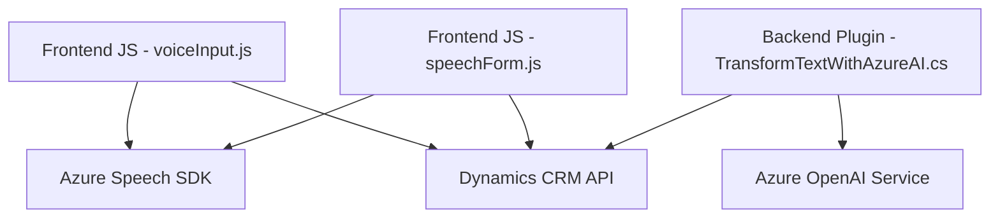

**Resumen Técnico:**
Se trata de un sistema dividido en tres componentes: frontend en JavaScript, interacción con formularios mediante procesamiento de voz, y un plugin en C# para Dynamics 365 que utiliza Azure OpenAI Service. El sistema implementa funcionalidades de **reconocimiento/síntesis de voz** y enriquecimiento de datos mediante IA. Todo apunta a una solución híbrida compuesta por un frontend interactivo y un backend extendido con una arquitectura derivada de Dynamics CRM.

---

### **Descripción de Arquitectura:**
La arquitectura es de tipo híbrido: **n-capas** con integración a servicios externos (Azure Speech SDK y Azure OpenAI). El frontend trabaja con formularios en Dynamics CRM utilizando lógica de procesamiento client-side modular en JavaScript. El backend implementa plugins que extienden el modelo tradicional de Dynamics CRM con funcionalidad adicional basada en IA y servicios REST.

---

### **Tecnologías Usadas:**
1. **Frontend (JS):**
   - Azure Speech SDK: Reconocimiento y síntesis de voz.
   - Modularización con funciones desacopladas.
   - Interacción con Dynamics CRM mediante `executionContext` y APIs internas.

2. **Backend (C# Plugin):**
   - `IPlugin` de Dynamics 365.
   - Comunicación REST con Azure OpenAI Service (GPT).
   - Serialización JSON con Newtonsoft y System.Text.Json.

---

### **Dependencias Internas y Externas:**
1. **Internas:**
   - APIS del CRM de Dynamics 365: `Xrm.WebApi` (para operaciones con datos y entidades).
   - Contexto del formulario para leer y escribir valores.

2. **Externas:**
   - **Azure Speech SDK:** Para reconocimiento y síntesis de voz.
   - **Azure OpenAI Service:** Para procesamiento de texto avanzado.
   - **Newtonsoft.Json:** Serialización de datos en el plugin de .NET.
   - **System.Net.Http:** Comunicación con APIs Azure desde el backend.

---

### **Diagrama Mermaid**:

---

### **Conclusión Final:**
El sistema representa una **solución extendida para Dynamics CRM**, incorporando capacidades avanzadas de procesamiento de voz y análisis de datos mediante IA. La arquitectura está basada en un modelo **n-capas híbrido**, donde el frontend interactúa directamente con SDKs y APIs del CRM, mientras que el backend extiende las funcionalidades estándar del CRM mediante plugins. Esta solución es adecuada para empresas que requieren automatización y enriquecimiento de procesos mediante tecnologías de Azure (Speech y OpenAI).