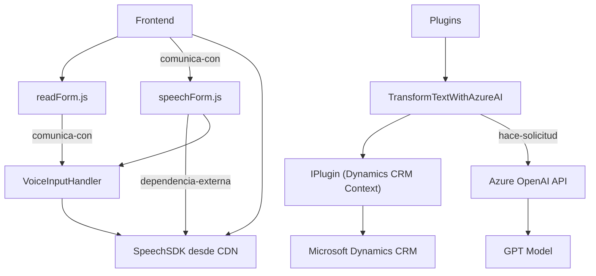

### Breve resumen técnico

El repositorio contiene tres archivos principales que implementan soluciones para procesamiento, transformación y síntesis de texto utilizando **Azure Speech SDK** y **Azure OpenAI API**. Las funcionalidades están relacionadas principalmente con la integración de servicios en el contexto de **Microsoft Dynamics CRM**, incluyendo formularios interactivos y plugins personalizados. 

---

### Descripción de arquitectura

La solución utiliza una **arquitectura modular** con **principios de n capas**, donde cada componente maneja funcionalidades específicas:
- **Frontend/JS**: Contiene scripts para interacción con formularios (extracción de datos y procesamiento de voz a texto con Azure Speech SDK).
- **Plugins/TransformTextWithAzureAI.cs**: Extiende Microsoft Dynamics CRM mediante un plugin que interactúa con Azure OpenAI para transformar texto conforme a reglas definidas.
- **Externo**: Dependencias dinámicas como **Azure Speech SDK** y **Azure OpenAI API**.

El diseño utiliza patrones de integración **Service-Oriented Architecture (SOA)** con servicios externos (Azure APIs) y el principio de **single responsibility**.

---

### Tecnologías usadas

1. **Microsoft Dynamics CRM API**:
   - Integración directa para manipulación de campos y atributos en formularios CRM.
   - Uso de `executionContext` y `formContext` para manejo del contexto de formularios.

2. **Azure Speech SDK**:
   - Para síntesis y reconocimiento de voz.
   - Cargado dinámicamente desde CDN.

3. **Azure OpenAI API**:
   - Llamadas directas al modelo GPT, aplicado en un plugin de Dynamics CRM.

4. **JavaScript**:
   - Modular, asíncrono, responsable tanto de la lógica de integración con Speech SDK como de la manipulación de datos en el frontend.

5. **C# (.NET Framework)**:
   - Utilizado en el plugin de Dynamics CRM para integración con modelos de Azure OpenAI API.

6. **HTTP Client Libraries**:
   - `System.Net.Http` y `System.Text.Json` manejan las solicitudes y respuestas JSON entre el plugin y la API de Azure.

---

### Diagrama Mermaid válido para GitHub

---

### Conclusión final

La estructura del repositorio evidencia una solución bien modular para la integración de **Azure Speech SDK** y **Azure OpenAI API** con **Microsoft Dynamics CRM**. El frontend maneja formularios interactivos y interfaces de voz, mientras que los plugins en C# realizan transformaciones avanzadas de texto para extender las capacidades del CRM.

El diseño emplea principios de arquitecturas como **n capas** y **SOA**, con servicios externos dinámicos para tareas específicas. Esto permite una alta integración con servicios en la nube y un enfoque extensible. Sin embargo, requiere configuraciones adicionales (como claves API y regiones de Azure) para desplegarlo efectivamente en entornos reales.