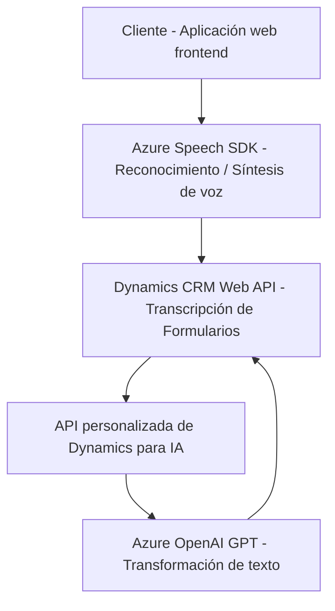

### Breve Resumen Técnico:
El repositorio muestra una solución orientada a la integración de servicios de voz y procesamiento de texto basada en **Azure Speech SDK**, **Dynamics CRM API**, y **Azure OpenAI GPT**. Contiene múltiples archivos organizados por rol (frontend, backend, plugins) para interactuar con formularios y datos. Cada archivo procesa tareas específicas, que incluyen reconocimiento y síntesis de voz, interacción con API externas, y transformación de texto utilizando inteligencia artificial.

---

### Descripción de Arquitectura:
La solución sigue una **arquitectura de software modular** basada en componentes. Se observan los siguientes elementos clave:
- **Frontend**: Contiene scripts de integración con Azure Speech SDK y procesamiento dinámico de datos en formularios (orientado a eventos del DOM y flujo lógico secuencial).
- **Backend**: Plugins diseñados para Dynamics CRM, integrados con Azure OpenAI API, que procesan y validan texto siguiendo reglas específicas.
- **Patrones Observados**:
  - **Modularidad**: Los archivos están separados por funcionalidad (sintetizador de voz, reconocimiento, transformadores de plugins), facilitando mantenimiento y escalabilidad.
  - **Capa de servicios**: La conexión a APIs y SDK externos (Azure, Dynamics) actúa como una capa de integración con servicios en la nube.
  - **Plugin Pattern** en Dynamics CRM: Extensiones que procesan eventos y transformación de datos desconectándose del cliente.
  - **Evento-driven architecture**: El frontend se basa en eventos como entrada de voz y datos en formularios.
  - **Uso de cloud services**: Comunicación directa con **Azure Speech SDK** y **Azure OpenAI GPT** para tareas específicas.

---

### Tecnologías Utilizadas:
1. **Frontend**:
   - **JavaScript** para manejar DOM y lógica dinámica para formularios.
   - **Azure Speech SDK** para reconocimiento y síntesis de voz.
   - **Dynamics CRM APIs** para actualizar campos en formularios cliente.
   - Consumo de servicios REST desde APIs personalizadas.
   
2. **Backend**:
   - **C#** en plugins diseñados para Dynamics CRM.
   - **Azure OpenAI GPT** como SaaS para procesamiento de texto.
   - **Microsoft Dynamics SDK**, incorporando `IPlugin`, contexto de organización, y manejo de parámetros de entrada/salida.
   - **HTTP client** para consumir servicios remotos.

3. **Servicios en la nube**:
   - **Azure Speech SDK** y **Azure OpenAI GPT** integrados directamente para síntesis de voz y transformación de texto.
   - **Dynamics CRM Web API** para operaciones específicas del modelo de datos CRM.

---

### Diagrama Mermaid:

---

### Conclusión Final:
La solución está diseñada para gestionar formularios dinámicos con entrada por voz y análisis inteligente del texto en aplicaciones vinculadas a Dynamics CRM. Se basa en una **arquitectura modular distribuida**, usando servicios en la nube como **Azure Speech SDK** y **Azure OpenAI GPT**, lo que garantiza escalabilidad, procesamiento eficiente, y modernización en aplicaciones empresariales. Es un excelente ejemplo de integración entre APIs de terceros y plataformas de CRM para experiencias centradas en la interacción de voz y datos.