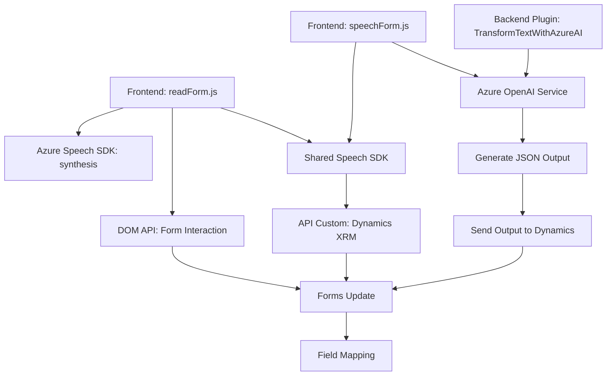

### Breve Resumen Técnico
El repositorio contiene una solución que combina **Frontend**, **Plugins**, y **APIs** con integración directa a servicios de inteligencia artificial de Azure. Su enfoque principal gira en torno a la interacción con formularios en la plataforma Dynamics CRM (XRM). Estas funcionalidades permiten habilitar reconocimiento y síntesis de voz, así como transformación de información en tiempo real, integrando AI.

---

### Descripción de Arquitectura
La solución implementa una **arquitectura de microservicios** basada en componentes distribuidos:

1. **Frontend (JavaScript)**: Files `readForm.js` y `speechForm.js` interactúan con el usuario en un entorno web mediante la API de Dynamics para capturar datos de formularios. Además, utiliza la API **Azure Cognitive Services Speech SDK** para realizar la síntesis y reconocimiento de voz. Estas funciones exhiben **un patrón de wrapper para SDK** externo y lógica de interacción con APIs remotas.  
   
2. **Backend Plugin (C#)**: File `TransformTextWithAzureAI.cs` implementa un plugin para Dynamics CRM que transforma datos de entrada con reglas predefinidas usando la **Azure OpenAI API**. Este backend sigue un enfoque orientado a **event-driven architecture**, activado por eventos internos del entorno Dynamics.

---

### Tecnologías y Frameworks Usados
1. **Front-End**:
   - **JavaScript** para scripts dinámicos en un entorno web.
   - **Azure Cognitive Services Speech SDK**: Servicios para síntesis y reconocimiento de voz.
   - **DOM API**: Gestión dinámica de elementos HTML/DOM en el navegador.
   - **Dynamics/XRM Framework**: Integración con el modelo de datos de Microsoft Dynamics.

2. **Backend/Plugin (C#)**:
   - **Microsoft Dynamics CRM SDK**: Extensiones y plugins en la plataforma XRM.
   - **Azure OpenAI Service**: Implementación avanzada de transformaciones de texto en JSON.
   - Framework estándar de .NET (`System.Text.Json`, `HttpClient` para integraciones externas).

3. **Patrones de Software**:
   - Wrapper para SDK.
   - Callbacks y Promises para tareas asíncronas.
   - Dependencia de servicios externos mediante **API REST**.
   - Event-driven para plugins de Dynamics.

---

### Dependencias o Componentes Externos Potenciales
1. **Servicios Externos**:
   - **Azure Cloud** para Cognitive Services (Speech SDK, OpenAI Service).
   - Custom API definida por el usuario en Dynamics/XRM.

2. **Librerías Externas**:
   - `Newtonsoft.Json`: Procesamiento JSON en .NET.
   - `Azure Speech SDK` y dependencias del entorno de ejecución (navegador o servidor de CRM).

---

### Diagrama Mermaid para GitHub Markdown

---

### Conclusión Final
La solución es una **aplicación híbrida** que integra servicios **Frontend-Backend**, diseñada para interactuar con formularios de usuarios en aplicaciones **Dynamics CRM**, y potenciar la experiencia con funcionalidades de **reconocimiento y síntesis de voz**, junto con el análisis de datos mediante inteligencia artificial.

El diseño implementa una arquitectura **modular** basada en **microservicios**, donde cada componente (Frontend, Plugin, y API) tiene un rol bien definido y se integran mediante **servicios externos (Azure)**. Aunque robusto, el repositorio podría beneficiarse de mejores prácticas como manejo externo de **credenciales** y **seguridad adicional** en su infraestructura.